# 概述

> **相关源文件**
>
> - [.gitignore](https://github.com/Mengbooo/TransBemo/blob/d3383946/.gitignore)
> - [README.md](https://github.com/Mengbooo/TransBemo/blob/d3383946/README.md)
> - [assets/images/icon.png](https://github.com/Mengbooo/TransBemo/blob/d3383946/assets/images/icon.png)
> - [  
>   资产/图片/splash-icon.png](https://github.com/Mengbooo/TransBemo/blob/d3383946/assets/images/splash-icon.png)
> - [package.json](https://github.com/Mengbooo/TransBemo/blob/d3383946/package.json)

TransBemo 是一个使用 Expo 和 React Native 构建的跨平台翻译应用程序，具有 Node.js/Express 后端。该系统使用户能够通过多种输入法（文本、语音、图像）翻译文本，并存储翻译以供以后参考。本文档提供了系统架构、关键组件和数据流的技术概述。

有关特定功能的详细信息，请参阅：

- [  
  文本翻译功能](/Mengbooo/TransBemo/2.1-text-translation-feature)
- [  
  语音翻译功能](/Mengbooo/TransBemo/2.2-speech-translation-feature)
- [  
  图像翻译功能](/Mengbooo/TransBemo/2.3-image-translation-feature)
- [  
  翻译历史记录](/Mengbooo/TransBemo/2.4-translation-history)
- [  
  后端架构](/Mengbooo/TransBemo/3-backend-architecture)

##

系统架构

TransBemo 遵循客户端-服务器架构，前端和后端组件明确分离：

###

高级系统架构

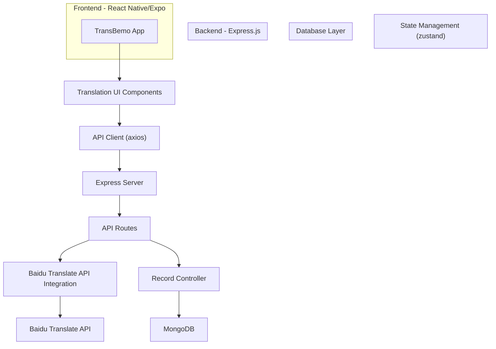

资料来源：[package.json L17-L49](https://github.com/Mengbooo/TransBemo/blob/d3383946/package.json#L17-L49)

[README.md L1-L5](https://github.com/Mengbooo/TransBemo/blob/d3383946/README.md#L1-L5)

##

前端架构

前端使用 React Native 和 Expo，带有基于选项卡的导航系统，用于访问不同的翻译模式和功能。

###

前端组件架构

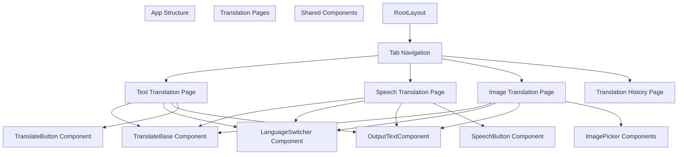

资料来源：[package.json L20-L48](https://github.com/Mengbooo/TransBemo/blob/d3383946/package.json#L20-L48)

[README.md L28-L29](https://github.com/Mengbooo/TransBemo/blob/d3383946/README.md#L28-L29)

该应用程序使用 Expo Router 提供的基于文件的路由，主要应用程序代码位于 `app` 目录中。该项目利用多个 Expo 库来实现 UI 组件和功能。

##

翻译功能

TransBemo 提供三种主要的翻译输入法，每种方法都有自己的专用界面：

###

翻译特征流程

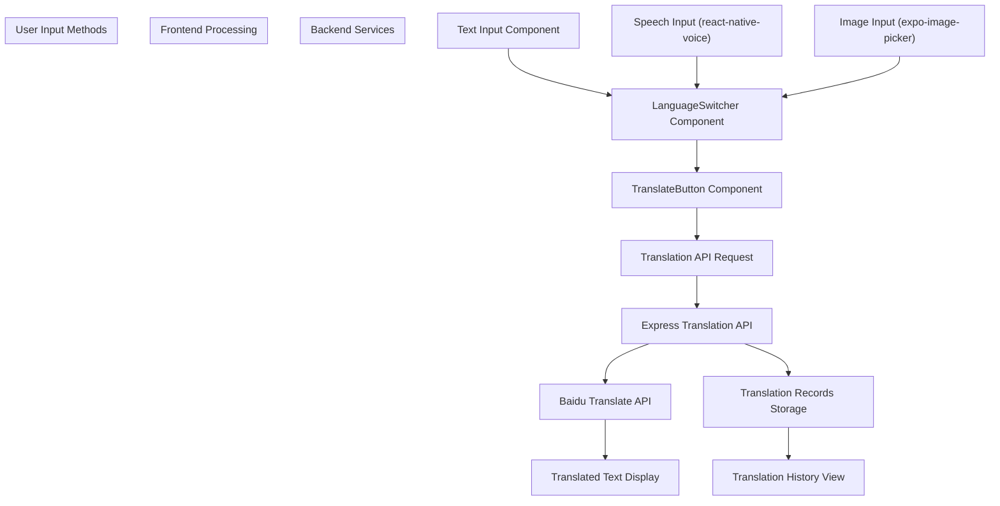

资料来源：[package.json L22-L48](https://github.com/Mengbooo/TransBemo/blob/d3383946/package.json#L22-L48)

[README.md L1-L5](https://github.com/Mengbooo/TransBemo/blob/d3383946/README.md#L1-L5)

1.  **文本翻译** \- 具有语言选择功能的直接文本输入
2.  **语音翻译** \- 使用 `react-native-voice` 库进行语音识别
3.  **图像翻译** \- 用于翻译的图像捕获和文本提取
4.  **翻译历史记录** \- 存储和显示过去的翻译

##

后端架构

后端是使用 Express.js 构建的，用于处理翻译服务和记录管理的 API 请求。

###

后端架构图

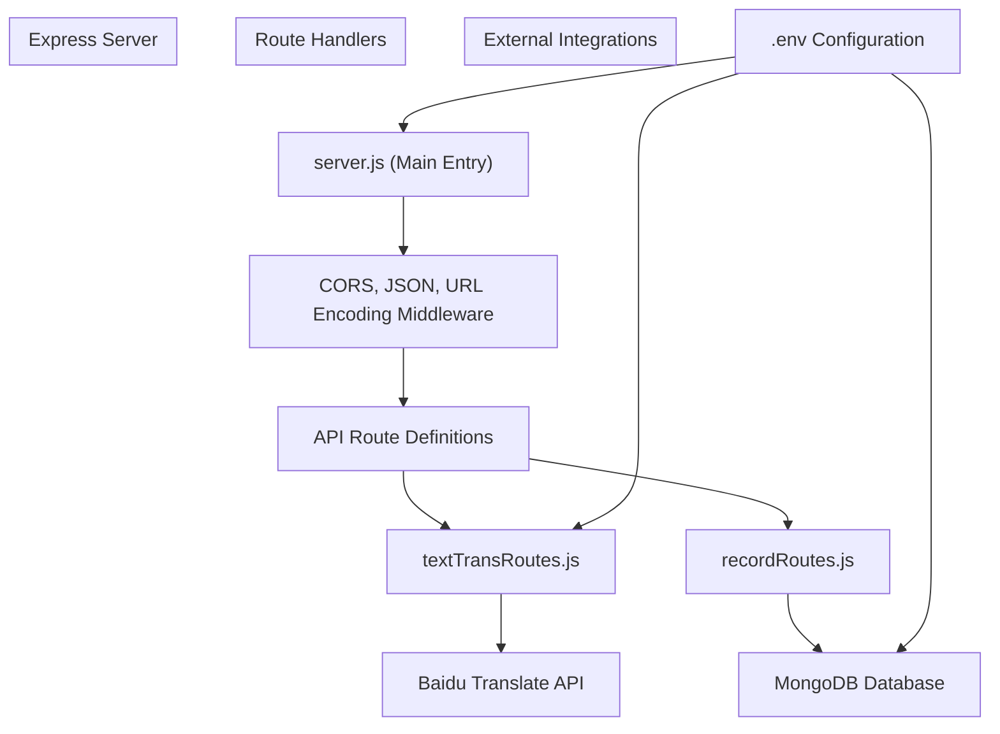

资料来源：[package.json L22-L38](https://github.com/Mengbooo/TransBemo/blob/d3383946/package.json#L22-L38)

Express 服务器公开了以下端点：

- 翻译请求 （`/api/translateText`）
- 记录管理 （`/api/records`）

后端与百度翻译 API 集成，用于翻译服务，与 MongoDB 集成，用于数据持久化。

##

数据流

完整的翻译过程涉及跨前端、后端和外部服务的多个步骤。

###

完整的翻译流程

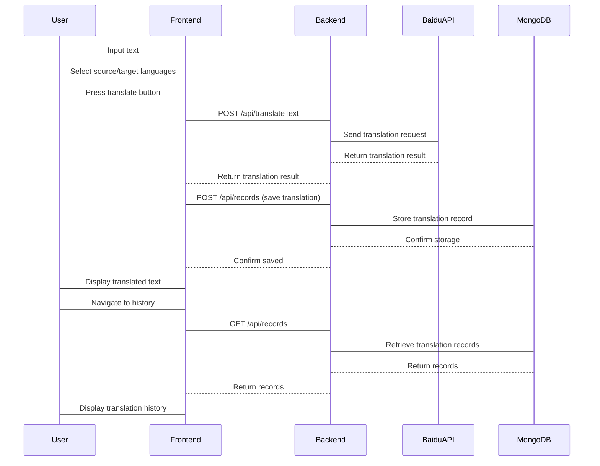

资料来源：[package.json L22-L48](https://github.com/Mengbooo/TransBemo/blob/d3383946/package.json#L22-L48)

##

关键依赖项

TransBemo 依赖于几个关键技术和库：

| 类别     | 依赖                                    |
| -------- | --------------------------------------- |
| 前端框架 | React Native， 博览会                   |
| 状态管理 | 祖斯坦德                                |
| 导航     | Expo Router、React 导航                 |
| API 集成 | Axios 公司                              |
| 语音识别 | React Native 语音                       |
| UI 组件  | Expo 矢量图标、Expo 模糊、Expo 线性渐变 |
| 后端     | Express.js、Node.js、HTTP 代理中间件    |
| 数据库   | MongoDB 数据库                          |
| 外部服务 | 百度翻译 API                            |

资料来源：[package.json L17-L49](https://github.com/Mengbooo/TransBemo/blob/d3383946/package.json#L17-L49)

##

开发设置

要设置 TransBemo 开发环境：

1.  克隆存储库
2.  安装依赖项：

`npm 安装`

3.  启动开发服务器：

`NPX 博览会开始`

该应用程序可以在以下位置运行：

- Android 模拟器
- iOS 模拟器
- Expo Go（有限沙盒）
- 开发构建

资料来源：[README.md L7-L28](https://github.com/Mengbooo/TransBemo/blob/d3383946/README.md#L7-L28)

[package.json L5-L12](https://github.com/Mengbooo/TransBemo/blob/d3383946/package.json#L5-L12)

该项目通过 Expo Router 使用基于文件的路由，主要应用程序代码位于 `app` 目录中。

#

前端架构

> **  
> 相关源文件**
>
> - [  
>   app/（翻译）/\_layout.tsx](<https://github.com/Mengbooo/TransBemo/blob/d3383946/app/(translate)/_layout.tsx>)
>
> /\_layout.tsx）
>
> - [app/\_layout.tsx](https://github.com/Mengbooo/TransBemo/blob/d3383946/app/_layout.tsx)
> - [package.json](https://github.com/Mengbooo/TransBemo/blob/d3383946/package.json)

##

目的和范围

本文档全面概述了 TransBemo 应用程序的前端架构。它涵盖了 React Native/Expo 框架实现、组件组织、导航结构和前端状态管理。具体翻译功能请参见[文本翻译、](/Mengbooo/TransBemo/2.1-text-translation-feature) [语音翻译、图片](/Mengbooo/TransBemo/2.2-speech-translation-feature)[翻译或](/Mengbooo/TransBemo/2.3-image-translation-feature)[历史翻译](/Mengbooo/TransBemo/2.4-translation-history) 。

##

框架和技术堆栈

TransBemo 是使用 React Native 和 Expo 框架构建的，可实现跨 iOS、Android 和 Web 的跨平台功能。前端利用了几项关键技术：

| 科技               | 目的                        |
| ------------------ | --------------------------- |
| React 原生         | 核心跨平台 UI 框架          |
| 世博会             | 开发框架和工具              |
| expo-router 路由器 | 应用程序路由和导航          |
| React 导航         | Tab 页和堆栈导航管理        |
| 祖斯坦德           | 状态管理库                  |
| Axios 公司         | 用于 API 请求的 HTTP 客户端 |
| React Native 复活  | 高级动画                    |

资料来源：[package.json L17-L48](https://github.com/Mengbooo/TransBemo/blob/d3383946/package.json#L17-L48)

##

应用程序结构

该应用程序遵循基于功能的组织，具有基于选项卡的导航系统。根布局建立主题提供程序和主要堆栈导航，而翻译布局为主要功能配置选项卡导航。

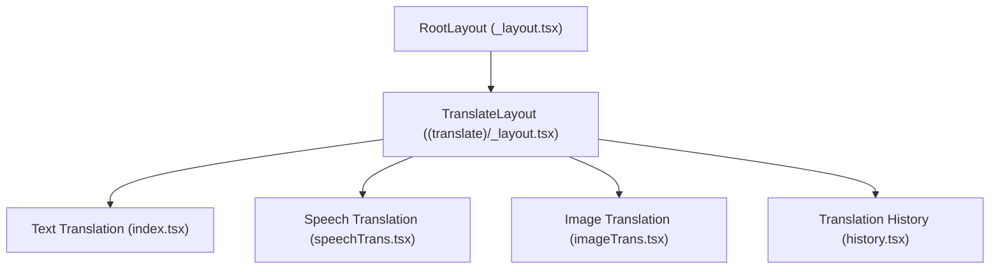

资料来源：[app/\_layout.tsx L14-L39](https://github.com/Mengbooo/TransBemo/blob/d3383946/app/_layout.tsx#L14-L39)

\[app/（翻译）/\_layout.tsx

28-74\]（[https://github.com/Mengbooo/TransBemo/blob/d3383946/app/（翻译）/\_layout.tsx#L28-L74](<https://github.com/Mengbooo/TransBemo/blob/d3383946/app/(translate)/_layout.tsx#L28-L74>)）

##

导航架构

TransBemo 实现了两级导航结构：

1.  **Root Stack Navigator**：管理高级应用程序流程
2.  **Tab Navigator**：处理主要功能选项卡

选项卡导航在翻译布局文件中定义，并使用基于图标的导航实现自定义样式的底部选项卡栏。

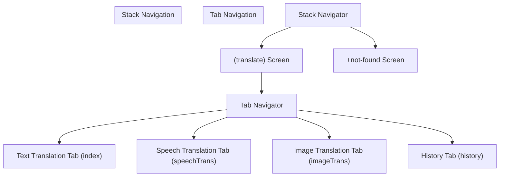

资料来源：[app/\_layout.tsx L30-L37](https://github.com/Mengbooo/TransBemo/blob/d3383946/app/_layout.tsx#L30-L37)

\[app/（翻译）/\_layout.tsx

32-72\]（[https://github.com/Mengbooo/TransBemo/blob/d3383946/app/（翻译）/\_layout.tsx#L32-L72](<https://github.com/Mengbooo/TransBemo/blob/d3383946/app/(translate)/_layout.tsx#L32-L72>)）

##

UI 组件体系结构

前端采用模块化组件架构，在不同的翻译功能之间共享可重用组件。组件层次结构遵循分层方法：

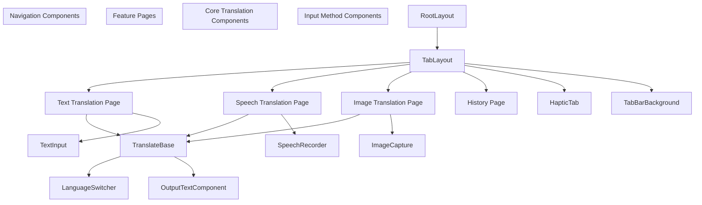

资料来源： \[app/（translate）/\_layout.tsx

5-7\]（[https://github.com/Mengbooo/TransBemo/blob/d3383946/app/（翻译）/\_layout.tsx#L5-L7](<https://github.com/Mengbooo/TransBemo/blob/d3383946/app/(translate)/_layout.tsx#L5-L7>)）

\[app/（翻译）/\_layout.tsx

48-71\]（[https://github.com/Mengbooo/TransBemo/blob/d3383946/app/（翻译）/\_layout.tsx#L48-L71](<https://github.com/Mengbooo/TransBemo/blob/d3383946/app/(translate)/_layout.tsx#L48-L71>)）

##

主题和样式

该应用程序根据设备的配色方案实现具有动态主题的响应式设计。样式方法结合了：

1.  特定于组件的样式表
2.  全局主题常量
3.  特定于平台的样式，可在不同设备上实现最佳外观

选项卡栏样式通过自定义背景、边框和特定于平台的调整演示了此方法：

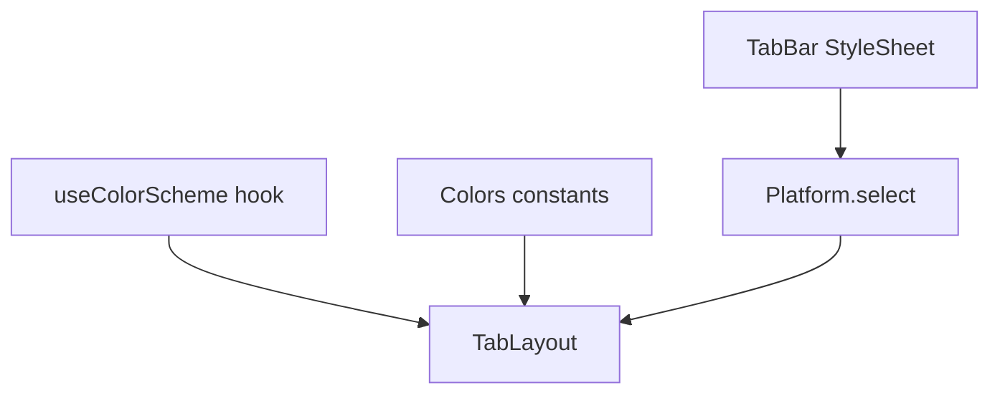

资料来源： \[app/（translate）/\_layout.tsx

13-26\]（[https://github.com/Mengbooo/TransBemo/blob/d3383946/app/（翻译）/\_layout.tsx#L13-L26](<https://github.com/Mengbooo/TransBemo/blob/d3383946/app/(translate)/_layout.tsx#L13-L26>)）

\[app/（翻译）/\_layout.tsx

34-45\]（[https://github.com/Mengbooo/TransBemo/blob/d3383946/app/（翻译）/\_layout.tsx#L34-L45](<https://github.com/Mengbooo/TransBemo/blob/d3383946/app/(translate)/_layout.tsx#L34-L45>)）

##

数据流和状态管理

TransBemo 使用 Zustand 进行状态管理，提供了一种简单而强大的方法来处理应用程序状态。

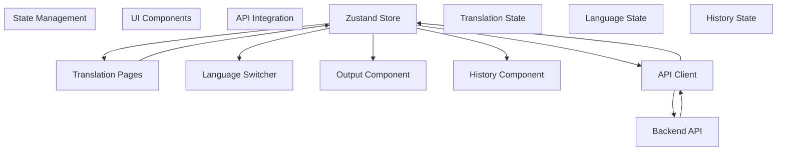

状态管理协调：

- 来自各种来源（文本、语音、图像）的用户输入
- 语言选择状态
- 翻译结果
- 历史记录

资料来源：\[package.json

48\]（[https://github.com/Mengbooo/TransBemo/blob/d3383946/package.json#L48-L48](https://github.com/Mengbooo/TransBemo/blob/d3383946/package.json#L48-L48)）

##

前端-后端集成

前端使用 Axios 与 HTTP 请求进行通信。API 客户端抽象化 API 调用和处理：

1.  对后端的翻译请求
2.  保存和检索翻译历史记录
3.  错误处理和响应格式

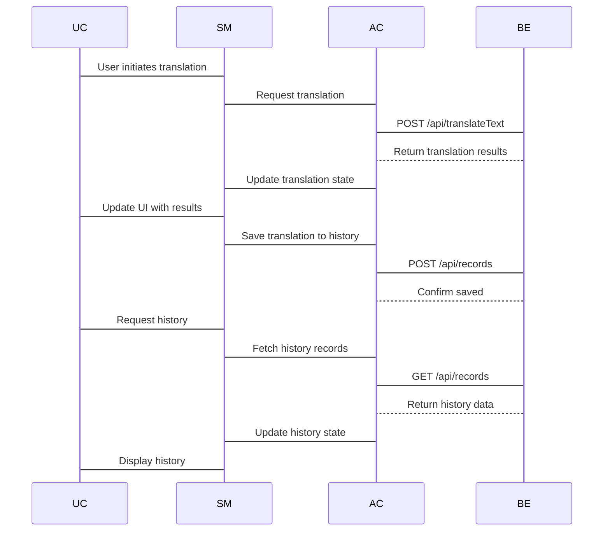

资料来源：\[package.json

22\]（[https://github.com/Mengbooo/TransBemo/blob/d3383946/package.json#L22-L22](https://github.com/Mengbooo/TransBemo/blob/d3383946/package.json#L22-L22)）

##

平台注意事项

该应用程序旨在跨多个平台运行，具有一致的行为，但具有平台优化的 UI 元素。

| 平台     | 考虑                           |
| -------- | ------------------------------ |
| iOS 设备 | 本机选项卡栏样式、触觉反馈支持 |
| 人造人   | 特定于平台的 UI 调整           |
| 蹼       | 响应式布局、键盘输入处理       |

该应用程序使用 `Platform.select` 来应用特定于平台的样式，特别是对于选项卡栏和导航元素：

资料来源： \[app/（translate）/\_layout.tsx

38-45\]（[https://github.com/Mengbooo/TransBemo/blob/d3383946/app/（翻译）/\_layout.tsx#L38-L45](<https://github.com/Mengbooo/TransBemo/blob/d3383946/app/(translate)/_layout.tsx#L38-L45>)）

##

初始化和加载

该应用程序实现了一个简化的初始化过程，该过程：

1.  防止初始屏幕在加载资源之前自动隐藏
2.  加载自定义字体
3.  根据设备配色方案设置主题提供程序
4.  初始化导航结构

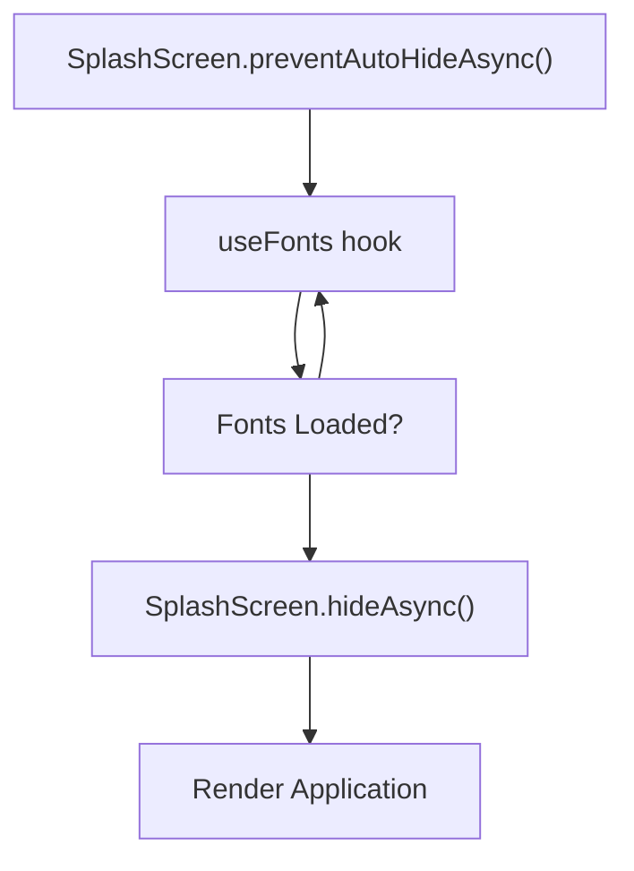

资料来源：[app/\_layout.tsx L12-L28](https://github.com/Mengbooo/TransBemo/blob/d3383946/app/_layout.tsx#L12-L28)

##

性能优化

TransBemo 实现了几个前端优化：

- 延迟加载 Tab 界面
- 具有优化渲染的自定义选项卡栏
- 重新激活以获得流畅的动画
- 使用 expo-asset 优化资产加载

这些优化可确保跨设备提供流畅、响应迅速的用户体验。

资料来源：\[package.json

24\]（[https://github.com/Mengbooo/TransBemo/blob/d3383946/package.json#L24-L24](https://github.com/Mengbooo/TransBemo/blob/d3383946/package.json#L24-L24)）

\[package.json

43\]（[https://github.com/Mengbooo/TransBemo/blob/d3383946/package.json#L43-L43](https://github.com/Mengbooo/TransBemo/blob/d3383946/package.json#L43-L43)）

#

文本翻译功能

> **  
> 相关源文件**
>
> - [api/textTransRequest.ts](https://github.com/Mengbooo/TransBemo/blob/d3383946/api/textTransRequest.ts)
> - [  
>   app/（翻译）/index.tsx](<https://github.com/Mengbooo/TransBemo/blob/d3383946/app/(translate)/index.tsx>)
>
> /index.tsx）
>
> - [components/translate/TranslateButton.tsx](https://github.com/Mengbooo/TransBemo/blob/d3383946/components/translate/TranslateButton.tsx)

本文档详细介绍了 TransBemo 中的文本翻译功能，包括 UI 组件、状态管理和用于在不同语言之间转换文本的后端集成。其他翻译方法请参见[语音翻译功能](/Mengbooo/TransBemo/2.2-speech-translation-feature)或[图片翻译功能](/Mengbooo/TransBemo/2.3-image-translation-feature) 。

##

概述

文本翻译功能允许用户输入一种语言的文本并接收另一种语言的翻译。该功能通过后端服务器连接到百度翻译 API，结果会立即显示给用户。翻译也可以保存到用户的历史记录中。

资料来源： \[app/（translate）/index.tsx

11-74\]（[https://github.com/Mengbooo/TransBemo/blob/d3383946/app/（翻译）/index.tsx#L11-L74](<https://github.com/Mengbooo/TransBemo/blob/d3383946/app/(translate)/index.tsx#L11-L74>)）

##

组件架构

文本翻译界面由多个模块化组件组成，这些组件处理翻译过程的特定方面：

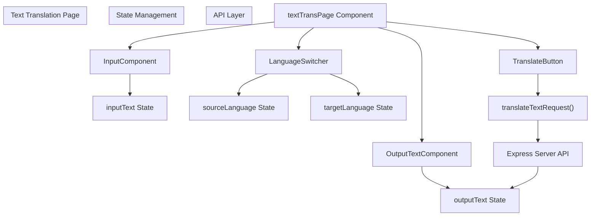

资料来源： \[app/（translate）/index.tsx

58-74\]（[https://github.com/Mengbooo/TransBemo/blob/d3383946/app/（翻译）/index.tsx#L58-L74](<https://github.com/Mengbooo/TransBemo/blob/d3383946/app/(translate)/index.tsx#L58-L74>)）

[components/translate/TranslateButton.tsx L8-L14](https://github.com/Mengbooo/TransBemo/blob/d3383946/components/translate/TranslateButton.tsx#L8-L14)

##

状态管理

文本翻译页面使用 React 的 useState 钩子管理几个状态变量：

| 状态变量 | 初始值     | 目的                 |
| -------- | ---------- | -------------------- |
| 输入文本 | "翻译内容" | 存储要翻译的文本     |
| 输出文本 | ""         | 存储翻译后的文本结果 |
| 源语言   | "中文"     | 存储源语言标签       |
| 目标语言 | "英语"     | 存储目标语言标签     |

这些状态变量作为 props 传递给相应的组件，并通过处理程序函数进行更新。

资料来源： \[app/（translate）/index.tsx

12-15\]（[https://github.com/Mengbooo/TransBemo/blob/d3383946/app/（翻译）/index.tsx#L12-L15](<https://github.com/Mengbooo/TransBemo/blob/d3383946/app/(translate)/index.tsx#L12-L15>)）

##

翻译流程

下面是从用户输入到显示结果的完整文本翻译过程的序列图：

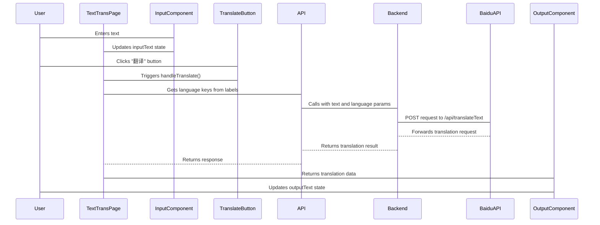

资料来源： \[app/（translate）/index.tsx

29-51\]（[https://github.com/Mengbooo/TransBemo/blob/d3383946/app/（翻译）/index.tsx#L29-L51](<https://github.com/Mengbooo/TransBemo/blob/d3383946/app/(translate)/index.tsx#L29-L51>)）

[api/textTransRequest.ts L4-L26](https://github.com/Mengbooo/TransBemo/blob/d3383946/api/textTransRequest.ts#L4-L26)

##

代码实现细节

###

文本翻译组件

主组件 `textTransPage` 封装了整个功能，并用作所有子组件的容器。它管理状态并处理转换逻辑：

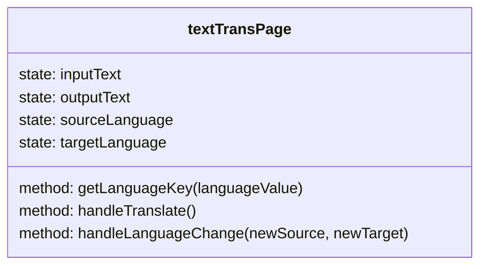

该组件的结构为函数组件，带有用于状态管理的钩子和用于用户交互的事件处理程序。

资料来源： \[app/（translate）/index.tsx

11-74\]（[https://github.com/Mengbooo/TransBemo/blob/d3383946/app/（翻译）/index.tsx#L11-L74](<https://github.com/Mengbooo/TransBemo/blob/d3383946/app/(translate)/index.tsx#L11-L74>)）

###

翻译 API 集成

文本翻译功能通过 `translateTextRequest` 函数与后端通信：

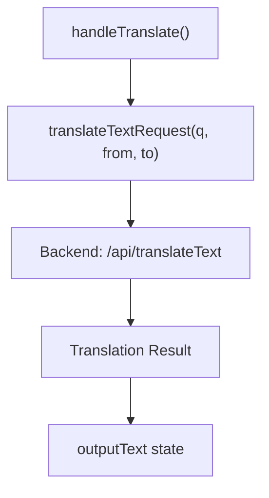

该函数采用三个参数：

- `q`：要翻译的文本
- `from`：源语言代码
- `to`：目标语言代码

它向后端 API 发出 HTTP POST 请求并返回响应数据，然后对其进行处理以提取翻译后的文本。

资料来源： [api/textTransRequest.ts L4-L26](https://github.com/Mengbooo/TransBemo/blob/d3383946/api/textTransRequest.ts#L4-L26)

\[app/（翻译）/index.tsx

29-51\]（[https://github.com/Mengbooo/TransBemo/blob/d3383946/app/（翻译）/index.tsx#L29-L51](<https://github.com/Mengbooo/TransBemo/blob/d3383946/app/(translate)/index.tsx#L29-L51>)）

##

用户界面组件

文本翻译界面由几个模块化组件组成：

###

输入组件

负责接受并显示要翻译的文本。用户可以在此组件中键入或粘贴文本。

### Output Component

显示翻译过程完成后的翻译文本结果。

###

Translate 按钮

一个可触摸的按钮组件，按下时启动翻译过程。它调用 `handleTranslate` 函数。

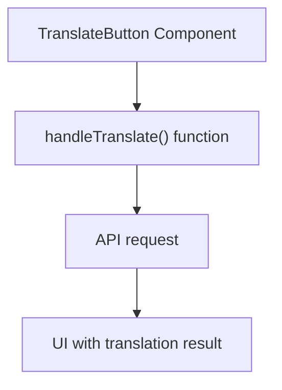

资料来源： [components/translate/TranslateButton.tsx L8-L14](https://github.com/Mengbooo/TransBemo/blob/d3383946/components/translate/TranslateButton.tsx#L8-L14)

###

语言切换器

允许用户选择要翻译的源语言和目标语言。此组件处理语言选择以及源语言和目标语言之间的切换。

资料来源： \[app/（translate）/index.tsx

53-56\]（[https://github.com/Mengbooo/TransBemo/blob/d3383946/app/（翻译）/index.tsx#L53-L56](<https://github.com/Mengbooo/TransBemo/blob/d3383946/app/(translate)/index.tsx#L53-L56>)）

\[app/（翻译）/index.tsx

64-70\]（[https://github.com/Mengbooo/TransBemo/blob/d3383946/app/（翻译）/index.tsx#L64-L70](<https://github.com/Mengbooo/TransBemo/blob/d3383946/app/(translate)/index.tsx#L64-L70>)）

##

文本翻译的数据流

文本翻译功能的完整数据流涉及几个步骤：

1.  用户在 input 组件中输入文本，这将更新 `inputText` 状态
2.  用户使用语言切换器选择源语言和目标语言
3.  用户按下 translate 按钮，触发 `handleTranslate` 函数
4.  该函数从所选语言标签中获取语言代码
5.  该函数使用文本和语言代码调用 `translateTextRequest`
6.  API 函数向后端服务器发出 POST 请求
7.  后端服务器处理请求并将其转发给百度翻译 API
8.  翻译结果返回给前端
9.  `outputText` 状态使用翻译后的文本进行更新
10. 输出组件重新渲染以显示已翻译的文本

资料来源： \[app/（translate）/index.tsx

29-51\]（[https://github.com/Mengbooo/TransBemo/blob/d3383946/app/（翻译）/index.tsx#L29-L51](<https://github.com/Mengbooo/TransBemo/blob/d3383946/app/(translate)/index.tsx#L29-L51>)）

[api/textTransRequest.ts L4-L26](https://github.com/Mengbooo/TransBemo/blob/d3383946/api/textTransRequest.ts#L4-L26)

##

与其他功能集成

文本翻译功能与 TransBemo 中的其他翻译功能共享多个组件：

- `TranslateBase`：跨翻译功能使用的通用布局组件
- `LanguageSwitcher`：用于所有翻译功能以选择语言
- `OutputTextComponent`：用于在多个特征中显示已翻译的文本

有关这些共享组件的更多信息，请参阅[共享 UI 组件](/Mengbooo/TransBemo/2.5-shared-ui-components) 。

资料来源： \[app/（translate）/index.tsx

2-6\]（[https://github.com/Mengbooo/TransBemo/blob/d3383946/app/（翻译）/index.tsx#L2-L6](<https://github.com/Mengbooo/TransBemo/blob/d3383946/app/(translate)/index.tsx#L2-L6>)）

\[app/（翻译）/index.tsx

58-74\]（[https://github.com/Mengbooo/TransBemo/blob/d3383946/app/（翻译）/index.tsx#L58-L74](<https://github.com/Mengbooo/TransBemo/blob/d3383946/app/(translate)/index.tsx#L58-L74>)）

##

总结

文本翻译功能为用户提供了一个简单的界面，可以在语言之间翻译文本。它利用 React Native 组件和状态管理来创建响应式用户体验，同时与后端服务器通信以通过百度翻译 API 执行实际翻译。

该功能演示了关注点的清晰分离，不同的组件处理 UI 元素、状态管理和 API 通信。这种模块化方法增强了可维护性，并允许在 TransBemo 应用程序内的不同翻译功能之间重用代码。

#

语音翻译功能

> **  
> 相关源文件**
>
> - [  
>   app/（翻译）/speechTrans.tsx](<https://github.com/Mengbooo/TransBemo/blob/d3383946/app/(translate)/speechTrans.tsx>)
>
> /speechTrans.tsx）
>
> - [components/animation/SoundWave.tsx](https://github.com/Mengbooo/TransBemo/blob/d3383946/components/animation/SoundWave.tsx)
> - [components/global/Button.tsx](https://github.com/Mengbooo/TransBemo/blob/d3383946/components/global/Button.tsx)

本文介绍了 TransBemo 的语音翻译功能，该功能使用户能够通过语音输入来翻译口语。此功能是应用程序提供的三种主要翻译方法之一，另外两个是文本和图像翻译。

有关基于文本的翻译的信息，请参阅[文本翻译功能](/Mengbooo/TransBemo/2.1-text-translation-feature) 。有关基于图像的翻译，请参阅[图像翻译功能](/Mengbooo/TransBemo/2.3-image-translation-feature) 。

##

概述

语音翻译功能允许用户：

- 使用设备的麦克风录制语音
- 将口语转换为文本
- 将转换后的文本翻译成目标语言
- 查看翻译后的输出

此功能对于喜欢说话而不是打字、需要免提翻译或想要练习不同语言发音的用户特别有用。

##

组件架构

语音翻译功能是通过一组分层组织的特定 React Native 组件实现的。

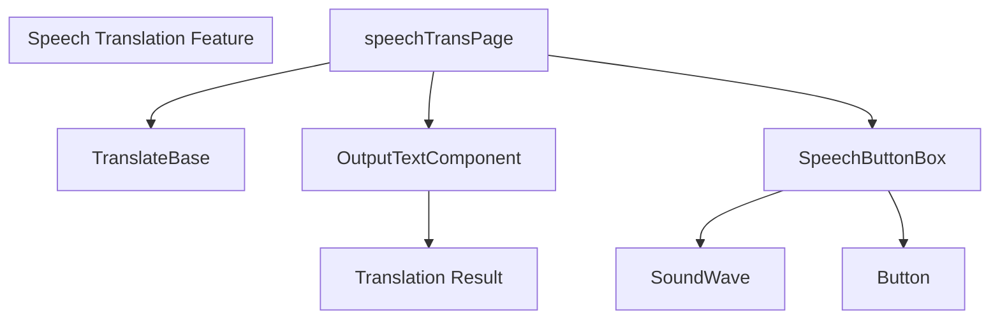

资料来源：\[app/（translate）/speechTrans.tsx

1-34\]（[https://github.com/Mengbooo/TransBemo/blob/d3383946/app/（翻译）/speechTrans.tsx#L1-L34](<https://github.com/Mengbooo/TransBemo/blob/d3383946/app/(translate)/speechTrans.tsx#L1-L34>)）

[components/animation/SoundWave.tsx L1-L71](https://github.com/Mengbooo/TransBemo/blob/d3383946/components/animation/SoundWave.tsx#L1-L71)

[components/global/Button.tsx L1-L36](https://github.com/Mengbooo/TransBemo/blob/d3383946/components/global/Button.tsx#L1-L36)

##

主要组件

###

语音翻译页面

语音翻译的主页面组件在 `speechTrans.tsx` 中定义。此组件充当语音翻译界面的容器，并管理输入文本状态。

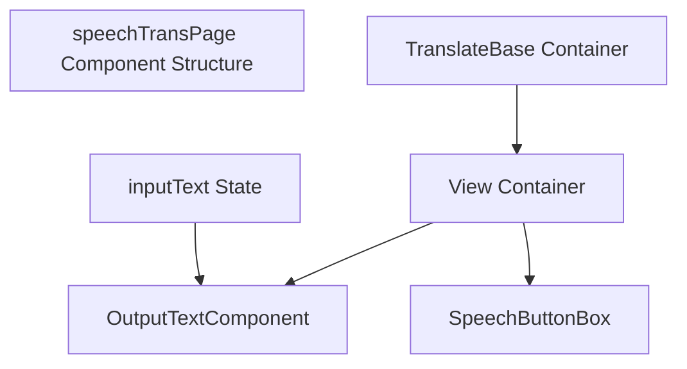

资料来源：\[app/（translate）/speechTrans.tsx

9-20\]（[https://github.com/Mengbooo/TransBemo/blob/d3383946/app/（翻译）/speechTrans.tsx#L9-L20](<https://github.com/Mengbooo/TransBemo/blob/d3383946/app/(translate)/speechTrans.tsx#L9-L20>)）

###

SoundWave 动画

`SoundWave` 组件通过创建声波的动画表示形式，在语音录制期间提供视觉反馈。这通过在应用程序捕获音频时提供清晰的反馈来增强用户体验。

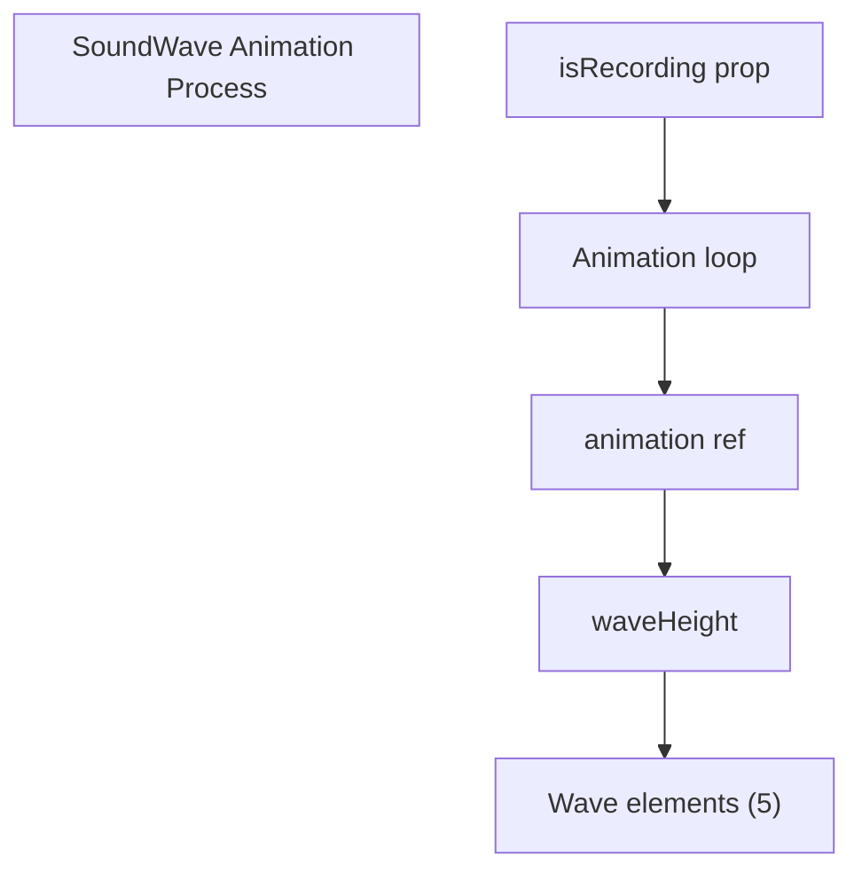

该组件会创建五个动画条，当录音处于活动状态时，这些条会放大和缩小以模拟声波。

资料来源： [components/animation/SoundWave.tsx L4-L55](https://github.com/Mengbooo/TransBemo/blob/d3383946/components/animation/SoundWave.tsx#L4-L55)

###

按钮组件

该应用程序使用可重用的 `Button` 组件，该组件用作用户界面的一部分，用于触发语音识别。

```mermaid
flowchart TD

subgraph Button_Component ["Button Component"]
end

ButtonProps["ButtonProps Interface"]
PressableElement["Pressable Element"]
IconContainer["Icon Container"]
IconProp["icon Prop"]

    ButtonProps --> PressableElement
    PressableElement --> IconContainer
    IconContainer --> IconProp
```

按钮组件设计有 `onPressIn` 和 `onPressOut` 属性，这表明它旨在用于语音录制界面中典型的按住作。

资料来源： [components/global/Button.tsx L5-L18](https://github.com/Mengbooo/TransBemo/blob/d3383946/components/global/Button.tsx#L5-L18)

##

与 Translation System 集成

语音翻译功能已集成到更广泛的 TransBemo 翻译系统中，作为三种输入方法之一，所有输入方法都流入同一翻译管道。

```mermaid
flowchart TD

subgraph Translation_Pipeline ["Translation Pipeline"]
end

subgraph Input_Methods ["Input Methods"]
end

TextInput["Text Input"]
SpeechInput["Speech Input"]
ImageInput["Image Input"]
TextContent["Text Content"]
TranslationRequest["Translation Request"]
BackendProcessing["Express Backend"]
BaiduAPI["Baidu Translate API"]
TranslatedOutput["Translated Text"]
RecordStorage["Translation Records"]

    SpeechInput --> TextContent
    TextInput --> TextContent
    ImageInput --> TextContent
    TextContent --> TranslationRequest
    TranslationRequest --> BackendProcessing
    BackendProcessing --> BaiduAPI
    BaiduAPI --> BackendProcessing
    BackendProcessing --> TranslatedOutput
    BackendProcessing --> RecordStorage
```

来源：基于系统架构图

##

用户流程

TransBemo 中语音翻译的典型用户流程遵循以下顺序：

```mermaid
sequenceDiagram
  participant User
  participant UI
  participant Backend
  participant BaiduTransAPI

  User->UI: Navigate to Speech Translation tab
  User->UI: Press and hold speech button
  Note over UI: SoundWave animation activates
  User->UI: Speak text to translate
  User->UI: Release button
  UI->Backend: Process speech to text
  Backend->BaiduTransAPI: Send text for translation
  BaiduTransAPI-->Backend: Forward translation request
  Backend-->UI: Return translation
  UI->User: Return translation result
```

来源：基于 \[app/（translate）/speechTrans.tsx 中的组件结构

9-20\]（[https://github.com/Mengbooo/TransBemo/blob/d3383946/app/（翻译）/speechTrans.tsx#L9-L20](<https://github.com/Mengbooo/TransBemo/blob/d3383946/app/(translate)/speechTrans.tsx#L9-L20>)）

和系统架构图

##

技术实现细节

###

语音翻译页面

`speechTrans.tsx` 文件定义了主要组件结构：

```
export default function speechTransPage() {
  const [inputText, setInputText] = useState("");

  return (
    <TranslateBase>
      <View style={styles.textContainer}>
        <OutputTextComponent inputText={inputText}></OutputTextComponent>
        <SpeechButtonBox></SpeechButtonBox>
      </View>
    </TranslateBase>
  );
}
```

此组件维护一个 `inputText` 状态，该状态将传递给 `OutputTextComponent` 以显示已翻译的文本。`SpeechButtonBox` 组件处理语音输入功能。

资料来源：\[app/（translate）/speechTrans.tsx

9-20\]（[https://github.com/Mengbooo/TransBemo/blob/d3383946/app/（翻译）/speechTrans.tsx#L9-L20](<https://github.com/Mengbooo/TransBemo/blob/d3383946/app/(translate)/speechTrans.tsx#L9-L20>)）

###

SoundWave 动画实现

`SoundWave` 组件可创建声波的动画可视化效果：

```mermaid
flowchart TD

subgraph SoundWave_Animation_Logic ["SoundWave Animation Logic"]
end

IsRecording["isRecording boolean prop"]
UseEffect["useEffect hook"]
AnimationStart["Animation start"]
AnimationStop["Animation stop"]
RenderBars["Render 5 animated bars"]
AnimatedLoop["Animated.loop"]

    IsRecording --> UseEffect
    UseEffect --> AnimationStart
    UseEffect --> AnimationStop
    AnimationStart --> AnimatedLoop
    AnimatedLoop --> RenderBars
    AnimationStop --> RenderBars
```

该动画使用 React Native 的 `Animated` API 来创建脉动效果，直观地表示正在捕获的音频输入。

资料来源： [components/animation/SoundWave.tsx L4-L54](https://github.com/Mengbooo/TransBemo/blob/d3383946/components/animation/SoundWave.tsx#L4-L54)

##

与其他翻译功能的比较

| 特征     | 输入法    | 视觉反馈       | 用户交互         |
| -------- | --------- | -------------- | ---------------- |
| 文本翻译 | 键盘输入  | 没有           | 键入并按翻译按钮 |
| 语音翻译 | 麦克风    | SoundWave 动画 | 按住语音按钮     |
| 图像翻译 | 相机/图库 | 图像预览       | 拍摄/选择照片    |

来源：系统架构概述

##

结论

TransBemo 中的语音翻译功能为用户提供了高效的免提翻译方式。通过将语音识别与应用程序的翻译管道相结合，它为在不同语言之间转换口语创造了无缝体验。

该功能是使用 React Native 组件构建的，这些组件协同工作，在录制过程中提供直观的用户界面和适当的视觉反馈。与应用程序中的其他翻译方法一样，语音翻译利用百度翻译 API 来执行实际翻译并存储记录以供将来参考。

#

图像翻译功能

> **  
> 相关源文件**
>
> - [  
>   app/（翻译）/imageTrans.tsx](<https://github.com/Mengbooo/TransBemo/blob/d3383946/app/(translate)/imageTrans.tsx>)
>
> /imageTrans.tsx）

##

目的和范围

本文档详细介绍了 TransBemo 的 Image Translation 功能，该功能允许用户翻译图像中的文本。该功能使用户能够从他们的设备库中捕获照片或选择图像，从这些图像中提取文本并获取翻译。有关基于文本的翻译的信息，请参阅[文本翻译功能](/Mengbooo/TransBemo/2.1-text-translation-feature) 。有关基于语音的翻译，请参阅 [语音翻译功能](/Mengbooo/TransBemo/2.2-speech-translation-feature) 。

##

功能概述

图像翻译功能为从图像中提取和翻译文本提供了无缝的工作流程。此功能对于翻译旅行或日常生活中遇到的标志、文档、菜单或其他文本特别有用，而无需手动键入内容。

```mermaid
flowchart TD

User["User"]
Image["Image Source(Camera/Gallery)"]
ImageTrans["Image Translation Page(imageTrans.tsx)"]
TextExtraction["Text Extraction"]
Translation["Translation Service"]
Display["Display Results"]

    User --> Image
    Image --> ImageTrans
    ImageTrans --> TextExtraction
    TextExtraction --> Translation
    Translation --> Display
    Display --> User
```

资料来源： \[app/（translate）/imageTrans.tsx

9-20\]（[https://github.com/Mengbooo/TransBemo/blob/d3383946/app/（翻译）/imageTrans.tsx#L9-L20](<https://github.com/Mengbooo/TransBemo/blob/d3383946/app/(translate)/imageTrans.tsx#L9-L20>)）

##

组件架构

Image Translation 功能是使用模块化组件架构构建的，该架构与整个 TransBemo 应用程序结构集成。

```mermaid
flowchart TD

subgraph User_Actions ["User Actions"]
end

subgraph Image_Translation_Page ["Image Translation Page"]
end

ImageTransPage["imageTransPage(imageTrans.tsx)"]
TranslateBase["TranslateBase(Base container)"]
OutputComponent["OutputTextComponent(Display translated text)"]
ImageCont["ImageContainer(Display selected image)"]
ImageButtons["ImageButtonBox(Camera/Gallery buttons)"]
CaptureImage["Capture Image"]
PickImage["Select from Gallery"]
ViewTranslation["View Translation"]

    ImageTransPage --> TranslateBase
    TranslateBase --> OutputComponent
    TranslateBase --> ImageCont
    TranslateBase --> ImageButtons
    ImageButtons --> CaptureImage
    ImageButtons --> PickImage
    OutputComponent --> ViewTranslation
```

资料来源： \[app/（translate）/imageTrans.tsx

9-20\]（[https://github.com/Mengbooo/TransBemo/blob/d3383946/app/（翻译）/imageTrans.tsx#L9-L20](<https://github.com/Mengbooo/TransBemo/blob/d3383946/app/(translate)/imageTrans.tsx#L9-L20>)）

##

关键组件

Image Translation 功能由几个关键组件组成，这些组件协同工作以提供功能：

| 元件                                 | 文件                                            | 目的                           |
| ------------------------------------ | ----------------------------------------------- | ------------------------------ |
| imageTransPage                       | app/（翻译）/imageTrans.tsx                     | 用于图像翻译的主页面组件       |
| 翻译基地                             | 从 “@/components/global/TranslateBase” 导入     | 提供常见翻译 UI 元素的容器组件 |
| OutputTextComponent （输出文本组件） | 从 “@/components/translate/OutputBox” 导入      | 显示提取和翻译的文本           |
| 图像容器                             | 从 “@/components/translate/imageContainer” 导入 | 显示所选图像或捕获的图像       |
| ImageButtonBox 图片按钮框            | 从 “@/components/translate/ImageButtonBox” 导入 | 提供用于相机和图库访问的按钮   |

资料来源： \[app/（translate）/imageTrans.tsx

1-8\]（[https://github.com/Mengbooo/TransBemo/blob/d3383946/app/（翻译）/imageTrans.tsx#L1-L8](<https://github.com/Mengbooo/TransBemo/blob/d3383946/app/(translate)/imageTrans.tsx#L1-L8>)）

##

用户流程

图像翻译的用户流程遵循一个简单的过程：

```mermaid
sequenceDiagram
  participant User
  participant App
  participant Camera
  participant Gallery
  participant Backend

  User->App: Navigate to Image Translation tab
  User->App: Choose image source
  App->Camera: Open camera
  User->Camera: Capture image
  Camera->App: Return captured image
  App->Gallery: Open gallery
  User->Gallery: Select image
  Gallery->App: Return selected image
  App->Backend: Display selected image
  Backend->App: Send image for text extraction
  App->User: Extract text from image
```

资料来源： \[app/（translate）/imageTrans.tsx

9-20\]（[https://github.com/Mengbooo/TransBemo/blob/d3383946/app/（翻译）/imageTrans.tsx#L9-L20](<https://github.com/Mengbooo/TransBemo/blob/d3383946/app/(translate)/imageTrans.tsx#L9-L20>)）

##

实现细节

###

页面结构

Image Translation 页面作为 React 功能组件实现，用于设置必要的状态并呈现 UI 组件。该页面使用基于容器的方法， `其中 TranslateBase` 组件提供通用翻译功能。

```mermaid
flowchart TD

subgraph State_Management ["State Management"]
end

subgraph Component_Hierarchy ["Component Hierarchy"]
end

ImageTransPage["imageTransPage()"]
TranslateBase[""]
View[""]
Output[""]
ImageCont[""]
ButtonBox[""]
InputText["inputText (useState)"]

    ImageTransPage --> TranslateBase
    TranslateBase --> View
    View --> Output
    View --> ImageCont
    View --> ButtonBox
    InputText --> Output
```

页面布局通过应用于主视图容器的样式来垂直组织组件，并在组件之间留出空间。

资料来源： \[app/（translate）/imageTrans.tsx

9-35\]（[https://github.com/Mengbooo/TransBemo/blob/d3383946/app/（翻译）/imageTrans.tsx#L9-L35](<https://github.com/Mengbooo/TransBemo/blob/d3383946/app/(translate)/imageTrans.tsx#L9-L35>)）

###

状态管理

图像翻译页面使用 React 的 `useState` 钩子维护输入文本的状态。从图像中提取文本时，此状态可能会更新。

```
const [inputText, setInputText] = useState("");
```

此状态将传递给 `OutputTextComponent` 以显示提取和翻译的文本。

资料来源： \[app/（translate）/imageTrans.tsx

10\]（[https://github.com/Mengbooo/TransBemo/blob/d3383946/app/（翻译）/imageTrans.tsx#L10-L10](<https://github.com/Mengbooo/TransBemo/blob/d3383946/app/(translate)/imageTrans.tsx#L10-L10>)）

###

图像捕获和选择

图像捕获和选择功能封装在 `ImageButtonBox` 组件中。尽管实现详细信息在提供的文件中不直接可见，但此组件可能提供：

1.  用于打开设备相机以捕获新图像的按钮
2.  用于访问设备库以选择现有映像的按钮

这些作将利用 Expo 的 `ImagePicker` 和 `Camera` API 来访问设备功能。

资料来源： \[app/（translate）/imageTrans.tsx

17\]（[https://github.com/Mengbooo/TransBemo/blob/d3383946/app/（翻译）/imageTrans.tsx#L17-L17](<https://github.com/Mengbooo/TransBemo/blob/d3383946/app/(translate)/imageTrans.tsx#L17-L17>)）

###

图像显示

`ImageContainer` 组件负责显示所选图像或捕获的图像。此组件将呈现图像，并可能提供用于调整图像视图或取消选择的选项。

资料来源： \[app/（translate）/imageTrans.tsx

16\]（[https://github.com/Mengbooo/TransBemo/blob/d3383946/app/（翻译）/imageTrans.tsx#L16-L16](<https://github.com/Mengbooo/TransBemo/blob/d3383946/app/(translate)/imageTrans.tsx#L16-L16>)）

###

文本提取和翻译过程

文本提取和翻译过程可能遵循以下步骤：

1.  图像由用户捕获或选择
2.  图像被处理（可能使用 OCR - 光学字符识别）
3.  提取的文本存储在 `inputText` 状态中
4.  文本被发送到翻译 API（根据系统架构的百度翻译 API）
5.  翻译后的文本将显示在 `OutputTextComponent` 中

```mermaid
flowchart TD

Image["Selected Image"]
OCR["OCR Processing"]
ExtractedText["Extracted Text(inputText state)"]
API["Translation API(Baidu Translate)"]
Result["Translation Result"]
Display["OutputTextComponent"]

    Image --> OCR
    OCR --> ExtractedText
    ExtractedText --> API
    API --> Result
    Result --> Display
```

资料来源： \[app/（translate）/imageTrans.tsx

9-20\]（[https://github.com/Mengbooo/TransBemo/blob/d3383946/app/（翻译）/imageTrans.tsx#L9-L20](<https://github.com/Mengbooo/TransBemo/blob/d3383946/app/(translate)/imageTrans.tsx#L9-L20>)）

##

与其他子系统集成

图像翻译功能与其他 TransBemo 子系统集成，以提供完整的翻译体验：

1.  **翻译 API 集成** ：与[翻译 API](/Mengbooo/TransBemo/3.1-translation-api) 中详述的后端翻译服务连接
2.  **语言管理** ：利用[语言管理](/Mengbooo/TransBemo/4-language-management)中描述的语言选择和管理功能
3.  **翻译历史记录** ：将已完成的翻译保存到历史记录中，如[翻译历史记录](/Mengbooo/TransBemo/2.4-translation-history)中所述

##

布局和样式

Image Translation 页面使用灵活的布局来适应不同的屏幕大小和方向。主容器占据完整的垂直空间，并在其子项之间留出空间来定位其子项。

关键样式元素包括：

- 容器宽度设置为父项的 90%
- 灵活的布局，带间距对齐
- 上边距 20 个单位
- 标题的粗体文本样式

资料来源： \[app/（translate）/imageTrans.tsx

23-35\]（[https://github.com/Mengbooo/TransBemo/blob/d3383946/app/（翻译）/imageTrans.tsx#L23-L35](<https://github.com/Mengbooo/TransBemo/blob/d3383946/app/(translate)/imageTrans.tsx#L23-L35>)）

##

总结

图像翻译功能提供了一个直观的界面，用于从图像中提取和翻译文本。通过与设备相机和图库功能集成，它允许用户快速翻译他们遇到的文本，而无需手动输入。模块化组件架构确保了可维护性以及与整个 TransBemo 应用程序的集成。

#

翻译历史记录

> **  
> 相关源文件**
>
> - [  
>   app/（翻译）/history.tsx](<https://github.com/Mengbooo/TransBemo/blob/d3383946/app/(translate)/history.tsx>)
>
> /history.tsx）
>
> - [components/translate/ImageButtonBox.tsx](https://github.com/Mengbooo/TransBemo/blob/d3383946/components/translate/ImageButtonBox.tsx)
> - [  
>   常量/Languages.ts](https://github.com/Mengbooo/TransBemo/blob/d3383946/constants/Languages.ts)

##

目的和范围

本文档详细介绍了 TransBemo 的翻译历史功能，该功能允许用户查看他们过去的翻译。该功能记录并显示以前翻译的内容，包括源语言和目标语言、输入和输出文本以及使用的翻译方法。有关执行翻译的信息，请参阅[文本翻译功能](/Mengbooo/TransBemo/2.1-text-translation-feature) 、 [语音翻译功能和](/Mengbooo/TransBemo/2.2-speech-translation-feature)[图像翻译功能](/Mengbooo/TransBemo/2.3-image-translation-feature) 。

##

概述

Translation History 系统维护用户执行的所有翻译的记录。当用户翻译文本、语音或图像时，翻译数据将保存到数据库中，以后可以检索并显示在专用的历史记录屏幕中。

```mermaid
flowchart TD

subgraph History_Access_Flow ["History Access Flow"]
end

subgraph Translation_Flow ["Translation Flow"]
end

UserTranslate["User performs translation"]
TranslationResult["Translation result returned"]
SaveRecord["Save translation record"]
NavigateHistory["User navigates to history"]
FetchRecords["Fetch translation records"]
DisplayHistory["Display translation history"]
Database["MongoDB"]

    UserTranslate --> TranslationResult
    TranslationResult --> SaveRecord
    SaveRecord --> Database
    NavigateHistory --> FetchRecords
    FetchRecords --> Database
    FetchRecords --> DisplayHistory
```

资料来源： [app/（translate）/history.tsx](<https://github.com/Mengbooo/TransBemo/blob/d3383946/app/(translate)/history.tsx>)

##

前端实现

###

“历史记录屏幕”组件

历史记录屏幕以可滚动视图显示翻译记录列表。每条记录都由一个 `HistoryItem` 组件表示，该组件显示：

- 源语言
- 目标语言
- 输入文本
- 输出文本
- 翻译方法图标（文本、语音或图像）

```mermaid
flowchart TD

subgraph HistoryItem_Properties ["HistoryItem Properties"]
end

subgraph History_Screen_Structure ["History Screen Structure"]
end

HistoryScreen["historyScreen Component"]
SafeAreaView["SafeAreaView"]
Logo["App Logo"]
ScrollView["ScrollView"]
HistoryItems["Multiple HistoryItem Components"]
SourceLang["sourceLanguage"]
TargetLang["targetLanguage"]
InputText["inputText"]
OutputText["outputText"]
Method["translationMethod"]

    HistoryScreen --> SafeAreaView
    SafeAreaView --> Logo
    SafeAreaView --> ScrollView
    ScrollView --> HistoryItems
    HistoryItems --> SourceLang
    HistoryItems --> TargetLang
    HistoryItems --> InputText
    HistoryItems --> OutputText
    HistoryItems --> Method
```

资料来源：\[app/（translate）/history.tsx

20-39\]（[https://github.com/Mengbooo/TransBemo/blob/d3383946/app/（翻译）/history.tsx#L20-L39](<https://github.com/Mengbooo/TransBemo/blob/d3383946/app/(translate)/history.tsx#L20-L39>)）

当前的实现使用 mock 数据进行演示：

```mermaid
flowchart TD

HistoryScreen["historyScreen Component"]
MockData["mockHistoryData Array"]
MappingFunction["map() Function"]
RenderItems["Rendered HistoryItem Components"]

    HistoryScreen --> MockData
    MockData --> MappingFunction
    MappingFunction --> RenderItems
```

资料来源：\[app/（translate）/history.tsx

12-18\]（[https://github.com/Mengbooo/TransBemo/blob/d3383946/app/（翻译）/history.tsx#L12-L18](<https://github.com/Mengbooo/TransBemo/blob/d3383946/app/(translate)/history.tsx#L12-L18>)）

\[app/（翻译）/history.tsx

26-35\]（[https://github.com/Mengbooo/TransBemo/blob/d3383946/app/（翻译）/history.tsx#L26-L35](<https://github.com/Mengbooo/TransBemo/blob/d3383946/app/(translate)/history.tsx#L26-L35>)）

###

历史记录项显示

每个历史记录项都使用一个专用组件显示，该组件会设置翻译记录的格式以便于阅读。该布局包括以下部分：

1.  语言对（源到目标）
2.  原始输入文本
3.  已翻译的输出文本
4.  所用翻译方法的视觉指示器（文本、语音或图像图标）

##

后端实现

虽然在提供的代码文件中不直接可见，但系统架构表明翻译历史记录通过后端 API 进行管理并存储在 MongoDB 中。

###

记录管理 API

```mermaid
sequenceDiagram
  participant User
  participant FrontendHistory
  participant API
  participant DB

  User->FrontendHistory: Navigate to history tab
  FrontendHistory->API: GET /api/records
  API->DB: Query translation records
  DB-->API: Return records
  API-->FrontendHistory: Send records as JSON
  FrontendHistory->User: Display formatted history
```

##

翻译记录数据模型

基于前端实现，每条翻译记录包含：

| 田                         | 描述                             | 类型          |
| -------------------------- | -------------------------------- | ------------- |
| 源语言                     | 原文的语言代码                   | 字符串        |
| 目标语言                   | 翻译文本的语言代码               | 字符串        |
| 输入文本                   | 用户提供的原始文本               | 字符串        |
| 输出文本                   | 翻译文本结果                     | 字符串        |
| translationMethod 翻译方法 | 翻译方法指标（文本、语音、图像） | 图标/字符串   |
| 时间戳                     | 执行翻译的时间                   | 日期 （隐含） |

资料来源：\[app/（translate）/history.tsx

12-18\]（[https://github.com/Mengbooo/TransBemo/blob/d3383946/app/（翻译）/history.tsx#L12-L18](<https://github.com/Mengbooo/TransBemo/blob/d3383946/app/(translate)/history.tsx#L12-L18>)）

[  
常数/Languages.ts L2-L29](https://github.com/Mengbooo/TransBemo/blob/d3383946/constants/Languages.ts#L2-L29)

##

与翻译功能集成

```mermaid
flowchart TD

subgraph Frontend_Views ["Frontend Views"]
end

subgraph Storage ["Storage"]
end

subgraph Backend_Services ["Backend Services"]
end

subgraph Translation_Features ["Translation Features"]
end

TextTrans["Text Translation"]
SpeechTrans["Speech Translation"]
ImageTrans["Image Translation"]
API["Express API"]
TranslateAPI["Translation API"]
RecordAPI["Record API"]
DB["MongoDB"]
HistoryView["History Screen"]

    TextTrans --> API
    SpeechTrans --> API
    ImageTrans --> API
    API --> TranslateAPI
    TranslateAPI --> API
    API --> RecordAPI
    RecordAPI --> DB
    HistoryView --> RecordAPI
    RecordAPI --> HistoryView
```

资料来源： [app/（translate）/history.tsx](<https://github.com/Mengbooo/TransBemo/blob/d3383946/app/(translate)/history.tsx>)

##

用户体验流程

1.  用户使用可用方法之一（文本、语音、图像）执行翻译
2.  翻译结果显示给用户
3.  翻译记录自动保存到数据库
4.  用户导航到 History 选项卡
5.  应用程序获取并显示所有过去的翻译
6.  用户可以滚动浏览他们的翻译历史记录

资料来源：\[app/（translate）/history.tsx

22-38\]（[https://github.com/Mengbooo/TransBemo/blob/d3383946/app/（翻译）/history.tsx#L22-L38](<https://github.com/Mengbooo/TransBemo/blob/d3383946/app/(translate)/history.tsx#L22-L38>)）

##

当前实施状态

代码库中的当前实现使用 mock 数据进行演示。模拟数据数组创建 10 个带有占位符文本的示例翻译记录。在生产环境中，这将替换为实际的 API 调用，以从数据库中检索真实的翻译记录。

要完成实施，需要满足以下条件：

1.  API 集成以获取真实的翻译记录
2.  排序功能（可能按日期排序，最近的在前）
3.  用于高效加载大型历史列表的分页
4.  可能的筛选选项（按语言对、翻译方法等）

资料来源：\[app/（translate）/history.tsx

12-18\]（[https://github.com/Mengbooo/TransBemo/blob/d3383946/app/（翻译）/history.tsx#L12-L18](<https://github.com/Mengbooo/TransBemo/blob/d3383946/app/(translate)/history.tsx#L12-L18>)）

#

共享 UI 组件

> **  
> 相关源文件**
>
> - [components/global/TranslateBase.tsx](https://github.com/Mengbooo/TransBemo/blob/d3383946/components/global/TranslateBase.tsx)
> - [components/translate/LanguageSwitcher.tsx](https://github.com/Mengbooo/TransBemo/blob/d3383946/components/translate/LanguageSwitcher.tsx)
> - [  
>   样式/translateCommonStyles.ts](https://github.com/Mengbooo/TransBemo/blob/d3383946/styles/translateCommonStyles.ts)

##

目的和范围

本页记录了 TransBemo 的不同翻译功能中使用的可重用 UI 组件。这些共享组件提供一致的用户体验，并减少文本、语音和图像翻译功能之间的代码重复。具体翻译功能请参见[文本翻译、](/Mengbooo/TransBemo/2.1-text-translation-feature) [语音翻译和](/Mengbooo/TransBemo/2.2-speech-translation-feature)[图片翻译。](/Mengbooo/TransBemo/2.3-image-translation-feature)

##

共享组件概述

TransBemo 应用程序使用多个共享的 UI 组件，这些组件在不同的翻译界面中提供通用功能。这些组件可确保用户体验的一致性，同时促进代码的可重用性。

```mermaid
flowchart TD

subgraph Translation_Features ["Translation Features"]
end

subgraph Shared_UI_Components ["Shared UI Components"]
end

TranslateBase["TranslateBase(Layout Container)"]
LanguageSwitcher["LanguageSwitcher(Language Selection)"]
CommonStyles["translateCommonStyles(Shared Styling)"]
TextTranslation["Text Translation"]
SpeechTranslation["Speech Translation"]
ImageTranslation["Image Translation"]

    TextTranslation --> TranslateBase
    SpeechTranslation --> TranslateBase
    ImageTranslation --> TranslateBase
    TextTranslation --> LanguageSwitcher
    SpeechTranslation --> LanguageSwitcher
    ImageTranslation --> LanguageSwitcher
    TextTranslation --> CommonStyles
    SpeechTranslation --> CommonStyles
    ImageTranslation --> CommonStyles
    TranslateBase --> CommonStyles
```

资料来源： [components/global/TranslateBase.tsx](https://github.com/Mengbooo/TransBemo/blob/d3383946/components/global/TranslateBase.tsx)

[components/translate/LanguageSwitcher.tsx](https://github.com/Mengbooo/TransBemo/blob/d3383946/components/translate/LanguageSwitcher.tsx)

[  
样式/translateCommonStyles.ts](https://github.com/Mengbooo/TransBemo/blob/d3383946/styles/translateCommonStyles.ts)

##

TranslateBase 组件

`TranslateBase` 是一个基础布局组件，可为应用程序中的所有翻译屏幕提供一致的容器。

###

实现细节

该组件将其子组件包装在具有通用样式的 `SafeAreaView` 中，并在顶部包含应用程序徽标。它旨在成为特定翻译功能组件的容器。

```mermaid
flowchart TD

TranslateBase["TranslateBase"]
SafeAreaView["SafeAreaView"]
Logo["Logo Image"]
Children["Children (Translation Feature UI)"]
CommonStyles["translateCommonStyles"]

    TranslateBase --> SafeAreaView
    SafeAreaView --> Logo
    SafeAreaView --> Children
    CommonStyles --> SafeAreaView
```

###

主要特点

- 提供一致的布局和定位
- 包括应用程序徽标
- 正确处理不同设备上的安全区域
- 接受特定于功能的 UI 的子组件

###

用法

```
// Example usage in a translation screen
<TranslateBase>
  <LanguageSwitcher />
  {/* Other feature-specific components */}
</TranslateBase>
```

资料来源： [components/global/TranslateBase.tsx L1-L20](https://github.com/Mengbooo/TransBemo/blob/d3383946/components/global/TranslateBase.tsx#L1-L20)

##

LanguageSwitcher 组件

`LanguageSwitcher` 组件提供了一个一致的界面，用于在所有翻译功能中选择源语言和目标语言。

###

实现细节

此组件显示当前选定的源语言和目标语言，并允许用户通过模态界面更改它们。它还提供快速交换功能来交换源语言和目标语言。

```mermaid
flowchart TD

LanguageSwitcher["LanguageSwitcher"]
SourceButton["Source Language Button"]
SwapButton["Swap Languages Button"]
TargetButton["Target Language Button"]
Modal["Language Selection Modal"]
SearchInput["Language Search Input"]
LanguageList["Language List"]
LanguagesData["languagesLabelTemp(Language Data)"]

    LanguageSwitcher --> SourceButton
    LanguageSwitcher --> SwapButton
    LanguageSwitcher --> TargetButton
    LanguageSwitcher --> Modal
    Modal --> SearchInput
    Modal --> LanguageList
    LanguagesData --> LanguageList
```

###

主要特点

- 显示当前源语言和目标语言
- 允许通过单击切换语言
- 为语言选择提供可搜索的模式
- 在整个应用程序中实现一致的样式
- 通过回调将语言更改传达给父组件

###

props 接口

| 支柱             | 类型   | 描述             |
| ---------------- | ------ | ---------------- |
| 源语言           | 字符串 | 当前源语言       |
| 目标语言         | 字符串 | 当前目标语言     |
| onLanguageChange | 功能   | 更改语言时的回调 |

###

使用示例

```
<LanguageSwitcher
  sourceLanguage="English"
  targetLanguage="Chinese"
  onLanguageChange={(newSource, newTarget) => {
    // Handle language change
  }}
/>
```

资料来源： [components/translate/LanguageSwitcher.tsx L1-L190](https://github.com/Mengbooo/TransBemo/blob/d3383946/components/translate/LanguageSwitcher.tsx#L1-L190)

##

共享样式

该应用程序使用 `translateCommonStyles.ts` 中定义的一组通用样式来保持不同翻译功能之间的视觉一致性。

###

常见样式元素

| 风格   | 描述                                 |
| ------ | ------------------------------------ |
| 容器   | 内容居中的主容器样式                 |
| 商标   | 应用程序 logo 的样式                 |
| 发短信 | 具有一致字体大小和颜色的常见文本样式 |

###

用法

```
import translateCommonStyles from '@/styles/translateCommonStyles';

// Using in a component
<View style={translateCommonStyles.container}>
  <Text style={translateCommonStyles.text}>Content</Text>
</View>
```

资料来源： [styles/translateCommonStyles.ts L1-L23](https://github.com/Mengbooo/TransBemo/blob/d3383946/styles/translateCommonStyles.ts#L1-L23)

##

组件交互流程

下图说明了共享组件如何与翻译功能和整个应用程序流程集成：

```mermaid
flowchart TD

subgraph Shared_Components ["Shared Components"]
end

subgraph Translation_Features ["Translation Features"]
end

subgraph App_Container ["App Container"]
end

TabNavigation["Tab Navigation"]
TextTranslation["Text Translation"]
SpeechTranslation["Speech Translation"]
ImageTranslation["Image Translation"]
TranslateBase["TranslateBase"]
LanguageSwitcher["LanguageSwitcher"]
FeatureSpecificUI["Feature-specific UI"]
TranslationLogic["Translation Logic"]
APIRequests["Translation API Requests"]

    TabNavigation --> TextTranslation
    TabNavigation --> SpeechTranslation
    TabNavigation --> ImageTranslation
    TextTranslation --> TranslateBase
    SpeechTranslation --> TranslateBase
    ImageTranslation --> TranslateBase
    TranslateBase --> FeatureSpecificUI
    FeatureSpecificUI --> LanguageSwitcher
    LanguageSwitcher --> TranslationLogic
    TranslationLogic --> APIRequests
```

资料来源： [components/global/TranslateBase.tsx](https://github.com/Mengbooo/TransBemo/blob/d3383946/components/global/TranslateBase.tsx)

[components/translate/LanguageSwitcher.tsx](https://github.com/Mengbooo/TransBemo/blob/d3383946/components/translate/LanguageSwitcher.tsx)

##

实施结构

共享组件在代码库中遵循明确的组织模式：

```mermaid
flowchart TD

components["components/"]
global["global/"]
translate["translate/"]
styles["styles/"]
TranslateBase["TranslateBase.tsx"]
LanguageSwitcher["LanguageSwitcher.tsx"]
CommonStyles["translateCommonStyles.ts"]

    components --> global
    components --> translate
    global --> TranslateBase
    translate --> LanguageSwitcher
    styles --> CommonStyles
```

这种结构在逻辑上将全局共享组件 （`TranslateBase`） 与特定于翻译的共享组件 （`LanguageSwitcher`） 分开，使代码库更易于维护和组织。

资料来源： [components/global/TranslateBase.tsx](https://github.com/Mengbooo/TransBemo/blob/d3383946/components/global/TranslateBase.tsx)

[components/translate/LanguageSwitcher.tsx](https://github.com/Mengbooo/TransBemo/blob/d3383946/components/translate/LanguageSwitcher.tsx)

[  
样式/translateCommonStyles.ts](https://github.com/Mengbooo/TransBemo/blob/d3383946/styles/translateCommonStyles.ts)

##

最佳实践

TransBemo 中的共享 UI 组件演示了几个最佳实践：

1.  **组件可重用性** ：组件在设计时考虑了可重用性，接受 prop 进行自定义，同时保持一致的核心功能。
2.  **关注点分离** ：每个组件都有明确定义的职责，例如布局管理或语言选择。
3.  **一致的样式** ：将常用样式提取到共享样式表中，以实现功能之间的一致外观。
4.  **正确的 TypeScript 接口定义** ：组件使用 TypeScript 接口来明确定义它们的 props 并提高代码的可维护性。
5.  **基于回调的通信** ：组件通过回调 props 而不是直接的状态作与父组件通信。

资料来源： [components/global/TranslateBase.tsx](https://github.com/Mengbooo/TransBemo/blob/d3383946/components/global/TranslateBase.tsx)

[components/translate/LanguageSwitcher.tsx](https://github.com/Mengbooo/TransBemo/blob/d3383946/components/translate/LanguageSwitcher.tsx)

[  
样式/translateCommonStyles.ts](https://github.com/Mengbooo/TransBemo/blob/d3383946/styles/translateCommonStyles.ts)

#

后端架构

> **  
> 相关源文件**
>
> - [  
>   backend/.env 的](https://github.com/Mengbooo/TransBemo/blob/d3383946/backend/.env)
> - [  
>   后端/package.json](https://github.com/Mengbooo/TransBemo/blob/d3383946/backend/package.json)
> - [  
>   后端/server.js](https://github.com/Mengbooo/TransBemo/blob/d3383946/backend/server.js)

##

目的和范围

本文档介绍了 TransBemo 翻译应用程序的后端架构。它涵盖了服务器配置、API 路由结构、中间件使用和外部集成。有关前端如何与此后端交互的信息，请参阅[前端体系结构](/Mengbooo/TransBemo/2-frontend-architecture) 。有关翻译 API 实施的具体详细信息，请参阅[翻译 API](/Mengbooo/TransBemo/3.1-translation-api)，有关数据库配置的信息，请参阅[数据库和记录管理](/Mengbooo/TransBemo/3.2-database-and-records-management) 。

##

概述

TransBemo 的后端是使用 Express.js 构建的，Node.js 是一个极简的 Web 框架。它充当 React Native 前端和外部服务（主要是百度翻译 API）之间的中介。后端还管理 MongoDB 中的翻译记录。

```mermaid
flowchart TD

subgraph Frontend ["Frontend"]
end

subgraph External_Services ["External Services"]
end

subgraph Backend_System ["Backend System"]
end

Server["Express Server (server.js)"]
TextTransRoutes["Text Translation Routes"]
RecordRoutes["Record Management Routes"]
BaiduAPI["Baidu Translate API"]
MongoDB["MongoDB Database"]
Client["TransBemo App"]

    Server --> TextTransRoutes
    Server --> RecordRoutes
    TextTransRoutes --> BaiduAPI
    RecordRoutes --> MongoDB
    Client --> Server
    Server --> Client
```

资料来源： [backend/server.js](https://github.com/Mengbooo/TransBemo/blob/d3383946/backend/server.js)

[  
backend/.env 的](https://github.com/Mengbooo/TransBemo/blob/d3383946/backend/.env)

##

服务器配置

Express 服务器在 `server.js` 中配置，用作后端的入口点。它加载环境变量、设置中间件并定义 API 路由。

###

环境配置

应用程序使用存储在 `.env` 文件中的环境变量进行配置：

| 变量      | 目的                      |
| --------- | ------------------------- |
| MONGO_URI | MongoDB 连接字符串        |
| PORT      | 服务器端口（默认为 5000） |
| APPID     | 百度翻译 API 应用程序 ID  |
| APPKEY    | 百度翻译 API 密钥         |

资料来源： [backend/.env](https://github.com/Mengbooo/TransBemo/blob/d3383946/backend/.env)

[  
后端/server.js L6-L8](https://github.com/Mengbooo/TransBemo/blob/d3383946/backend/server.js#L6-L8)

###

服务器初始化

服务器使用以下组件在 `server.js` 中初始化：

```mermaid
flowchart TD

Start["Import dependencies"]
LoadEnv["Load environment variables"]
CreateApp["Create Express application"]
SetupMiddleware["Configure middleware (CORS, JSON parsing)"]
MountRoutes["Mount API routes"]
StartServer["Start server on configured port"]

    Start --> LoadEnv
    LoadEnv --> CreateApp
    CreateApp --> SetupMiddleware
    SetupMiddleware --> MountRoutes
    MountRoutes --> StartServer
```

资料来源： [backend/server.js L1-L27](https://github.com/Mengbooo/TransBemo/blob/d3383946/backend/server.js#L1-L27)

##

中间件配置

后端使用多个中间件包来处理跨域请求、JSON 解析和 URL 编码的表单数据：

| 中间件             | 目的                           |
| ------------------ | ------------------------------ |
| cors               | 启用跨域资源共享以允许前端请求 |
| express.json       | 解析传入的 JSON 请求           |
| express.urlencoded | 解析 URL 编码的表单数据        |

资料来源： [backend/server.js L15-L18](https://github.com/Mengbooo/TransBemo/blob/d3383946/backend/server.js#L15-L18)

[  
后端/package.json L13-L19](https://github.com/Mengbooo/TransBemo/blob/d3383946/backend/package.json#L13-L19)

##

API 路由结构

后端将其 API 端点组织到逻辑路由组中：

```mermaid
flowchart TD

subgraph Translation_Routes ["Translation Routes"]
end

subgraph Record_Routes ["Record Routes"]
end

Server["server.js"]
RecordRoutes["/api/records - Record Management"]
TextTransRoutes["/api - Text Translation"]
GetRecords["GET /"]
PostRecord["POST /"]
DeleteRecord["DELETE /:id"]
TranslateText["POST /translateText"]

    Server --> RecordRoutes
    Server --> TextTransRoutes
    RecordRoutes --> GetRecords
    RecordRoutes --> PostRecord
    RecordRoutes --> DeleteRecord
    TextTransRoutes --> TranslateText
```

这些路由使用以下方式挂载到服务器中：

- `app.use('/api/records', recordRoutes);`
- `app.use('/api', textTransRoutes);`

资料来源： [backend/server.js L20-L21](https://github.com/Mengbooo/TransBemo/blob/d3383946/backend/server.js#L20-L21)

##

外部集成

###

百度翻译 API

后端与用于文本翻译服务的百度翻译 API 集成。API 凭证在环境变量中配置：

```
APPID="20250325002314217"
APPKEY="4wA24W4DhIyPpB5YWJsL"
```

转换路由使用这些凭证来验证对 Baidu API 的请求。

资料来源： [backend/.env L4-L5](https://github.com/Mengbooo/TransBemo/blob/d3383946/backend/.env#L4-L5)

###

MongoDB 数据库

后端使用 MongoDB 存储翻译记录。数据库连接字符串在环境变量中定义：

```
MONGO_URI=mongodb://localhost:27017/transbemo
```

注意：实际的数据库连接代码似乎在服务器文件中被注释掉了，这表明它可能被有条件地启用或配置在其他地方。

资料来源： \[backend/.env

1\]（[https://github.com/Mengbooo/TransBemo/blob/d3383946/backend/.env#L1-L1](https://github.com/Mengbooo/TransBemo/blob/d3383946/backend/.env#L1-L1)）

\[后端/server.js

3\]（[https://github.com/Mengbooo/TransBemo/blob/d3383946/backend/server.js#L3-L3](https://github.com/Mengbooo/TransBemo/blob/d3383946/backend/server.js#L3-L3)）

[  
后端/server.js L12-L13](https://github.com/Mengbooo/TransBemo/blob/d3383946/backend/server.js#L12-L13)

##

请求处理流程

下图说明了通过后端系统的翻译请求流程：

```mermaid
sequenceDiagram
  participant Client
  participant Server
  participant TransRoute
  participant BaiduAPI
  participant RecordRoute
  participant MongoDB

  Client->Server: POST /api/translateText
  Server->TransRoute: Route to translation handler
  TransRoute->BaiduAPI: Request translation with credentials
  BaiduAPI-->TransRoute: Return translation result
  TransRoute-->Server: Format and return response
  Server-->Client: Send translation response
  Client->Server: POST /api/records
  Server->RecordRoute: Route to record handler
  RecordRoute->MongoDB: Store translation record
  MongoDB-->RecordRoute: Confirm storage
  RecordRoute-->Server: Return success response
  Server-->Client: Confirm record saved
```

资料来源： [backend/server.js](https://github.com/Mengbooo/TransBemo/blob/d3383946/backend/server.js)

[  
backend/.env 的](https://github.com/Mengbooo/TransBemo/blob/d3383946/backend/.env)

##

依赖

后端依赖于几个 npm 包：

| 包     | 版本         | 目的                                  |
| ------ | ------------ | ------------------------------------- |
| 表达   | ^5.1.0       | Node.js Web 框架                      |
| cors   | ^2.8.5       | 跨域资源共享中间件                    |
| 点颜   | ^16.5.0      | 环境变量加载器                        |
| 獴     | ^8.13.3      | MongoDB 对象建模工具                  |
| 穆尔特 | ^1.4.5-lts.2 | 用于处理 multipart/form-data 的中间件 |

资料来源： [backend/package.json L13-L19](https://github.com/Mengbooo/TransBemo/blob/d3383946/backend/package.json#L13-L19)

##

组件架构

后端的整体架构遵循模块化方法，将关注点分成不同的组件：

```mermaid
flowchart TD

subgraph External_Services ["External Services"]
end

subgraph Configuration ["Configuration"]
end

subgraph Route_Handlers ["Route Handlers"]
end

subgraph Entry_Point ["Entry Point"]
end

Server["server.js"]
TextTrans["textTransRoutes.js"]
Records["recordRoutes.js"]
EnvConfig[".env"]
BaiduAPI["Baidu Translate API"]
MongoDB["MongoDB"]

    Server --> TextTrans
    Server --> Records
    EnvConfig --> Server
    TextTrans --> BaiduAPI
    Records --> MongoDB
```

资料来源： [backend/server.js](https://github.com/Mengbooo/TransBemo/blob/d3383946/backend/server.js)

[  
backend/.env 的](https://github.com/Mengbooo/TransBemo/blob/d3383946/backend/.env)

##

总结

TransBemo 后端是一个轻量级的 Express.js 服务器，它提供：

1.  与百度翻译集成的翻译 API
2.  用于存储和检索翻译历史记录的记录管理
3.  React Native 前端的 RESTful 接口

后端在设计时考虑了关注点分离，将功能组织到逻辑路由模块中，同时使用环境变量进行配置。该系统充当前端应用程序与外部服务（如百度翻译 API 和 MongoDB 数据库）之间的桥梁。

#

翻译 API

> **  
> 相关源文件**
>
> - [api/textTransRequest.ts](https://github.com/Mengbooo/TransBemo/blob/d3383946/api/textTransRequest.ts)
> - [  
>   后端/路由/textTransRoutes.js](https://github.com/Mengbooo/TransBemo/blob/d3383946/backend/routes/textTransRoutes.js)

##

目的和范围

本文档详细介绍了 TransBemo 应用程序的 Translation API 组件，该组件充当前端翻译功能和百度翻译服务之间的桥梁。API 处理文本翻译请求，管理与外部翻译提供商的身份验证，并将格式化的响应返回给客户端应用程序。

有关翻译记录的数据库和存储的信息，请参阅[数据库和记录管理](/Mengbooo/TransBemo/3.2-database-and-records-management) 。

##

API 架构概述

翻译 API 是作为 Express.js 路由处理程序实现的，它处理来自前端的传入翻译请求，将其转发到百度翻译 API，并返回翻译结果。

```mermaid
flowchart TD

subgraph External_API ["External API"]
end

subgraph Backend_API ["Backend API"]
end

subgraph Frontend ["Frontend"]
end

TextInput["Text Input Component"]
SpeechInput["Speech Input Component"]
ImageInput["Image Input Component"]
TranslateRequest["translateTextRequest()"]
ExpressServer["Express Server"]
TranslateRoute["/api/translateText Endpoint"]
AuthHandler["Authentication Handler(appid, salt, sign generation)"]
BaiduAPI["Baidu Translation API"]
TextOutput["Translated Text Output"]

    TextInput --> TranslateRequest
    SpeechInput --> TranslateRequest
    ImageInput --> TranslateRequest
    TranslateRequest --> ExpressServer
    ExpressServer --> TranslateRoute
    TranslateRoute --> AuthHandler
    AuthHandler --> BaiduAPI
    BaiduAPI --> TranslateRoute
    TranslateRoute --> TranslateRequest
    TranslateRequest --> TextOutput
```

资料来源： [backend/routes/textTransRoutes.js L1-L79](https://github.com/Mengbooo/TransBemo/blob/d3383946/backend/routes/textTransRoutes.js#L1-L79)

[api/textTransRequest.ts L1-L26](https://github.com/Mengbooo/TransBemo/blob/d3383946/api/textTransRequest.ts#L1-L26)

##

API 实现细节

###

后端翻译端点

后端实现一个处理文本翻译请求的翻译终端节点：

| 端点               | 方法 | 描述                   |
| ------------------ | ---- | ---------------------- |
| /api/translateText | POST | 在指定语言之间翻译文本 |

####

请求参数

| 参数 | 类型   | 必填 | 描述         |
| ---- | ------ | ---- | ------------ |
| 问   | 字符串 | 是的 | 要翻译的文本 |
| 从   | 字符串 | 是的 | 源语言代码   |
| 自   | 字符串 | 是的 | 目标语言代码 |

####

响应格式

```
{
  "from": "en",
  "to": "zh",
  "trans_result": [
    {
      "src": "Hello world",
      "dst": "你好，世界"
    }
  ]
}
```

资料来源： [backend/routes/textTransRoutes.js L22-L77](https://github.com/Mengbooo/TransBemo/blob/d3383946/backend/routes/textTransRoutes.js#L22-L77)

###

与百度翻译 API 集成

后端 Translation API 使用以下过程与百度的 Translation 服务集成：

```mermaid
sequenceDiagram
  participant Client
  participant Server
  participant Auth
  participant Baidu

  Client->Server: POST /api/translateText (q, from, to)
  Server->Auth: Validate request parameters
  Auth-->Server: Generate salt and signature
  Server->Baidu: Return auth parameters
  Baidu-->Server: POST request with parameters
  Note over Server,Baidu: Parameters: q, from, to, appid, salt, sign
  Server-->Client: Translation response
```

身份验证过程包括：

1.  生成基于时间戳的盐
2.  通过拼接方式创建签名字符串：`appid + q + salt + appkey`
3.  使用 MD5 对签名字符串进行哈希处理
4.  将所有必需的参数发送到百度 API 端点

资料来源： [backend/routes/textTransRoutes.js L31-L48](https://github.com/Mengbooo/TransBemo/blob/d3383946/backend/routes/textTransRoutes.js#L31-L48)

###

参数编码

为了正确处理特殊字符和非 ASCII 文本，API 实现了 URL 参数编码：

```mermaid
flowchart TD

RequestParams["Request Parameters(q, from, to, appid, salt, sign)"]
URLEncoding["URL Parameter Encoding"]
EncodedURL["Encoded Request URL"]
BaiduAPI["Baidu Translation API"]

    RequestParams --> URLEncoding
    URLEncoding --> EncodedURL
    EncodedURL --> BaiduAPI
```

资料来源： [backend/routes/textTransRoutes.js L50-L63](https://github.com/Mengbooo/TransBemo/blob/d3383946/backend/routes/textTransRoutes.js#L50-L63)

##

前端集成

前端应用程序使用专用的请求函数与后端 Translation API 通信：

```mermaid
flowchart TD

subgraph Backend ["Backend"]
end

subgraph API_Client ["API Client"]
end

subgraph Frontend_Components ["Frontend Components"]
end

TransComponents["Translation UI Components"]
TranslateFunc["translateTextRequest()"]
ExpressAPI["/api/translateText Endpoint"]

    TransComponents --> TranslateFunc
    TranslateFunc --> ExpressAPI
    ExpressAPI --> TranslateFunc
    TranslateFunc --> TransComponents
```

`translateTextRequest` 函数：

1.  接受要翻译的文本 （`q`） 和语言参数 （`from`、`to`）
2.  使用这些参数构造请求正文
3.  向后端终端节点发出 HTTP POST 请求
4.  返回响应或引发错误

资料来源： [api/textTransRequest.ts L4-L26](https://github.com/Mengbooo/TransBemo/blob/d3383946/api/textTransRequest.ts#L4-L26)

##

错误处理

Translation API 在多个级别实现错误处理：

```mermaid
flowchart TD

subgraph Error_Responses ["Error Responses"]
end

subgraph API_Communication ["API Communication"]
end

subgraph Backend_Validation ["Backend Validation"]
end

ClientRequest["Client Request"]
ParamCheck["Parameter Validation(q, from, to required)"]
EnvCheck["Environment Variables Check(APPID, APPKEY)"]
BaiduRequest["Baidu API Request"]
ResponseProcess["Response Processing"]
ValidationError["400: Bad Request(Missing Parameters)"]
APIError["500: Server Error(Translation Request Failed)"]
ClientResponse["Client Response"]

    ClientRequest --> ParamCheck
    ParamCheck --> EnvCheck
    ParamCheck --> ValidationError
    EnvCheck --> BaiduRequest
    BaiduRequest --> ResponseProcess
    BaiduRequest --> APIError
    ResponseProcess --> ClientResponse
```

1.  **请求验证** ：检查必需的参数，如果缺少，则返回 400 错误
2.  **环境配置** ：验证 API 凭证是否已正确配置
3.  **API 通信** ：处理来自百度 API 的错误，如果翻译失败，则返回 500 错误

资料来源： [backend/routes/textTransRoutes.js L17-L20](https://github.com/Mengbooo/TransBemo/blob/d3383946/backend/routes/textTransRoutes.js#L17-L20)

[  
后端/路由/textTransRoutes.js L26-L29](https://github.com/Mengbooo/TransBemo/blob/d3383946/backend/routes/textTransRoutes.js#L26-L29)

[  
后端/路由/textTransRoutes.js L73-L76](https://github.com/Mengbooo/TransBemo/blob/d3383946/backend/routes/textTransRoutes.js#L73-L76)

##

配置

翻译 API 需要设置以下环境变量：

| 变量   | 描述                       |
| ------ | -------------------------- |
| APPID  | 百度翻译 API 的应用程序 ID |
| APPKEY | 百度翻译 API 的密钥        |

这些凭证是使用 dotenv 从环境中加载的，用于对百度翻译服务的请求进行身份验证。

资料来源： [backend/routes/textTransRoutes.js L4-L12](https://github.com/Mengbooo/TransBemo/blob/d3383946/backend/routes/textTransRoutes.js#L4-L12)

##

结论

翻译 API 是 TransBemo 应用程序中的关键组件，支持不同语言之间的无缝文本翻译。通过充当前端和百度翻译服务之间的中介，它处理了 API 身份验证、请求格式化和错误管理的复杂性，为客户端应用程序提供了一个简化的界面。

#

数据库和记录管理

> **  
> 相关源文件**
>
> - [  
>   backend/.env 的](https://github.com/Mengbooo/TransBemo/blob/d3383946/backend/.env)
> - [  
>   后端/config/db.js](https://github.com/Mengbooo/TransBemo/blob/d3383946/backend/config/db.js)
> - [  
>   后端/控制器/recordController.js](https://github.com/Mengbooo/TransBemo/blob/d3383946/backend/controllers/recordController.js)
> - [  
>   后端/模型/record.js](https://github.com/Mengbooo/TransBemo/blob/d3383946/backend/models/record.js)

本文档详细介绍了 TransBemo 中用于存储翻译历史记录的数据库配置和记录管理系统。它涵盖了 MongoDB 设置、数据库连接、架构定义以及管理翻译记录的控制器函数。有关生成这些记录的翻译 API 的信息，请参阅[翻译 API](/Mengbooo/TransBemo/3.1-translation-api)。

##

数据库配置

TransBemo 使用 MongoDB 作为其主数据库，以 Mongoose 作为 ODM（对象数据建模）库，以方便数据库作。

###

连接设置

数据库连接是通过专用连接模块建立的：

```mermaid
flowchart TD

A["server.js"]
B["connectDB()"]
C["process.env.MONGO_URI"]
D["mongoose.connect()"]
E["MongoDB transbemo database"]

    A --> B
    B --> C
    C --> D
    D --> E
```

标题： MongoDB Connection Flow

资料来源： [backend/config/db.js](https://github.com/Mengbooo/TransBemo/blob/d3383946/backend/config/db.js)

\[后端/.env

1\]（[https://github.com/Mengbooo/TransBemo/blob/d3383946/backend/.env#L1-L1](https://github.com/Mengbooo/TransBemo/blob/d3383946/backend/.env#L1-L1)）

连接配置包含以下组件：

1.  **连接函数** ：`db.js` 中的 `connectDB` 函数处理 MongoDB 连接设置和错误处理。
2.  **环境变量** ：MongoDB 连接 URI 作为 `MONGO_URI` 存储在 `.env` 文件中。
3.  **错误处理** ：连接函数包括一个 try-catch 块，如果连接失败，该块将退出进程。

```
// Example connection string format in .env file
MONGO_URI=mongodb://localhost:27017/transbemo
```

连接函数是从主服务器文件导入和调用的，以便在应用程序启动时建立数据库连接。

资料来源： [backend/config/db.js](https://github.com/Mengbooo/TransBemo/blob/d3383946/backend/config/db.js)

\[后端/.env

1\]（[https://github.com/Mengbooo/TransBemo/blob/d3383946/backend/.env#L1-L1](https://github.com/Mengbooo/TransBemo/blob/d3383946/backend/.env#L1-L1)）

##

记录架构和模型

翻译记录根据 Mongoose 架构定义进行结构化。

###

Schema 结构

标题： 翻译记录架构结构

资料来源： [backend/models/record.js](https://github.com/Mengbooo/TransBemo/blob/d3383946/backend/models/record.js)

`Record` 架构包含以下字段：

| 田         | 类型   | 必填 | 违约     | 描述               |
| ---------- | ------ | ---- | -------- | ------------------ |
| 源语言     | 字符串 | 是的 | \-       | 源文本的语言代码   |
| 目标语言   | 字符串 | 是的 | \-       | 目标文本的语言代码 |
| 输入文本   | 字符串 | 是的 | \-       | 要翻译的原始文本   |
| 输出文本   | 字符串 | 是的 | \-       | 翻译文本结果       |
| methodType | 日期   | 不   | 日期.now | 翻译的时间戳       |

**注意** ：字段 `methodType` 在架构中的命名似乎不正确。根据其类型 （Date） 和默认值 （Date.now），它可能表示时间戳而不是翻译方法类型。为清楚起见，未来的重构应考虑将其重命名为 `createdAt` 或 `timestamp`。

资料来源： [backend/models/record.js](https://github.com/Mengbooo/TransBemo/blob/d3383946/backend/models/record.js)

##

记录控制器

Record Controller 通过两个主要功能来管理 API 路由和数据库之间的交互：保存新记录和检索现有记录。

```mermaid
flowchart TD

A["API Routes"]
B["saveRecord()"]
C["getRecords()"]
D["Record.save()"]
E["MongoDB Query"]
F["MongoDB database"]

    A --> B
    A --> C
    B --> D
    C --> E
    D --> F
    E --> F
```

标题： Record Controller Functions Flow

资料来源： [backend/controllers/recordController.js L4-L22](https://github.com/Mengbooo/TransBemo/blob/d3383946/backend/controllers/recordController.js#L4-L22)

###

Save Record 功能

`saveRecord` 函数创建并存储新的翻译记录：

1.  通过 `req.body` 接收请求数据
2.  创建新的 Record 实例
3.  将记录保存到数据库
4.  成功时返回 201 状态和保存的记录数据
5.  返回 400 状态，失败时显示错误消息

资料来源： [backend/controllers/recordController.js L4-L12](https://github.com/Mengbooo/TransBemo/blob/d3383946/backend/controllers/recordController.js#L4-L12)

###

获取记录功能

`getRecords` 函数检索所有翻译记录：

1.  使用 `Record.find（）` 查询数据库中的所有记录
2.  成功时返回记录数组
3.  返回 500 状态，失败时显示错误消息

资料来源： [backend/controllers/recordController.js L15-L22](https://github.com/Mengbooo/TransBemo/blob/d3383946/backend/controllers/recordController.js#L15-L22)

##

数据流

###

保存翻译记录

以下序列图说明了保存新翻译记录的过程：

```mermaid
sequenceDiagram
  participant Frontend
  participant APIRoute
  participant Controller
  participant Model
  participant DB

  Frontend->APIRoute: POST /api/records
  Note over Frontend,APIRoute: JSON with translation details
  APIRoute->Controller: saveRecord(req, res)
  Controller->Model: new Record(req.body)
  Controller->Model: record.save()
  Model->DB: Document Insert
  DB-->Model: Confirmation
  Model-->Controller: Saved record
  Controller-->APIRoute: res.status(201).json(record)
  APIRoute-->Frontend: 201 Created with record
```

标题： 保存翻译记录的流程

资料来源： [backend/controllers/recordController.js L4-L12](https://github.com/Mengbooo/TransBemo/blob/d3383946/backend/controllers/recordController.js#L4-L12)

[  
后端/模型/record.js](https://github.com/Mengbooo/TransBemo/blob/d3383946/backend/models/record.js)

###

检索翻译历史记录

以下序列图说明了检索翻译历史记录的过程：

```mermaid
sequenceDiagram
  participant Frontend
  participant APIRoute
  participant Controller
  participant Model
  participant DB

  Frontend->APIRoute: GET /api/records
  APIRoute->Controller: getRecords(req, res)
  Controller->Model: Record.find()
  Model->DB: Find Query
  DB-->Model: Record documents
  Model-->Controller: records array
  Controller-->APIRoute: res.json(records)
  APIRoute-->Frontend: 200 OK with records array
```

标题： 检索翻译历史记录的流程

资料来源： [backend/controllers/recordController.js L15-L22](https://github.com/Mengbooo/TransBemo/blob/d3383946/backend/controllers/recordController.js#L15-L22)

[  
后端/模型/record.js](https://github.com/Mengbooo/TransBemo/blob/d3383946/backend/models/record.js)

##

与应用程序集成

数据库和记录管理系统通过以程与更广泛的 TransBemo 应用程序集成：

```mermaid
flowchart TD

subgraph Database ["Database"]
end

subgraph Backend_API ["Backend API"]
end

subgraph Frontend ["Frontend"]
end

TextTransPage["Text Translation Page"]
SpeechTransPage["Speech Translation Page"]
ImageTransPage["Image Translation Page"]
HistoryPage["Translation History Page"]
ExpressServer["server.js"]
RecordRoutes["recordRoutes.js"]
RecordController["recordController.js"]
RecordModel["record.js (Model)"]
MongoDB["MongoDB (transbemo)"]

    TextTransPage --> ExpressServer
    SpeechTransPage --> ExpressServer
    ImageTransPage --> ExpressServer
    HistoryPage --> ExpressServer
    ExpressServer --> RecordRoutes
    RecordRoutes --> RecordController
    RecordController --> RecordModel
    RecordModel --> MongoDB
```

标题： 应用程序与数据库系统集成

资料来源： [backend/controllers/recordController.js](https://github.com/Mengbooo/TransBemo/blob/d3383946/backend/controllers/recordController.js)

[  
后端/模型/record.js](https://github.com/Mengbooo/TransBemo/blob/d3383946/backend/models/record.js)

[  
后端/config/db.js](https://github.com/Mengbooo/TransBemo/blob/d3383946/backend/config/db.js)

##

当前限制和未来增强功能

当前实现提供了基本的记录存储和检索功能，但可以考虑以下几项增强功能：

1.  **分页** ：目前，`getRecords（）` 返回所有没有分页的记录，这可能会随着数据库的增长而导致性能问题。
2.  **筛选和排序** ：没有可用于检索特定记录的筛选或排序选项。
3.  **用户关联** ：当前架构不会将记录与特定用户关联，这对于多用户环境是必需的。
4.  **记录管理** ：不实现更新或删除记录的功能。
5.  **翻译方法存储** ：尽管字段名称为 `methodType`，但当前架构不会存储使用的翻译方法（文本、语音、图像）。

资料来源： [backend/models/record.js](https://github.com/Mengbooo/TransBemo/blob/d3383946/backend/models/record.js)

[  
后端/控制器/recordController.js](https://github.com/Mengbooo/TransBemo/blob/d3383946/backend/controllers/recordController.js)

#

语言管理

> **  
> 相关源文件**
>
> - [components/translate/LanguageSwitcher.tsx](https://github.com/Mengbooo/TransBemo/blob/d3383946/components/translate/LanguageSwitcher.tsx)

本文档介绍了如何在整个 TransBemo 翻译应用程序中管理语言，包括用于定义语言的数据结构、用于语言选择的用户界面以及语言代码如何与翻译 API 集成。

有关使用此语言系统的特定翻译功能的信息，请参阅[文本翻译功能](/Mengbooo/TransBemo/2.1-text-translation-feature) 、 [语音翻译功能和](/Mengbooo/TransBemo/2.2-speech-translation-feature)[图像翻译功能](/Mengbooo/TransBemo/2.3-image-translation-feature) 。

##

语言数据结构

TransBemo 使用一个集中式系统来定义和管理整个应用程序中可用于翻译的语言。

```mermaid
flowchart TD

subgraph Language_Data_Structure ["Language Data Structure"]
end

LanguageConstants["languagesLabelTemp in Languages.ts"]
LanguageCodes["Language Codes (API keys)"]
LanguageDisplayNames["Language Display Names (UI text)"]

    LanguageConstants --> LanguageCodes
    LanguageConstants --> LanguageDisplayNames
```

资料来源： \[components/translate/LanguageSwitcher.tsx

13\]（[https://github.com/Mengbooo/TransBemo/blob/d3383946/components/translate/LanguageSwitcher.tsx#L13-L13](https://github.com/Mengbooo/TransBemo/blob/d3383946/components/translate/LanguageSwitcher.tsx#L13-L13)）

该应用程序使用从 `@/constants/Languages` 模块导入的 `languagesLabelTemp` 对象。此对象充当以下对象之间的映射：

- 语言代码：在内部和 API 请求中使用（例如，“en”、“zh”、“fr”）
- 语言显示名称：UI 中显示的人类可读名称（例如，“English”、“Chinese”、“Français”）

##

语言选择界面

语言管理的主要组件是 `LanguageSwitcher` 组件，它提供了一个一致的界面，用于在所有翻译模式下选择源语言和目标语言。

```mermaid
flowchart TD

subgraph LanguageSwitcher_Component ["LanguageSwitcher Component"]
end

Component["LanguageSwitcher"]
SourceButton["Source Language Button"]
SwapButton["Language Swap Button"]
TargetButton["Target Language Button"]
Modal["Language Selection Modal"]
SearchInput["Language Search"]
LanguageList["Scrollable Language List"]

    Component --> SourceButton
    Component --> SwapButton
    Component --> TargetButton
    SourceButton --> Modal
    TargetButton --> Modal
    Modal --> SearchInput
    Modal --> LanguageList
    SearchInput --> LanguageList
```

资料来源： [components/translate/LanguageSwitcher.tsx L30-L118](https://github.com/Mengbooo/TransBemo/blob/d3383946/components/translate/LanguageSwitcher.tsx#L30-L118)

###

组件接口

`LanguageSwitcher` 组件接受以下 props：

| 财产             | 类型   | 目的                         |
| ---------------- | ------ | ---------------------------- |
| 源语言           | 字符串 | 当前源语言显示名称           |
| 目标语言         | 字符串 | 当前目标语言显示名称         |
| onLanguageChange | 功能   | 通知父组件语言更改的回调函数 |

资料来源： [components/translate/LanguageSwitcher.tsx L24-L28](https://github.com/Mengbooo/TransBemo/blob/d3383946/components/translate/LanguageSwitcher.tsx#L24-L28)

###

语言切换流程

该组件提供交换源语言和目标语言的功能，这是翻译应用程序中的常见作：

```mermaid
sequenceDiagram
  participant User
  participant LSC
  participant Parent

  User->LSC: Tap swap button
  LSC->Parent: handleSwapLanguages()
  Note over LSC,Parent: Temporary variable stores sourceLanguage
  Note over LSC: sourceLanguage = targetLanguage
  Note over LSC: targetLanguage = temporary variable
  Parent->LSC: onLanguageChange(newSource, newTarget)
  LSC->User: Update internal state
```

资料来源： [components/translate/LanguageSwitcher.tsx L39-L44](https://github.com/Mengbooo/TransBemo/blob/d3383946/components/translate/LanguageSwitcher.tsx#L39-L44)

##

语言选择模式

当用户需要更改语言时，该组件会显示一个模式，其中包含可用语言的可搜索列表。

```mermaid
flowchart TD

subgraph Language_Selection_Process ["Language Selection Process"]
end

Tap["User taps language button"]
OpenModal["Open language selection modal"]
Search["Optional: User searches for language"]
Select["User selects a language"]
Update["Update language in parent component"]
CloseModal["Close modal"]

    Tap --> OpenModal
    OpenModal --> Search
    Search --> Select
    Select --> Update
    Update --> CloseModal
```

资料来源： [components/translate/LanguageSwitcher.tsx L46-L54](https://github.com/Mengbooo/TransBemo/blob/d3383946/components/translate/LanguageSwitcher.tsx#L46-L54)

[components/translate/LanguageSwitcher.tsx L94-L114](https://github.com/Mengbooo/TransBemo/blob/d3383946/components/translate/LanguageSwitcher.tsx#L94-L114)

###

语言搜索功能

该模式包括搜索功能，可帮助用户在列表中快速查找语言：

```mermaid
flowchart TD

subgraph Language_Search_Implementation ["Language Search Implementation"]
end

SearchInput["SearchInput Component"]
SearchState["searchTerm State"]
FilterFunction["Filter Function"]
AllLanguages["All Languages Array"]
FilteredList["Filtered Languages Array"]
FlatList["FlatList Component"]

    SearchInput --> SearchState
    SearchState --> FilterFunction
    AllLanguages --> FilterFunction
    FilterFunction --> FilteredList
    FilteredList --> FlatList
```

资料来源： [components/translate/LanguageSwitcher.tsx L56-L59](https://github.com/Mengbooo/TransBemo/blob/d3383946/components/translate/LanguageSwitcher.tsx#L56-L59)

[components/translate/LanguageSwitcher.tsx L96-L107](https://github.com/Mengbooo/TransBemo/blob/d3383946/components/translate/LanguageSwitcher.tsx#L96-L107)

##

语言代码转换

在发出翻译请求时，应用程序需要在用户友好的语言名称和 API 语言代码之间进行转换。

```mermaid
flowchart TD

subgraph Language_Code_Conversion ["Language Code Conversion"]
end

UILanguage["Language Display Name"]
GetLanguageKey["getLanguageKey() Function"]
Languages["languagesLabelTemp Object"]
APILanguage["Language Code for API"]
TranslationRequest["Translation API Request"]

    UILanguage --> GetLanguageKey
    GetLanguageKey --> Languages
    GetLanguageKey --> APILanguage
    APILanguage --> TranslationRequest
```

资料来源： [components/translate/LanguageSwitcher.tsx L15-L22](https://github.com/Mengbooo/TransBemo/blob/d3383946/components/translate/LanguageSwitcher.tsx#L15-L22)

`getLanguageKey` 函数遍历语言映射，以查找与给定显示名称对应的键（语言代码）：

```
const getLanguageKey = (languageValue: string) => {
  for (const key in languagesLabelTemp) {
    if (languagesLabelTemp[key] === languageValue) {
      return key;
    }
  }
  return null;
};
```

##

与翻译功能集成

LanguageSwitcher 组件在不同的翻译功能中一致地使用，从而提供统一的体验：

```mermaid
flowchart TD

subgraph Integration_with_Translation_Features ["Integration with Translation Features"]
end

LanguageSwitcher["LanguageSwitcher Component"]
TextTransPage["Text Translation Page"]
SpeechTransPage["Speech Translation Page"]
ImageTransPage["Image Translation Page"]
APIClient["API Client"]
BaiduAPI["Baidu Translate API"]

    TextTransPage --> LanguageSwitcher
    SpeechTransPage --> LanguageSwitcher
    ImageTransPage --> LanguageSwitcher
    LanguageSwitcher --> TextTransPage
    LanguageSwitcher --> SpeechTransPage
    LanguageSwitcher --> ImageTransPage
    TextTransPage --> APIClient
    SpeechTransPage --> APIClient
    ImageTransPage --> APIClient
    APIClient --> BaiduAPI
```

###

包含语言上下文的完整翻译流程

```mermaid
sequenceDiagram
  participant User
  participant UI
  participant LSC
  participant API
  participant BaiduAPI

  User->LSC: Select source language
  User->LSC: Select target language
  User->UI: Enter text to translate
  User->UI: Press translate button
  UI->API: Convert language names to codes
  API->BaiduAPI: Send translation request with text and language codes
  BaiduAPI-->API: Forward request to Baidu API
  API-->UI: Return translation result
  UI-->User: Return translation result
```

##

组件状态管理

LanguageSwitcher 组件维护内部状态以管理 UI，同时从父组件接收语言选择：

| 状态变量          | 类型   | 目的                         |
| ----------------- | ------ | ---------------------------- |
| isModalVisible    | 布尔   | 控制语言选择模式的可见性     |
| isSelectingSource | 布尔   | 确定是选择源语言还是目标语言 |
| 搜索词            | 字符串 | 存储筛选语言的当前搜索输入   |

资料来源： [components/translate/LanguageSwitcher.tsx L35-L37](https://github.com/Mengbooo/TransBemo/blob/d3383946/components/translate/LanguageSwitcher.tsx#L35-L37)

##

UI 实现详细信息

语言切换器提供了一个简洁的界面，其中包含用于语言选择和交换的按钮：

```
┌─────────────────────────────────────────────────┐
│                                                 │
│   ┌─────────────┐     ↔     ┌─────────────┐     │
│   │    English  │           │    中文     │     │
│   └─────────────┘           └─────────────┘     │
│        Source              Target               │
│                                                 │
└─────────────────────────────────────────────────┘
```

点按语言按钮时，将显示一个带有搜索字段和可滚动列表的模式：

```
┌─────────────────────────────────────────────────┐
│ ┌─────────────────────────────────────────────┐ │
│ │ Search languages...                         │ │
│ └─────────────────────────────────────────────┘ │
│                                                 │
│ ┌─────────────────────────────────────────────┐ │
│ │ English                                     │ │
│ ├─────────────────────────────────────────────┤ │
│ │ 中文 (Chinese)                              │ │
│ ├─────────────────────────────────────────────┤ │
│ │ Français (French)                           │ │
│ ├─────────────────────────────────────────────┤ │
│ │ Español (Spanish)                           │ │
│ ├─────────────────────────────────────────────┤ │
│ │ ...                                         │ │
│ └─────────────────────────────────────────────┘ │
│                                                 │
│ ┌─────────────────────────────────────────────┐ │
│ │                   Close                     │ │
│ └─────────────────────────────────────────────┘ │
└─────────────────────────────────────────────────┘
```

资料来源： [components/translate/LanguageSwitcher.tsx L70-L116](https://github.com/Mengbooo/TransBemo/blob/d3383946/components/translate/LanguageSwitcher.tsx#L70-L116)

[components/translate/LanguageSwitcher.tsx L120-L187](https://github.com/Mengbooo/TransBemo/blob/d3383946/components/translate/LanguageSwitcher.tsx#L120-L187)

该组件使用标准的 React Native 元素：

- `TouchableOpacity` 用于交互式元素
- 语言选择屏幕的`模态`
- `FlatList` 用于高效渲染可滚动语言列表
- 用于搜索功能的 `TextInput`

#

开发指南

> **  
> 相关源文件**
>
> - [.gitignore](https://github.com/Mengbooo/TransBemo/blob/d3383946/.gitignore)
> - [README.md](https://github.com/Mengbooo/TransBemo/blob/d3383946/README.md)
> - [  
>   后端/package.json](https://github.com/Mengbooo/TransBemo/blob/d3383946/backend/package.json)
> - [package-lock.json](https://github.com/Mengbooo/TransBemo/blob/d3383946/package-lock.json)
> - [package.json](https://github.com/Mengbooo/TransBemo/blob/d3383946/package.json)
> - [tsconfig.json](https://github.com/Mengbooo/TransBemo/blob/d3383946/tsconfig.json)

本指南提供了有关设置、运行和扩展 TransBemo 翻译应用程序的全面说明。它涵盖了前端 （React Native/Expo） 和后端 （Express.js） 开发环境，并将帮助您了解项目结构以进行有效贡献。

关于系统整体架构的信息，请参见[系统架构概述](/Mengbooo/TransBemo/1-overview) 。

##

目录

- \[开发环境设置\]（[https://github.com/Mengbooo/TransBemo/blob/d3383946/Development](https://github.com/Mengbooo/TransBemo/blob/d3383946/Development) 环境设置）
- \[项目结构\]（[https://github.com/Mengbooo/TransBemo/blob/d3383946/Project](https://github.com/Mengbooo/TransBemo/blob/d3383946/Project) 结构）
- \[运行应用程序\]（[https://github.com/Mengbooo/TransBemo/blob/d3383946/Running](https://github.com/Mengbooo/TransBemo/blob/d3383946/Running) 应用程序）
- \[后端开发\]（[https://github.com/Mengbooo/TransBemo/blob/d3383946/Backend](https://github.com/Mengbooo/TransBemo/blob/d3383946/Backend) 开发）
- \[前端开发\]（[https://github.com/Mengbooo/TransBemo/blob/d3383946/Frontend](https://github.com/Mengbooo/TransBemo/blob/d3383946/Frontend) 开发）
- \[添加新功能\]（[https://github.com/Mengbooo/TransBemo/blob/d3383946/Adding](https://github.com/Mengbooo/TransBemo/blob/d3383946/Adding) 新功能）
- \[常见开发任务\]（[https://github.com/Mengbooo/TransBemo/blob/d3383946/Common](https://github.com/Mengbooo/TransBemo/blob/d3383946/Common) 开发任务）

##

开发环境设置

###

先决条件

- Node.js（v14 或更高版本）
- npm（v6 或更高版本）
- Expo CLI （`npm install -g expo-cli`）
- MongoDB 实例（本地或基于云的）
- Git 公司

###

安装步骤

```mermaid
flowchart TD

A["Clone Repository"]
B["Install Frontend Dependencies"]
C["Install Backend Dependencies"]
D["Configure Environment Variables"]
E["Start Development Servers"]
B1["Dependencies installed in root directory"]
C1["Dependencies installed in backend directory"]
D1["Configure API keys and connection strings"]
E1["Expo development server running"]
E2["Express server running"]

    A --> B
    B --> C
    C --> D
    D --> E
    B --> B1
    C --> C1
    D --> D1
    E --> E1
    E --> E2
```

1.  **  
    克隆存储库**

```
git clone https://github.com/Mengbooo/TransBemo.git
cd TransBemo
```

2.  **  
    安装前端依赖项**

`npm 安装`

3.  **  
    安装后端依赖项**

`CD 后端 npm 安装`

4.  **  
    配置环境变量**

- 使用以下变量在 backend 目录中创建一个 `.env` 文件：

```
PORT=3000
MONGODB_URI=your_mongodb_connection_string
BAIDU_APP_ID=your_baidu_app_id
BAIDU_APP_KEY=your_baidu_app_key
```

资料来源：[README.md L7-L27](https://github.com/Mengbooo/TransBemo/blob/d3383946/README.md#L7-L27)

[package.json L4-L13](https://github.com/Mengbooo/TransBemo/blob/d3383946/package.json#L4-L13)

[  
后端/package.json L4-L12](https://github.com/Mengbooo/TransBemo/blob/d3383946/backend/package.json#L4-L12)

##

项目结构

TransBemo 项目遵循客户端-服务器架构，具有明确分离的前端和后端代码库。

```mermaid
flowchart TD

subgraph Project_Structure ["Project Structure"]
end

Root["TransBemo Root Directory"]
Frontend["Frontend (Expo/React Native)"]
Backend["Backend (Express.js)"]
F1["app/ - Main application code"]
F2["components/ - Reusable UI components"]
F3["assets/ - Images and static resources"]
F4["constants/ - Application constants"]
F5["store/ - State management (Zustand)"]
B1["server.js - Entry point"]
B2["routes/ - API endpoints"]
B3["controllers/ - Business logic"]
B4["models/ - Data models"]

    Root --> Frontend
    Root --> Backend
    Frontend --> F1
    Frontend --> F2
    Frontend --> F3
    Frontend --> F4
    Frontend --> F5
    Backend --> B1
    Backend --> B2
    Backend --> B3
    Backend --> B4
```

###

关键文件和目录

| 路径            | 描述                                  |
| --------------- | ------------------------------------- |
| 应用程序/       | 包含使用 Expo Router 的主应用程序屏幕 |
| 组件/           | 跨屏幕的可重用 UI 组件                |
| 常数/           | 应用程序常量，如颜色、布局和 API URL  |
| 商店/           | 使用 Zustand 进行状态管理             |
| 后端/server.js  | Express 服务器入口点                  |
| backend/routes/ | API 路由定义                          |
| 后端/控制器/    | 请求处理程序和业务逻辑                |
| 后端/模型/      | MongoDB 架构和模型                    |

资料来源：[package.json L17-L49](https://github.com/Mengbooo/TransBemo/blob/d3383946/package.json#L17-L49)

[  
后端/package.json L13-L19](https://github.com/Mengbooo/TransBemo/blob/d3383946/backend/package.json#L13-L19)

##

运行应用程序

###

启动前端

```
# In the project root directory
npx expo start
```

这将启动 Expo 开发服务器并提供运行选项：

- Android 模拟器（按“a”）
- iOS 模拟器（按“i”）
- Web 浏览器（按“w”）
- 使用 Expo Go App 的实体设备（扫描二维码）

###

启动后端

```
# In the backend directory
node server.js
```

这将在 .env 文件中指定的端口（默认值：3000）上启动 Express 服务器。

###

开发工作流程

```mermaid
sequenceDiagram
  participant Dev
  participant FE
  participant BE
  participant DB
  participant API

  Dev->FE: Make UI changes
  Dev->BE: Hot reload updates
  Dev->FE: Make API changes
  FE->BE: Restart server to apply
  BE->DB: Test feature in app
  BE->API: API request
  API->BE: Query/update data
  BE->FE: Translation request
  FE->Dev: Translation response
```

资料来源：[README.md L15-L27](https://github.com/Mengbooo/TransBemo/blob/d3383946/README.md#L15-L27)

[package.json L5-L12](https://github.com/Mengbooo/TransBemo/blob/d3383946/package.json#L5-L12)

##

后端开发

后端使用 Express.js 和 MongoDB 构建，为翻译服务和记录存储提供 API 终端节点。

###

API 端点

| 端点               | 方法   | 描述                  |
| ------------------ | ------ | --------------------- |
| /api/translateText | POST   | 使用百度 API 翻译文本 |
| /api/records       | GET    | 检索翻译历史记录      |
| /api/records       | POST   | 保存翻译记录          |
| /api/records/：id  | DELETE | 删除翻译记录          |

###

后端组件

```mermaid
flowchart TD

subgraph Backend_Architecture ["Backend Architecture"]
end

Server["server.js - Entry point"]
Routes["API Routes"]
Controllers["Controllers"]
Models["MongoDB Models"]
BaiduAPI["Baidu Translation API Client"]
TextTransRoute["textTransRoutes.js"]
RecordRoute["recordRoutes.js"]
RecordController["recordController.js"]
RecordModel["recordModel.js"]

    Server --> Routes
    Routes --> Controllers
    Controllers --> Models
    Controllers --> BaiduAPI
    Routes --> TextTransRoute
    Routes --> RecordRoute
    TextTransRoute --> BaiduAPI
    RecordRoute --> RecordController
    RecordController --> RecordModel
```

###

连接到 MongoDB

后端使用 Mongoose 连接到 MongoDB。使用环境变量中的 MONGODB_URI 在 `server.js` 中建立连接。

###

百度 API 集成

翻译请求通过百度翻译 API 进行处理。通过使用您的应用 ID 和密钥创建 MD5 签名来处理身份验证。

资料来源： [backend/package.json L13-L19](https://github.com/Mengbooo/TransBemo/blob/d3383946/backend/package.json#L13-L19)

##

前端开发

前端是使用 React Native 和 Expo 构建的，使用基于选项卡的导航系统来实现不同的翻译功能。

###

屏幕结构

```mermaid
flowchart TD

subgraph Frontend_Navigation_Structure ["Frontend Navigation Structure"]
end

Root["RootLayout"]
TabNav["Tab Navigation"]
TextScreen["Text Translation Screen"]
SpeechScreen["Speech Translation Screen"]
ImageScreen["Image Translation Screen"]
HistoryScreen["History Screen"]
TranslateBase["TranslateBase Component"]
LanguageSwitcher["LanguageSwitcher Component"]
InputComponent["Input Component (varies by type)"]
OutputComponent["Output Component"]
TranslateButton["Translate Button"]

    Root --> TabNav
    TabNav --> TextScreen
    TabNav --> SpeechScreen
    TabNav --> ImageScreen
    TabNav --> HistoryScreen
    TextScreen --> TranslateBase
    SpeechScreen --> TranslateBase
    ImageScreen --> TranslateBase
    TranslateBase --> LanguageSwitcher
    TranslateBase --> InputComponent
    TranslateBase --> OutputComponent
    TranslateBase --> TranslateButton
```

###

状态管理

TransBemo 使用 Zustand 进行状态管理。主要商店包括：

- 翻译状态（输入文本、输出文本、语言选择）
- 历史记录状态（已保存的翻译）
- UI 状态 （加载指示器、错误）

###

进行 API 调用

对后端的 API 调用是使用 Axios 进行的。主 API 客户端配置为连接到 Express 后端。

资料来源：[package.json L17-L49](https://github.com/Mengbooo/TransBemo/blob/d3383946/package.json#L17-L49)

##

添加新功能

###

添加新的转换方法

1.  在 `app/` 目录中**创建一个新的 screen 组件**
2.  将其添加到布局组件**中的选项卡导航**中
3.  实现特定于您的翻译类型的**输入法**
4.  **重用现有组件** ，如 LanguageSwitcher 和 OutputComponent
5.  如果需要，请为新的转换方法**添加后端路由**

###

扩展现有功能

```mermaid
flowchart TD

subgraph Feature_Extension_Process ["Feature Extension Process"]
end

Identify[""]
Modify[""]
State[""]
API[""]
Test[""]

    Identify --> Modify
    Modify --> State
    State --> API
    API --> Test
```

扩展现有功能时：

1.  在组件层次结构**中标识**要修改的组件
2.  使用新功能**更新组件代码**
3.  如果需要，更新 Zustand 存储中的**状态管理**
4.  如果需要 **，扩展后端 API 端点**
5.  **在多个平台** （Android、iOS、Web）上测试

资料来源：[package.json L17-L49](https://github.com/Mengbooo/TransBemo/blob/d3383946/package.json#L17-L49)

##

常见开发任务

###

添加新语言

要添加对新语言的支持：

1.  使用新的语言代码和名称更新语言常量文件
2.  确保百度 API 支持语言代码
3.  更新语言选择器组件以包含新选项

###

调试提示

- 在开发中使用 `console.log（）` 语句进行调试
- 对于前端，Expo 提供了可从 Expo DevTools 界面访问的开发人员工具
- 对于后端，请监控请求/响应日志的控制台输出
- 检查浏览器控制台以进行 Web 平台调试

###

测试

使用以下方法运行测试：

`npm 测试`

TransBemo 使用 Jest 来测试前端和后端组件。

资料来源：\[package.json

12\]（[https://github.com/Mengbooo/TransBemo/blob/d3383946/package.json#L12-L12](https://github.com/Mengbooo/TransBemo/blob/d3383946/package.json#L12-L12)）

##

环境配置

###

前端环境变量

对于前端环境变量，请在根目录中创建一个 `app.config.js` 文件：

```
export default {
  expo: {
    // ... other expo config
    extra: {
      apiUrl: process.env.API_URL || "http://localhost:3000",
      baiduApiKey: process.env.BAIDU_API_KEY,
    },
  },
};
```

###

后端环境变量

对于 backend，请使用 backend 目录中的 `.env` 文件和变量：

```
PORT=3000
MONGODB_URI=mongodb://localhost:27017/transbemo
BAIDU_APP_ID=your_app_id
BAIDU_APP_KEY=your_app_key
```

资料来源：[package.json L17-L37](https://github.com/Mengbooo/TransBemo/blob/d3383946/package.json#L17-L37)

[  
后端/package.json L13-L19](https://github.com/Mengbooo/TransBemo/blob/d3383946/backend/package.json#L13-L19)
