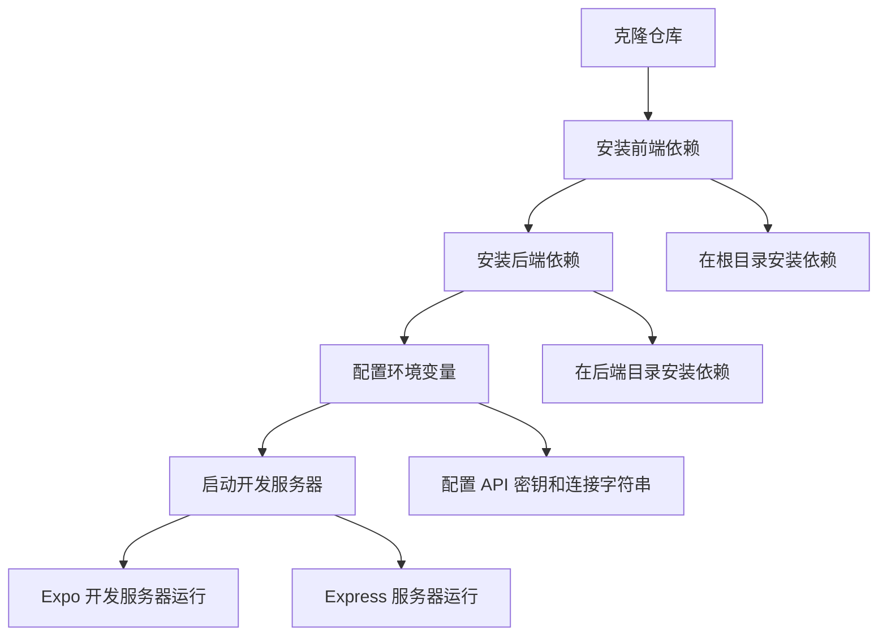
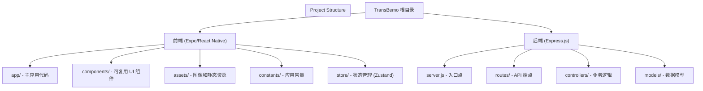
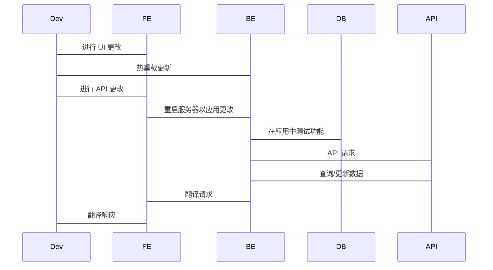
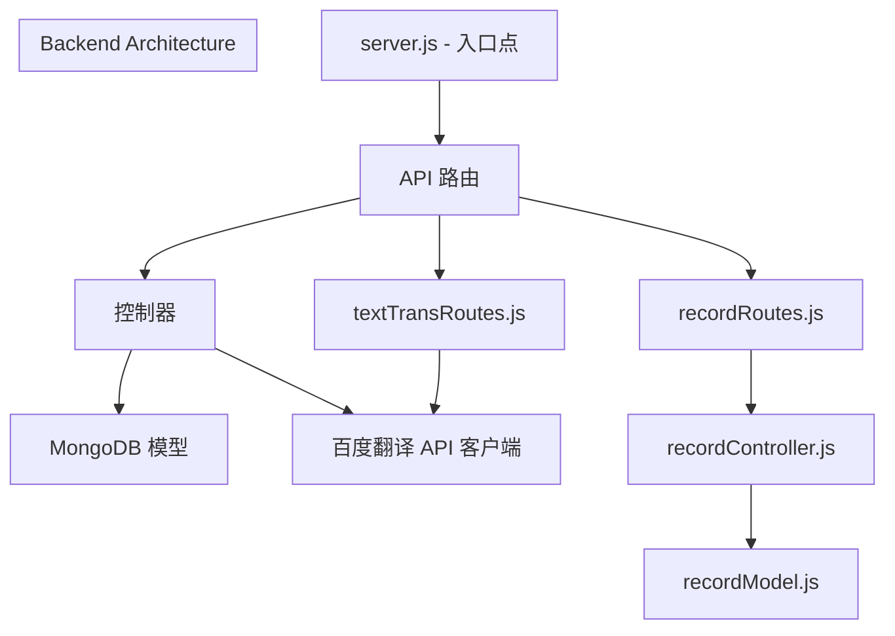
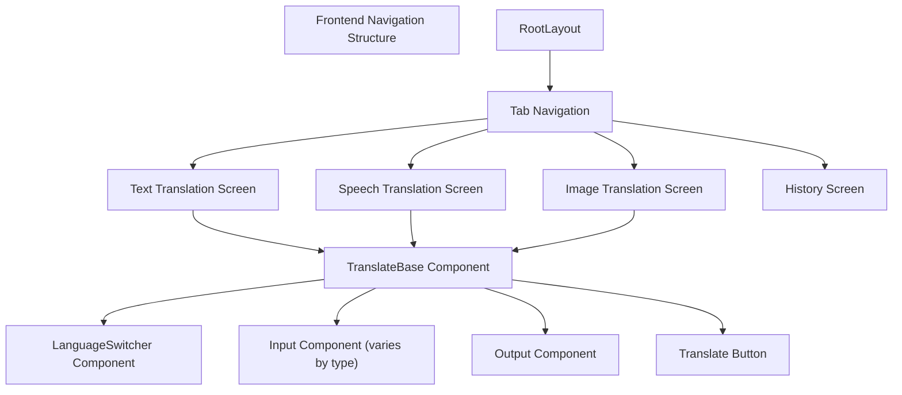

# TransBemo 开发指南

## 目录

* [开发环境设置](https://github.com/Mengbooo/TransBemo/blob/d3383946/开发环境设置)
* [项目结构](https://github.com/Mengbooo/TransBemo/blob/d3383946/项目结构)
* [运行应用程序](https://github.com/Mengbooo/TransBemo/blob/d3383946/运行应用程序)
* [后端开发](https://github.com/Mengbooo/TransBemo/blob/d3383946/后端开发)
* [前端开发](https://github.com/Mengbooo/TransBemo/blob/d3383946/前端开发)
* [添加新功能](https://github.com/Mengbooo/TransBemo/blob/d3383946/添加新功能)
* [常见开发任务](https://github.com/Mengbooo/TransBemo/blob/d3383946/常见开发任务)

## 开发环境设置

### 前提条件

* Node.js（v14 或更高版本）
* npm（v6 或更高版本）
* Expo CLI（`npm install -g expo-cli`）
* MongoDB 实例（本地或云端）
* Git

### 安装步骤



1. **克隆仓库**

```bash
git clone https://github.com/Mengbooo/TransBemo.git
cd TransBemo
```

2. **安装前端依赖**

```bash
npm install
```

3. **安装后端依赖**

```bash
cd backend
npm install
```

4. **配置环境变量**

* 在后端目录创建 `.env` 文件，包含以下变量：

```
PORT=3000
MONGODB_URI=你的_mongodb_连接字符串
BAIDU_APP_ID=你的_百度_应用_ID
BAIDU_APP_KEY=你的_百度_应用_密钥
```

## 项目结构

TransBemo 项目遵循客户端-服务器架构，前端和后端代码库明确分离。



### 关键文件和目录

| 路径                   | 描述                                              |
| ---------------------- | ------------------------------------------------ |
| `app/`                 | 包含使用 Expo Router 的主应用屏幕                  |
| `components/`          | 跨屏幕的可复用 UI 组件                             |
| `constants/`           | 应用常量，如颜色、布局和 API URL                   |
| `store/`               | 使用 Zustand 的状态管理                            |
| `backend/server.js`    | Express 服务器入口点                               |
| `backend/routes/`      | API 路由定义                                       |
| `backend/controllers/` | 请求处理程序和业务逻辑                             |
| `backend/models/`      | MongoDB 模式和模型                                 |

## 运行应用程序

### 启动前端

```bash
# 在项目根目录
npx expo start
```

这将启动 Expo 开发服务器，并提供以下运行选项：

* Android 模拟器（按 'a'）
* iOS 模拟器（按 'i'）
* Web 浏览器（按 'w'）
* 使用 Expo Go 应用的物理设备（扫描二维码）

### 启动后端

```bash
# 在后端目录
node server.js
```

这将在 .env 文件中指定的端口上启动 Express 服务器（默认：3000）。

### 开发工作流



## 后端开发

后端使用 Express.js 和 MongoDB 构建，提供翻译服务和记录存储的 API 端点。

### API 端点

| 端点               | 方法   | 描述                    |
| ------------------ | ------ | ---------------------- |
| `/api/translateText` | POST   | 使用百度 API 翻译文本     |
| `/api/records`       | GET    | 检索翻译历史             |
| `/api/records`       | POST   | 保存翻译记录             |
| `/api/records/:id`   | DELETE | 删除翻译记录             |

### 后端组件



### 连接到 MongoDB

后端使用 Mongoose 连接到 MongoDB。连接在 `server.js` 中建立，使用环境变量中的 MONGODB_URI。

### 百度 API 集成

翻译请求通过百度翻译 API 处理。使用应用 ID 和密钥创建 MD5 签名进行身份验证。

## 前端开发

前端使用 React Native 和 Expo 构建，使用基于选项卡的导航系统进行不同的翻译功能。

### 屏幕结构



### 状态管理

TransBemo 使用 Zustand 进行状态管理。关键存储包括：

* 翻译状态（输入文本、输出文本、语言选择）
* 历史状态（保存的翻译）
* UI 状态（加载指示器、错误）

### 进行 API 调用

使用 Axios 进行 API 调用。主要 API 客户端配置为连接到 Express 后端。

## 添加新功能

### 添加新的翻译方法

1. 在 `app/` 目录中**创建新的屏幕组件**
2. 在布局组件中**将其添加到选项卡导航**
3. **实现特定于翻译类型的输入方法**
4. **重用现有组件**，如 LanguageSwitcher 和 OutputComponent
5. 如有需要，**添加后端路由**

### 扩展现有功能

```mermaid
flowchart TD

subgraph 功能扩展过程 ["Feature Extension Process"]
end

识别[""]
修改[""]
状态[""]
API[""]
测试[""]

    识别 --> 修改
    修改 --> 状态
    状态 --> API
    API --> 测试
```

扩展现有功能时：

1. **识别要修改的组件**在组件层次结构中
2. 使用新功能**更新组件代码**
3. 如有需要，在 Zustand 存储中**更新状态管理**
4. 如需要，**扩展后端 API 端点**
5. 在多个平台上**测试**（Android、iOS、Web）

## 常见开发任务

### 添加新语言

要添加新语言支持：

1. 使用新语言代码和名称更新语言常量文件
2. 确保百度 API 支持该语言代码
3. 更新语言选择器组件以包含新选项

### 调试技巧

* 在开发中使用 `console.log()` 语句进行调试
* 对于前端，Expo 提供可从 Expo DevTools 界面访问的开发者工具
* 对于后端，监控控制台输出以获取请求/响应日志
* 检查浏览器控制台以进行 Web 平台调试

### 测试

使用以下命令运行测试：

```bash
npm test
```

TransBemo 使用 Jest 测试前端和后端组件。

## 环境配置

### 前端环境变量

对于前端环境变量，在根目录创建 `app.config.js` 文件：

```javascript
export default {
  expo: {
    // ... 其他 expo 配置
    extra: {
      apiUrl: process.env.API_URL || "http://localhost:3000",
      baiduApiKey: process.env.BAIDU_API_KEY,
    },
  },
};
```

### 后端环境变量

对于后端，在后端目录使用 `.env` 文件，包含以下变量：

```
PORT=3000
MONGODB_URI=mongodb://localhost:27017/transbemo
BAIDU_APP_ID=你的_应用_ID
BAIDU_APP_KEY=你的_应用_密钥
```