# Overview

> **Relevant source files**
>
> * [.gitignore](https://github.com/Mengbooo/TransBemo/blob/d3383946/.gitignore)
> * [README.md](https://github.com/Mengbooo/TransBemo/blob/d3383946/README.md)
> * [assets/images/icon.png](https://github.com/Mengbooo/TransBemo/blob/d3383946/assets/images/icon.png)
> * [assets/images/splash-icon.png](https://github.com/Mengbooo/TransBemo/blob/d3383946/assets/images/splash-icon.png)
> * [package.json](https://github.com/Mengbooo/TransBemo/blob/d3383946/package.json)

TransBemo is a cross-platform translation application built with Expo and React Native, featuring a Node.js/Express backend. The system enables users to translate text through multiple input methods (text, speech, image) and store translations for later reference. This document provides a technical overview of the system architecture, key components, and data flow.

For detailed information about specific features, see:

* [Text Translation Feature](/Mengbooo/TransBemo/2.1-text-translation-feature)
* [Speech Translation Feature](/Mengbooo/TransBemo/2.2-speech-translation-feature)
* [Image Translation Feature](/Mengbooo/TransBemo/2.3-image-translation-feature)
* [Translation History](/Mengbooo/TransBemo/2.4-translation-history)
* [Backend Architecture](/Mengbooo/TransBemo/3-backend-architecture)

## System Architecture

TransBemo follows a client-server architecture with clear separation of frontend and backend components:

### High-Level System Architecture

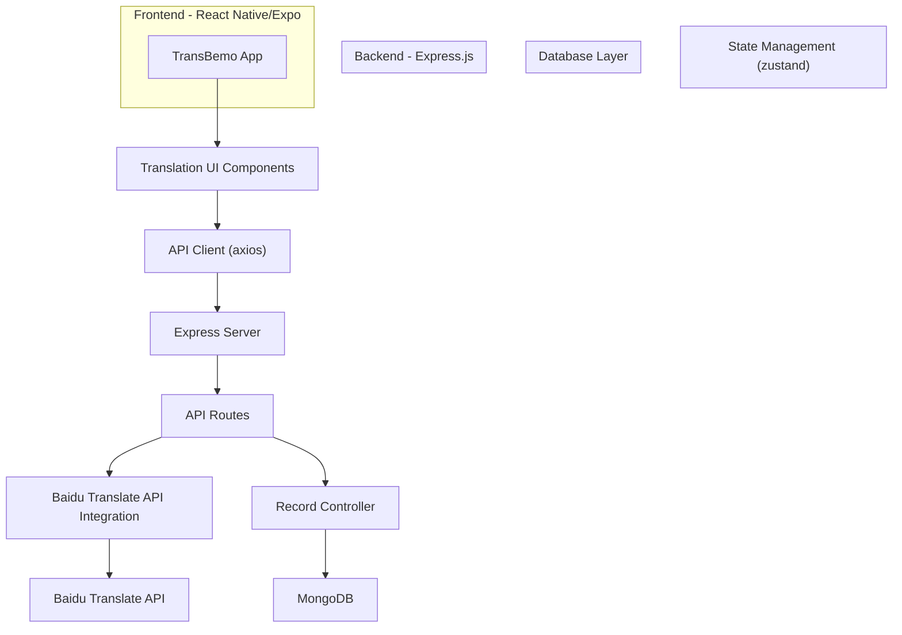

Sources: [package.json L17-L49](https://github.com/Mengbooo/TransBemo/blob/d3383946/package.json#L17-L49)

 [README.md L1-L5](https://github.com/Mengbooo/TransBemo/blob/d3383946/README.md#L1-L5)

## Frontend Architecture

The frontend uses React Native and Expo, with a tab-based navigation system for accessing different translation modes and features.

### Frontend Component Architecture

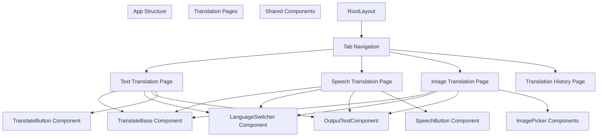

Sources: [package.json L20-L48](https://github.com/Mengbooo/TransBemo/blob/d3383946/package.json#L20-L48)

 [README.md L28-L29](https://github.com/Mengbooo/TransBemo/blob/d3383946/README.md#L28-L29)

The application uses file-based routing provided by Expo Router, with the main application code located in the `app` directory. The project leverages several Expo libraries for UI components and functionality.

## Translation Features

TransBemo offers three primary translation input methods, each with its own dedicated interface:

### Translation Feature Flow

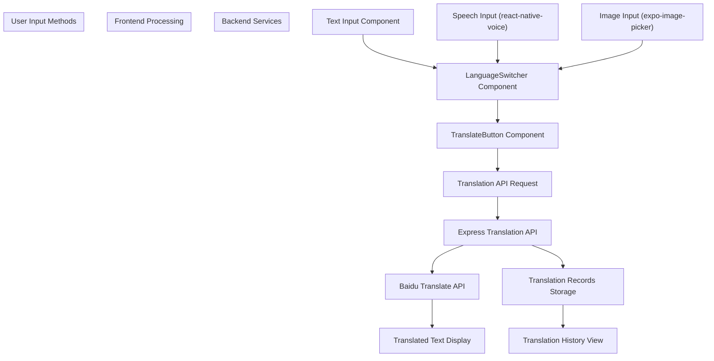

Sources: [package.json L22-L48](https://github.com/Mengbooo/TransBemo/blob/d3383946/package.json#L22-L48)

 [README.md L1-L5](https://github.com/Mengbooo/TransBemo/blob/d3383946/README.md#L1-L5)

1. **Text Translation** - Direct text input with language selection capabilities
2. **Speech Translation** - Voice recognition using `react-native-voice` library
3. **Image Translation** - Image capture and text extraction for translation
4. **Translation History** - Storage and display of past translations

## Backend Architecture

The backend is built with Express.js, handling API requests for both translation services and record management.

### Backend Architecture Diagram

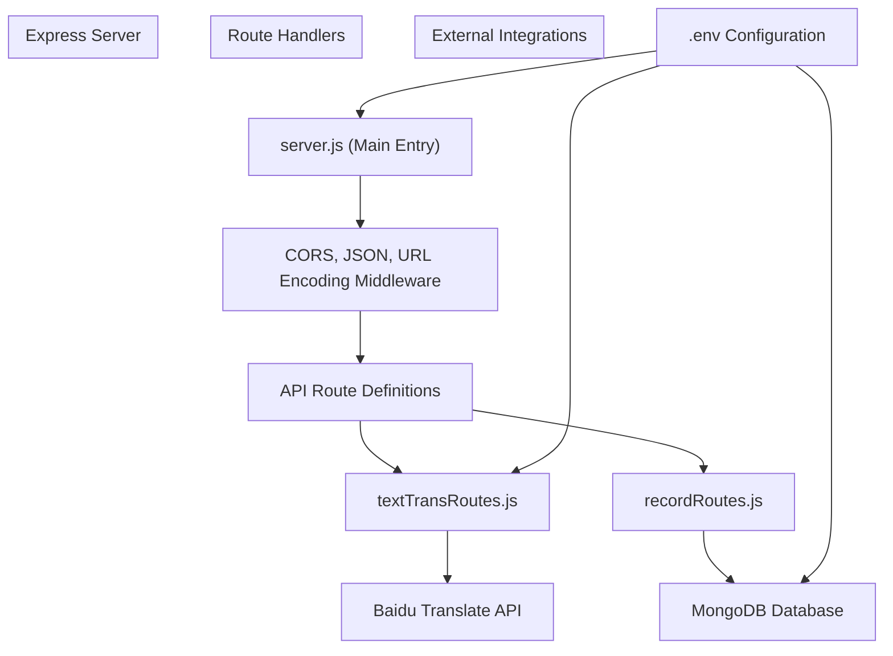

Sources: [package.json L22-L38](https://github.com/Mengbooo/TransBemo/blob/d3383946/package.json#L22-L38)

The Express server exposes endpoints for:

* Translation requests (`/api/translateText`)
* Record management (`/api/records`)

The backend integrates with the Baidu Translation API for translation services and MongoDB for data persistence.

## Data Flow

The complete translation process involves several steps across the frontend, backend, and external services.

### Complete Translation Process

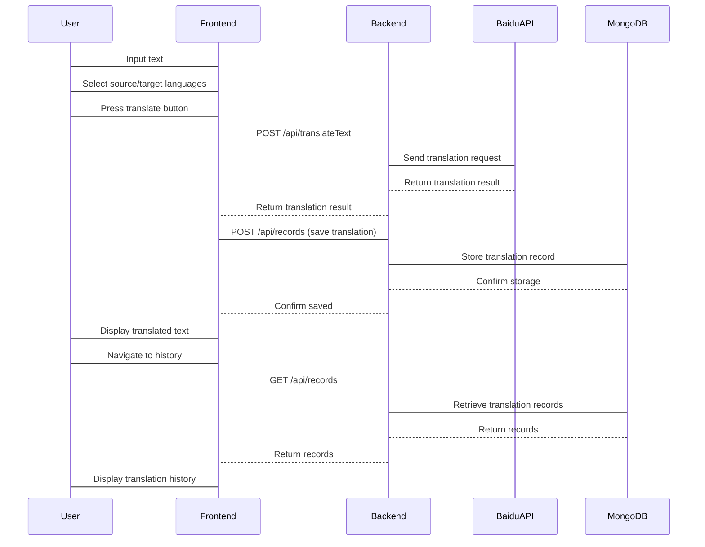

Sources: [package.json L22-L48](https://github.com/Mengbooo/TransBemo/blob/d3383946/package.json#L22-L48)

## Key Dependencies

TransBemo relies on several key technologies and libraries:

| Category           | Dependencies                                       |
| ------------------ | -------------------------------------------------- |
| Frontend Framework | React Native, Expo                                 |
| State Management   | Zustand                                            |
| Navigation         | Expo Router, React Navigation                      |
| API Integration    | Axios                                              |
| Voice Recognition  | React Native Voice                                 |
| UI Components      | Expo Vector Icons, Expo Blur, Expo Linear Gradient |
| Backend            | Express.js, Node.js, HTTP Proxy Middleware         |
| Database           | MongoDB                                            |
| External Services  | Baidu Translate API                                |

Sources: [package.json L17-L49](https://github.com/Mengbooo/TransBemo/blob/d3383946/package.json#L17-L49)

## Development Setup

To set up the TransBemo development environment:

1. Clone the repository
2. Install dependencies:

```
npm install
```

3. Start the development server:

```
npx expo start
```

The application can be run on:

* Android emulator
* iOS simulator
* Expo Go (limited sandbox)
* Development build

Sources: [README.md L7-L28](https://github.com/Mengbooo/TransBemo/blob/d3383946/README.md#L7-L28)

 [package.json L5-L12](https://github.com/Mengbooo/TransBemo/blob/d3383946/package.json#L5-L12)

The project uses file-based routing through Expo Router, with the main application code located in the `app` directory.

# Frontend Architecture

> **Relevant source files**
>
> * [app/(translate)/_layout.tsx](https://github.com/Mengbooo/TransBemo/blob/d3383946/app/(translate)/_layout.tsx)
>
> /_layout.tsx)
>
> * [app/_layout.tsx](https://github.com/Mengbooo/TransBemo/blob/d3383946/app/_layout.tsx)
> * [package.json](https://github.com/Mengbooo/TransBemo/blob/d3383946/package.json)

## Purpose and Scope

This document provides a comprehensive overview of the TransBemo application's frontend architecture. It covers the React Native/Expo framework implementation, component organization, navigation structure, and frontend state management. For detailed information about specific translation features, see [Text Translation Feature](/Mengbooo/TransBemo/2.1-text-translation-feature), [Speech Translation Feature](/Mengbooo/TransBemo/2.2-speech-translation-feature), [Image Translation Feature](/Mengbooo/TransBemo/2.3-image-translation-feature), or [Translation History](/Mengbooo/TransBemo/2.4-translation-history).

## Framework and Technical Stack

TransBemo is built using React Native with the Expo framework, enabling cross-platform functionality across iOS, Android, and web. The frontend leverages several key technologies:

| Technology              | Purpose                             |
| ----------------------- | ----------------------------------- |
| React Native            | Core cross-platform UI framework    |
| Expo                    | Development framework and tooling   |
| expo-router             | Application routing and navigation  |
| React Navigation        | Tab and stack navigation management |
| Zustand                 | State management library            |
| Axios                   | HTTP client for API requests        |
| React Native Reanimated | Advanced animations                 |

Sources: [package.json L17-L48](https://github.com/Mengbooo/TransBemo/blob/d3383946/package.json#L17-L48)

## Application Structure

The application follows a feature-based organization with a tab-based navigation system. The root layout establishes the theme provider and primary stack navigation, while the translate layout configures the tab navigation for the main features.

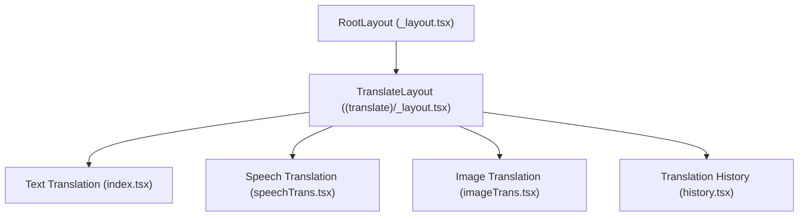

Sources: [app/_layout.tsx L14-L39](https://github.com/Mengbooo/TransBemo/blob/d3383946/app/_layout.tsx#L14-L39)

 [app/(translate)/_layout.tsx

28-74](https://github.com/Mengbooo/TransBemo/blob/d3383946/app/(translate)/_layout.tsx#L28-L74)

## Navigation Architecture

TransBemo implements a two-level navigation structure:

1. **Root Stack Navigator**: Manages the high-level application flow
2. **Tab Navigator**: Handles the main feature tabs

The tab navigation is defined in the translate layout file and implements a custom-styled bottom tab bar with icon-based navigation.

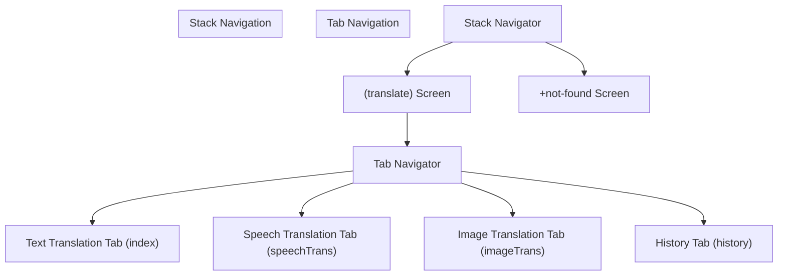

Sources: [app/_layout.tsx L30-L37](https://github.com/Mengbooo/TransBemo/blob/d3383946/app/_layout.tsx#L30-L37)

 [app/(translate)/_layout.tsx

32-72](https://github.com/Mengbooo/TransBemo/blob/d3383946/app/(translate)/_layout.tsx#L32-L72)

## UI Component Architecture

The frontend employs a modular component architecture with shared reusable components across different translation features. The component hierarchy follows a layered approach:

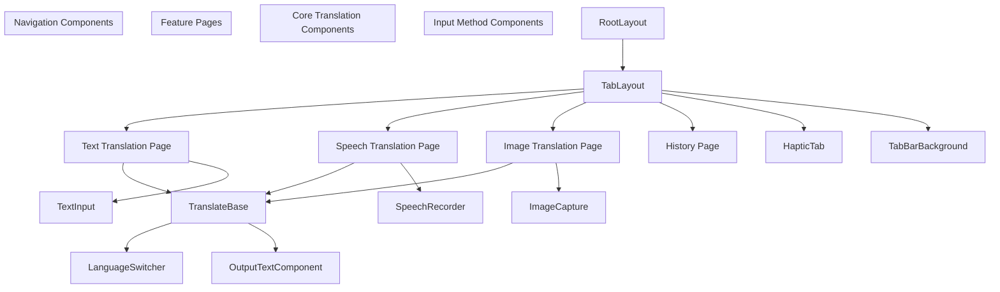

Sources: [app/(translate)/_layout.tsx

5-7](https://github.com/Mengbooo/TransBemo/blob/d3383946/app/(translate)/_layout.tsx#L5-L7)

 [app/(translate)/_layout.tsx

48-71](https://github.com/Mengbooo/TransBemo/blob/d3383946/app/(translate)/_layout.tsx#L48-L71)

## Theming and Styling

The application implements a responsive design with dynamic theming based on the device's color scheme. The styling approach combines:

1. Component-specific stylesheets
2. Global theme constants
3. Platform-specific styling for optimal appearance on different devices

The tab bar styling demonstrates this approach with custom background, borders, and platform-specific adjustments:

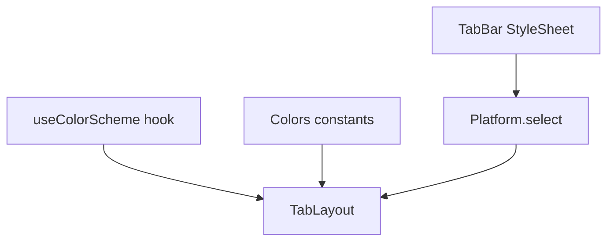

Sources: [app/(translate)/_layout.tsx

13-26](https://github.com/Mengbooo/TransBemo/blob/d3383946/app/(translate)/_layout.tsx#L13-L26)

 [app/(translate)/_layout.tsx

34-45](https://github.com/Mengbooo/TransBemo/blob/d3383946/app/(translate)/_layout.tsx#L34-L45)

## Data Flow and State Management

TransBemo uses Zustand for state management, providing a simple yet powerful way to handle application state.

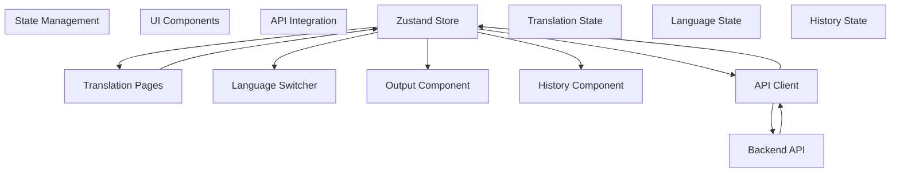

The state management coordinates:

* User input from various sources (text, speech, image)
* Language selection state
* Translation results
* History records

Sources: [package.json

48](https://github.com/Mengbooo/TransBemo/blob/d3383946/package.json#L48-L48)

## Frontend-Backend Integration

The frontend communicates with the backend using Axios for HTTP requests. The API client abstracts the API calls and handles:

1. Translation requests to the backend
2. Saving and retrieving translation history
3. Error handling and response formatting

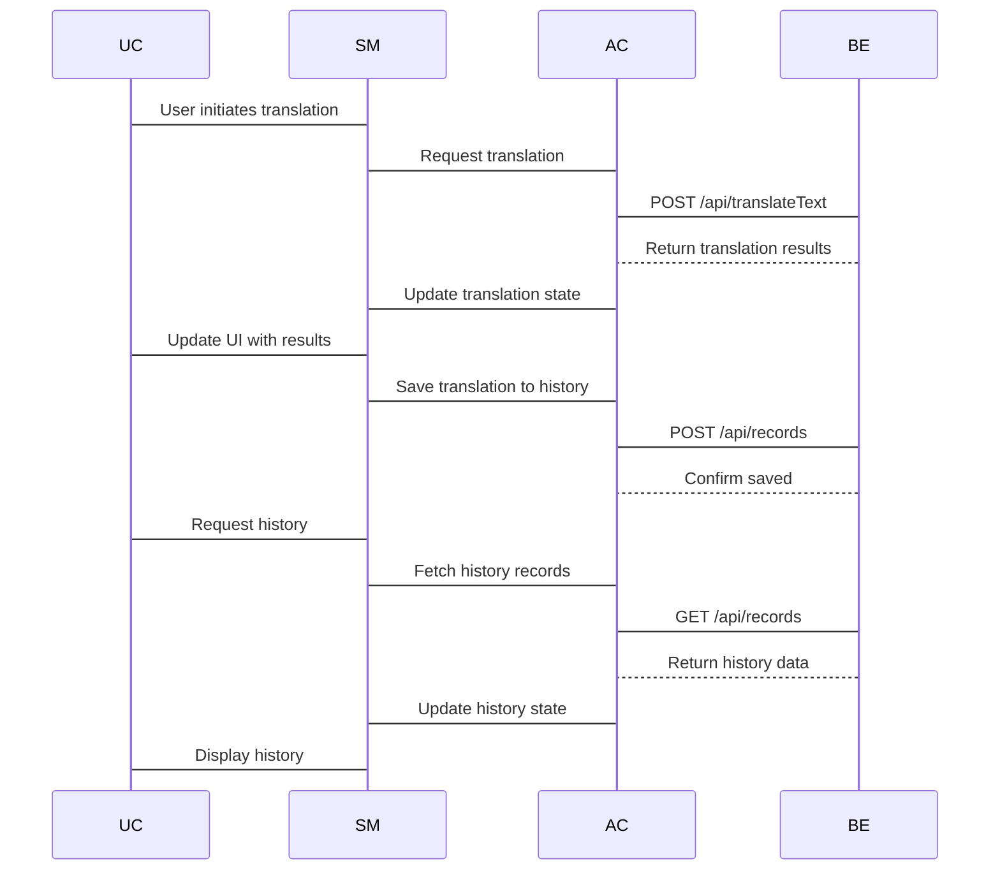

Sources: [package.json

22](https://github.com/Mengbooo/TransBemo/blob/d3383946/package.json#L22-L22)

## Platform Considerations

The application is designed to run across multiple platforms with consistent behavior but platform-optimized UI elements.

| Platform | Considerations                                  |
| -------- | ----------------------------------------------- |
| iOS      | Native tab bar styling, haptic feedback support |
| Android  | Platform-specific UI adjustments                |
| Web      | Responsive layout, keyboard input handling      |

The app uses `Platform.select` to apply platform-specific styling, particularly for the tab bar and navigation elements:

Sources: [app/(translate)/_layout.tsx

38-45](https://github.com/Mengbooo/TransBemo/blob/d3383946/app/(translate)/_layout.tsx#L38-L45)

## Initialization and Loading

The application implements a streamlined initialization process that:

1. Prevents the splash screen from auto-hiding until assets are loaded
2. Loads custom fonts
3. Sets up theme providers based on device color scheme
4. Initializes the navigation structure

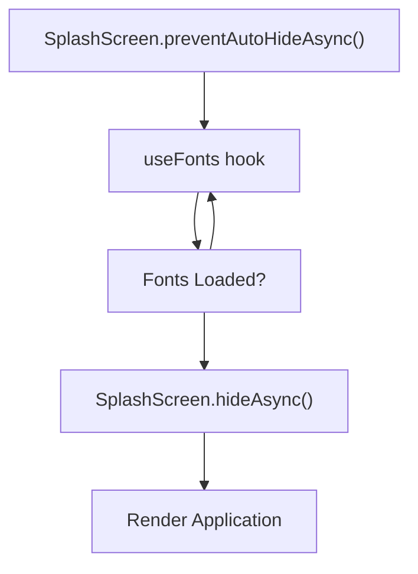

Sources: [app/_layout.tsx L12-L28](https://github.com/Mengbooo/TransBemo/blob/d3383946/app/_layout.tsx#L12-L28)

## Performance Optimizations

TransBemo implements several frontend optimizations:

* Lazy loading of tab screens
* Custom tab bar with optimized rendering
* Reanimated for smooth animations
* Optimized asset loading with expo-asset

These optimizations ensure a smooth, responsive user experience across devices.

Sources: [package.json

24](https://github.com/Mengbooo/TransBemo/blob/d3383946/package.json#L24-L24)

 [package.json

43](https://github.com/Mengbooo/TransBemo/blob/d3383946/package.json#L43-L43)

# Text Translation Feature

> **Relevant source files**
>
> * [api/textTransRequest.ts](https://github.com/Mengbooo/TransBemo/blob/d3383946/api/textTransRequest.ts)
> * [app/(translate)/index.tsx](https://github.com/Mengbooo/TransBemo/blob/d3383946/app/(translate)/index.tsx)
>
> /index.tsx)
>
> * [components/translate/TranslateButton.tsx](https://github.com/Mengbooo/TransBemo/blob/d3383946/components/translate/TranslateButton.tsx)

This document details the text translation functionality in TransBemo, covering the UI components, state management, and backend integration for converting text between different languages. For information about other translation methods, see [Speech Translation Feature](/Mengbooo/TransBemo/2.2-speech-translation-feature) or [Image Translation Feature](/Mengbooo/TransBemo/2.3-image-translation-feature).

## Overview

The Text Translation Feature allows users to input text in one language and receive a translation in another language. The feature connects to the Baidu Translation API through the backend server, with results displayed instantly to the user. Translations can also be saved to the user's history.

Sources: [app/(translate)/index.tsx

11-74](https://github.com/Mengbooo/TransBemo/blob/d3383946/app/(translate)/index.tsx#L11-L74)

## Component Architecture

The text translation interface is composed of several modular components that handle specific aspects of the translation process:

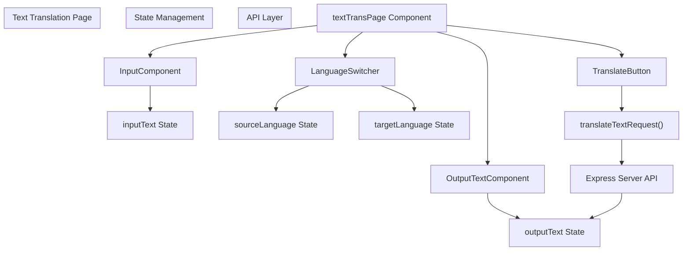

Sources: [app/(translate)/index.tsx

58-74](https://github.com/Mengbooo/TransBemo/blob/d3383946/app/(translate)/index.tsx#L58-L74)

 [components/translate/TranslateButton.tsx L8-L14](https://github.com/Mengbooo/TransBemo/blob/d3383946/components/translate/TranslateButton.tsx#L8-L14)

## State Management

The text translation page manages several state variables using React's useState hook:

| State Variable   | Initial Value | Purpose                           |
| ---------------- | ------------- | --------------------------------- |
| `inputText`      | "翻译内容"    | Stores the text to be translated  |
| `outputText`     | ""            | Stores the translated text result |
| `sourceLanguage` | "中文"        | Stores the source language label  |
| `targetLanguage` | "英语"        | Stores the target language label  |

These state variables are passed to the appropriate components as props and updated through handler functions.

Sources: [app/(translate)/index.tsx

12-15](https://github.com/Mengbooo/TransBemo/blob/d3383946/app/(translate)/index.tsx#L12-L15)

## Translation Process Flow

Below is the sequence diagram showing the complete text translation process from user input to displaying results:

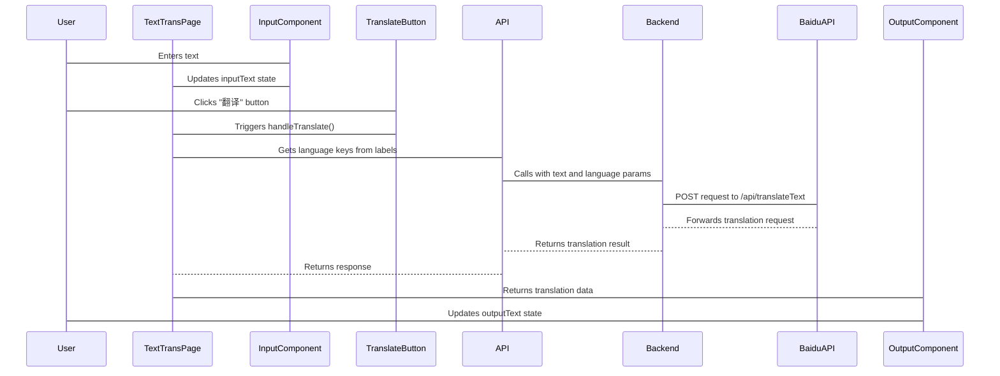

Sources: [app/(translate)/index.tsx

29-51](https://github.com/Mengbooo/TransBemo/blob/d3383946/app/(translate)/index.tsx#L29-L51)

 [api/textTransRequest.ts L4-L26](https://github.com/Mengbooo/TransBemo/blob/d3383946/api/textTransRequest.ts#L4-L26)

## Code Implementation Details

### Text Translation Component

The main component, `textTransPage`, encapsulates the entire feature and serves as the container for all child components. It manages state and handles the translation logic:

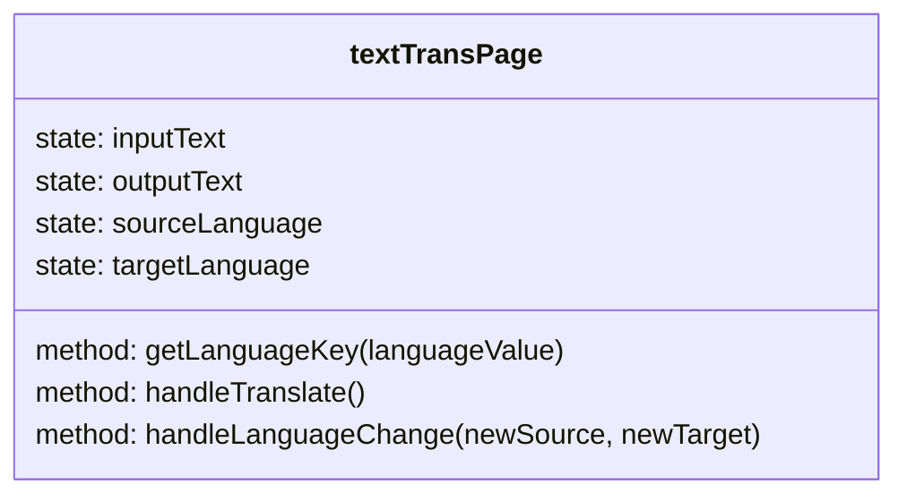

The component is structured as a function component with hooks for state management and event handlers for user interactions.

Sources: [app/(translate)/index.tsx

11-74](https://github.com/Mengbooo/TransBemo/blob/d3383946/app/(translate)/index.tsx#L11-L74)

### Translation API Integration

The text translation feature communicates with the backend through the `translateTextRequest` function:

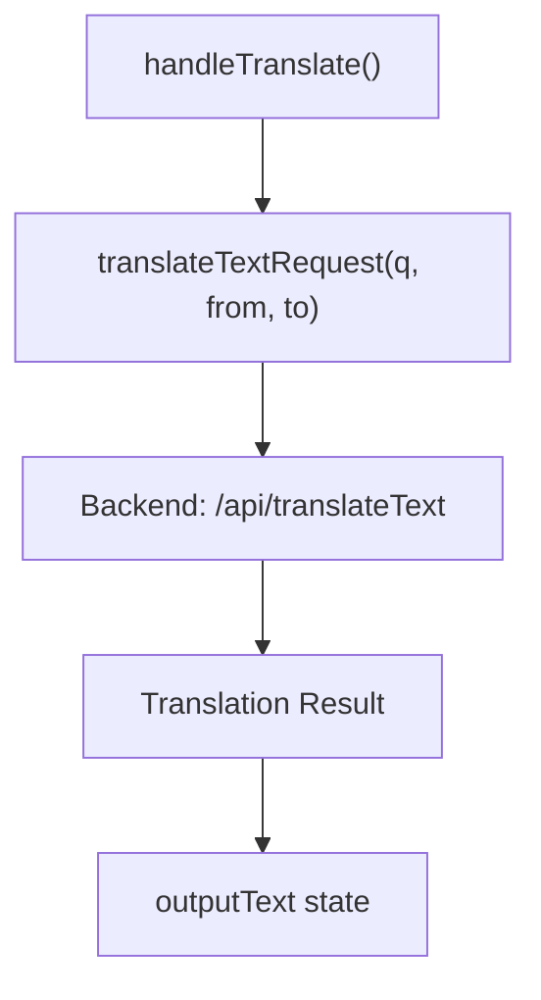

The function takes three parameters:

* `q`: The text to translate
* `from`: The source language code
* `to`: The target language code

It makes an HTTP POST request to the backend API and returns the response data, which is then processed to extract the translated text.

Sources: [api/textTransRequest.ts L4-L26](https://github.com/Mengbooo/TransBemo/blob/d3383946/api/textTransRequest.ts#L4-L26)

 [app/(translate)/index.tsx

29-51](https://github.com/Mengbooo/TransBemo/blob/d3383946/app/(translate)/index.tsx#L29-L51)

## User Interface Components

The text translation interface is composed of several modular components:

### Input Component

Responsible for accepting and displaying the text to be translated. Users can type or paste text into this component.

### Output Component

Displays the translated text result after the translation process is complete.

### Translate Button

A touchable button component that initiates the translation process when pressed. It calls the `handleTranslate` function.

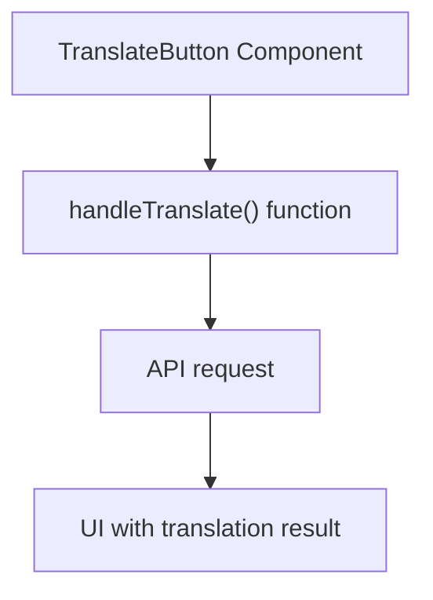

Sources: [components/translate/TranslateButton.tsx L8-L14](https://github.com/Mengbooo/TransBemo/blob/d3383946/components/translate/TranslateButton.tsx#L8-L14)

### Language Switcher

Allows users to select the source and target languages for translation. This component handles language selection and switching between source and target languages.

Sources: [app/(translate)/index.tsx

53-56](https://github.com/Mengbooo/TransBemo/blob/d3383946/app/(translate)/index.tsx#L53-L56)

 [app/(translate)/index.tsx

64-70](https://github.com/Mengbooo/TransBemo/blob/d3383946/app/(translate)/index.tsx#L64-L70)

## Data Flow for Text Translation

The complete data flow for text translation feature involves several steps:

1. User enters text in the input component, which updates the `inputText` state
2. User selects source and target languages using the language switcher
3. User presses the translate button, triggering the `handleTranslate` function
4. The function gets language codes from the selected language labels
5. The function calls `translateTextRequest` with the text and language codes
6. The API function makes a POST request to the backend server
7. The backend server processes the request and forwards it to the Baidu Translate API
8. The translation result is returned to the frontend
9. The `outputText` state is updated with the translated text
10. The output component re-renders to display the translated text

Sources: [app/(translate)/index.tsx

29-51](https://github.com/Mengbooo/TransBemo/blob/d3383946/app/(translate)/index.tsx#L29-L51)

 [api/textTransRequest.ts L4-L26](https://github.com/Mengbooo/TransBemo/blob/d3383946/api/textTransRequest.ts#L4-L26)

## Integration with Other Features

The Text Translation Feature shares several components with other translation features in TransBemo:

* `TranslateBase`: Common layout component used across translation features
* `LanguageSwitcher`: Used in all translation features to select languages
* `OutputTextComponent`: Used to display translated text in multiple features

For more information about these shared components, see [Shared UI Components](/Mengbooo/TransBemo/2.5-shared-ui-components).

Sources: [app/(translate)/index.tsx

2-6](https://github.com/Mengbooo/TransBemo/blob/d3383946/app/(translate)/index.tsx#L2-L6)

 [app/(translate)/index.tsx

58-74](https://github.com/Mengbooo/TransBemo/blob/d3383946/app/(translate)/index.tsx#L58-L74)

## Summary

The Text Translation Feature provides a straightforward interface for users to translate text between languages. It leverages React Native components and state management to create a responsive user experience, while communicating with the backend server to perform the actual translation via the Baidu Translate API.

The feature demonstrates a clean separation of concerns, with distinct components handling UI elements, state management, and API communication. This modular approach enhances maintainability and allows for code reuse across different translation features within the TransBemo application.

# Speech Translation Feature

> **Relevant source files**
>
> * [app/(translate)/speechTrans.tsx](https://github.com/Mengbooo/TransBemo/blob/d3383946/app/(translate)/speechTrans.tsx)
>
> /speechTrans.tsx)
>
> * [components/animation/SoundWave.tsx](https://github.com/Mengbooo/TransBemo/blob/d3383946/components/animation/SoundWave.tsx)
> * [components/global/Button.tsx](https://github.com/Mengbooo/TransBemo/blob/d3383946/components/global/Button.tsx)

This document describes the Speech Translation feature of TransBemo, which enables users to translate spoken language through voice input. This feature is one of the three primary translation methods offered by the application, alongside text and image translation.

For information about text-based translation, see [Text Translation Feature](/Mengbooo/TransBemo/2.1-text-translation-feature). For image-based translation, see [Image Translation Feature](/Mengbooo/TransBemo/2.3-image-translation-feature).

## Overview

The Speech Translation feature allows users to:

* Record speech using their device's microphone
* Convert spoken words to text
* Translate the converted text to a target language
* View the translated output

This feature is particularly useful for users who prefer speaking over typing, need hands-free translation, or want to practice pronunciation in different languages.

## Component Architecture

The Speech Translation feature is implemented through a specific set of React Native components organized hierarchically.

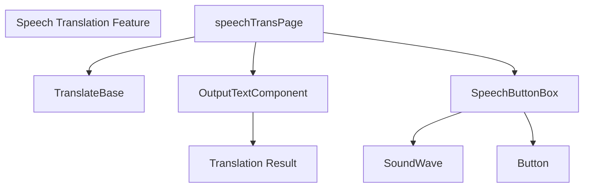

Sources: [app/(translate)/speechTrans.tsx

1-34](https://github.com/Mengbooo/TransBemo/blob/d3383946/app/(translate)/speechTrans.tsx#L1-L34)

 [components/animation/SoundWave.tsx L1-L71](https://github.com/Mengbooo/TransBemo/blob/d3383946/components/animation/SoundWave.tsx#L1-L71)

 [components/global/Button.tsx L1-L36](https://github.com/Mengbooo/TransBemo/blob/d3383946/components/global/Button.tsx#L1-L36)

## Main Components

### Speech Translation Page

The main page component for speech translation is defined in `speechTrans.tsx`. This component serves as the container for the speech translation interface and manages the input text state.

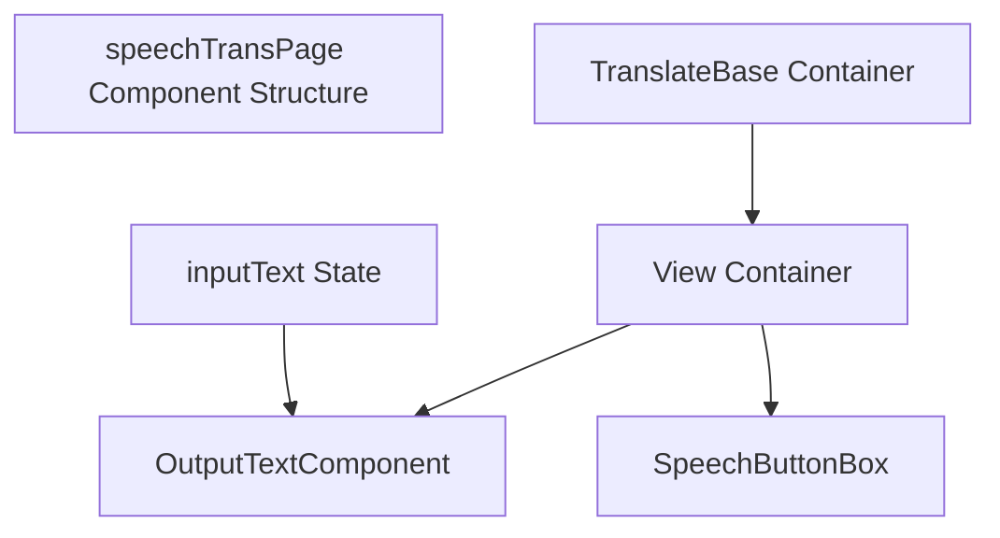

Sources: [app/(translate)/speechTrans.tsx

9-20](https://github.com/Mengbooo/TransBemo/blob/d3383946/app/(translate)/speechTrans.tsx#L9-L20)

### SoundWave Animation

The `SoundWave` component provides visual feedback during speech recording by creating an animated representation of sound waves. This enhances the user experience by providing clear feedback when the app is capturing audio.

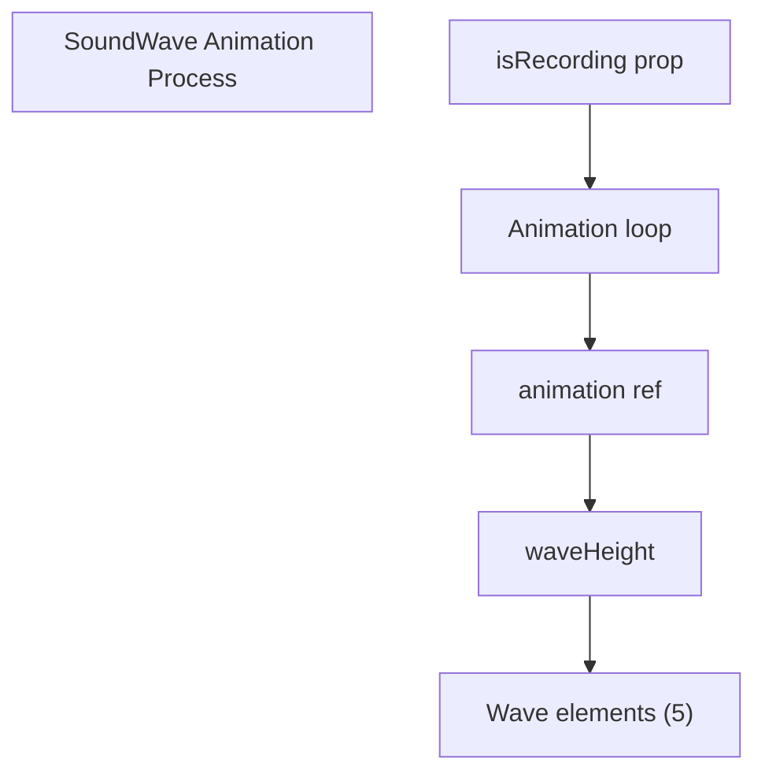

The component creates five animated bars that grow and shrink to simulate sound waves when recording is active.

Sources: [components/animation/SoundWave.tsx L4-L55](https://github.com/Mengbooo/TransBemo/blob/d3383946/components/animation/SoundWave.tsx#L4-L55)

### Button Component

The application uses a reusable `Button` component that serves as part of the user interface for triggering speech recognition.

```mermaid
flowchart TD

subgraph Button_Component ["Button Component"]
end

ButtonProps["ButtonProps Interface"]
PressableElement["Pressable Element"]
IconContainer["Icon Container"]
IconProp["icon Prop"]

    ButtonProps --> PressableElement
    PressableElement --> IconContainer
    IconContainer --> IconProp
```

The button component is designed with `onPressIn` and `onPressOut` props, suggesting that it's meant to be used for press-and-hold actions typical in speech recording interfaces.

Sources: [components/global/Button.tsx L5-L18](https://github.com/Mengbooo/TransBemo/blob/d3383946/components/global/Button.tsx#L5-L18)

## Integration with Translation System

The speech translation feature is integrated into the broader TransBemo translation system as one of the three input methods that all flow into the same translation pipeline.

```mermaid
flowchart TD

subgraph Translation_Pipeline ["Translation Pipeline"]
end

subgraph Input_Methods ["Input Methods"]
end

TextInput["Text Input"]
SpeechInput["Speech Input"]
ImageInput["Image Input"]
TextContent["Text Content"]
TranslationRequest["Translation Request"]
BackendProcessing["Express Backend"]
BaiduAPI["Baidu Translate API"]
TranslatedOutput["Translated Text"]
RecordStorage["Translation Records"]

    SpeechInput --> TextContent
    TextInput --> TextContent
    ImageInput --> TextContent
    TextContent --> TranslationRequest
    TranslationRequest --> BackendProcessing
    BackendProcessing --> BaiduAPI
    BaiduAPI --> BackendProcessing
    BackendProcessing --> TranslatedOutput
    BackendProcessing --> RecordStorage
```

Sources: Based on system architecture diagrams

## User Flow

The typical user flow for speech translation in TransBemo follows this sequence:

```mermaid
sequenceDiagram
  participant User
  participant UI
  participant Backend
  participant BaiduTransAPI

  User->UI: Navigate to Speech Translation tab
  User->UI: Press and hold speech button
  Note over UI: SoundWave animation activates
  User->UI: Speak text to translate
  User->UI: Release button
  UI->Backend: Process speech to text
  Backend->BaiduTransAPI: Send text for translation
  BaiduTransAPI-->Backend: Forward translation request
  Backend-->UI: Return translation
  UI->User: Return translation result
```

Sources: Based on component structure in [app/(translate)/speechTrans.tsx

9-20](https://github.com/Mengbooo/TransBemo/blob/d3383946/app/(translate)/speechTrans.tsx#L9-L20)

 and system architecture diagrams

## Technical Implementation Details

### Speech Translation Page

The `speechTrans.tsx` file defines the main component structure:

```
export default function speechTransPage() {
  const [inputText, setInputText] = useState("");

  return (
    <TranslateBase>
      <View style={styles.textContainer}>
        <OutputTextComponent inputText={inputText}></OutputTextComponent>
        <SpeechButtonBox></SpeechButtonBox>
      </View>
    </TranslateBase>
  );
}
```

This component maintains an `inputText` state which is passed to the `OutputTextComponent` for displaying the translated text. The `SpeechButtonBox` component handles speech input functionality.

Sources: [app/(translate)/speechTrans.tsx

9-20](https://github.com/Mengbooo/TransBemo/blob/d3383946/app/(translate)/speechTrans.tsx#L9-L20)

### SoundWave Animation Implementation

The `SoundWave` component creates an animated visualization of sound waves:

```mermaid
flowchart TD

subgraph SoundWave_Animation_Logic ["SoundWave Animation Logic"]
end

IsRecording["isRecording boolean prop"]
UseEffect["useEffect hook"]
AnimationStart["Animation start"]
AnimationStop["Animation stop"]
RenderBars["Render 5 animated bars"]
AnimatedLoop["Animated.loop"]

    IsRecording --> UseEffect
    UseEffect --> AnimationStart
    UseEffect --> AnimationStop
    AnimationStart --> AnimatedLoop
    AnimatedLoop --> RenderBars
    AnimationStop --> RenderBars
```

The animation uses React Native's `Animated` API to create a pulsating effect that visually represents audio input being captured.

Sources: [components/animation/SoundWave.tsx L4-L54](https://github.com/Mengbooo/TransBemo/blob/d3383946/components/animation/SoundWave.tsx#L4-L54)

## Comparison with Other Translation Features

| Feature            | Input Method    | Visual Feedback     | User Interaction                |
| ------------------ | --------------- | ------------------- | ------------------------------- |
| Text Translation   | Keyboard typing | None                | Type and press translate button |
| Speech Translation | Microphone      | SoundWave animation | Press and hold speech button    |
| Image Translation  | Camera/Gallery  | Image preview       | Take/select photo               |

Sources: System architecture overview

## Conclusion

The Speech Translation feature in TransBemo provides an efficient hands-free alternative for users to translate content. By combining speech recognition with the application's translation pipeline, it creates a seamless experience for converting spoken language between different languages.

The feature is built using React Native components that work together to provide an intuitive user interface with appropriate visual feedback during the recording process. Like other translation methods in the application, speech translation leverages the Baidu Translation API for performing the actual translation and stores records for future reference.

# Image Translation Feature

> **Relevant source files**
>
> * [app/(translate)/imageTrans.tsx](https://github.com/Mengbooo/TransBemo/blob/d3383946/app/(translate)/imageTrans.tsx)
>
> /imageTrans.tsx)

## Purpose and Scope

This document details the Image Translation feature of TransBemo, which allows users to translate text from images. The feature enables users to capture photos or select images from their device gallery, extract text from these images, and obtain translations. For information about text-based translation, see [Text Translation Feature](/Mengbooo/TransBemo/2.1-text-translation-feature). For voice-based translation, see [Speech Translation Feature](/Mengbooo/TransBemo/2.2-speech-translation-feature).

## Feature Overview

The Image Translation feature provides a seamless workflow for extracting and translating text from images. This feature is particularly useful for translating signs, documents, menus, or other text encountered during travel or daily life without the need to manually type content.

```mermaid
flowchart TD

User["User"]
Image["Image Source(Camera/Gallery)"]
ImageTrans["Image Translation Page(imageTrans.tsx)"]
TextExtraction["Text Extraction"]
Translation["Translation Service"]
Display["Display Results"]

    User --> Image
    Image --> ImageTrans
    ImageTrans --> TextExtraction
    TextExtraction --> Translation
    Translation --> Display
    Display --> User
```

Sources: [app/(translate)/imageTrans.tsx

9-20](https://github.com/Mengbooo/TransBemo/blob/d3383946/app/(translate)/imageTrans.tsx#L9-L20)

## Component Architecture

The Image Translation feature is built using a modular component architecture that integrates with the overall TransBemo application structure.

```mermaid
flowchart TD

subgraph User_Actions ["User Actions"]
end

subgraph Image_Translation_Page ["Image Translation Page"]
end

ImageTransPage["imageTransPage(imageTrans.tsx)"]
TranslateBase["TranslateBase(Base container)"]
OutputComponent["OutputTextComponent(Display translated text)"]
ImageCont["ImageContainer(Display selected image)"]
ImageButtons["ImageButtonBox(Camera/Gallery buttons)"]
CaptureImage["Capture Image"]
PickImage["Select from Gallery"]
ViewTranslation["View Translation"]

    ImageTransPage --> TranslateBase
    TranslateBase --> OutputComponent
    TranslateBase --> ImageCont
    TranslateBase --> ImageButtons
    ImageButtons --> CaptureImage
    ImageButtons --> PickImage
    OutputComponent --> ViewTranslation
```

Sources: [app/(translate)/imageTrans.tsx

9-20](https://github.com/Mengbooo/TransBemo/blob/d3383946/app/(translate)/imageTrans.tsx#L9-L20)

## Key Components

The Image Translation feature consists of several key components that work together to provide the functionality:

| Component           | File                                                         | Purpose                                                      |
| ------------------- | ------------------------------------------------------------ | ------------------------------------------------------------ |
| imageTransPage      | [app/(translate)/imageTrans.tsx](https://github.com/Mengbooo/TransBemo/blob/d3383946/app/(translate)/imageTrans.tsx) | Main page component for image translation                    |
| TranslateBase       | Imported from "@/components/global/TranslateBase"            | Container component providing common translation UI elements |
| OutputTextComponent | Imported from "@/components/translate/OutputBox"             | Displays extracted and translated text                       |
| ImageContainer      | Imported from "@/components/translate/imageContainer"        | Displays the selected or captured image                      |
| ImageButtonBox      | Imported from "@/components/translate/ImageButtonBox"        | Provides buttons for camera and gallery access               |

Sources: [app/(translate)/imageTrans.tsx

1-8](https://github.com/Mengbooo/TransBemo/blob/d3383946/app/(translate)/imageTrans.tsx#L1-L8)

## User Flow

The user flow for image translation follows a straightforward process:

```mermaid
sequenceDiagram
  participant User
  participant App
  participant Camera
  participant Gallery
  participant Backend

  User->App: Navigate to Image Translation tab
  User->App: Choose image source
  App->Camera: Open camera
  User->Camera: Capture image
  Camera->App: Return captured image
  App->Gallery: Open gallery
  User->Gallery: Select image
  Gallery->App: Return selected image
  App->Backend: Display selected image
  Backend->App: Send image for text extraction
  App->User: Extract text from image
```

Sources: [app/(translate)/imageTrans.tsx

9-20](https://github.com/Mengbooo/TransBemo/blob/d3383946/app/(translate)/imageTrans.tsx#L9-L20)

## Implementation Details

### Page Structure

The Image Translation page is implemented as a React functional component that sets up the necessary state and renders the UI components. The page uses a container-based approach with the `TranslateBase` component providing common translation functionality.

```mermaid
flowchart TD

subgraph State_Management ["State Management"]
end

subgraph Component_Hierarchy ["Component Hierarchy"]
end

ImageTransPage["imageTransPage()"]
TranslateBase[""]
View[""]
Output[""]
ImageCont[""]
ButtonBox[""]
InputText["inputText (useState)"]

    ImageTransPage --> TranslateBase
    TranslateBase --> View
    View --> Output
    View --> ImageCont
    View --> ButtonBox
    InputText --> Output
```

The page layout organizes components vertically with space between them, achieved through styling applied to the main view container.

Sources: [app/(translate)/imageTrans.tsx

9-35](https://github.com/Mengbooo/TransBemo/blob/d3383946/app/(translate)/imageTrans.tsx#L9-L35)

### State Management

The image translation page maintains state for the input text using React's `useState` hook. This state likely gets updated when text is extracted from an image.

```
const [inputText, setInputText] = useState("");
```

This state is passed to the `OutputTextComponent` for displaying the extracted and translated text.

Sources: [app/(translate)/imageTrans.tsx

10](https://github.com/Mengbooo/TransBemo/blob/d3383946/app/(translate)/imageTrans.tsx#L10-L10)

### Image Capture and Selection

Image capture and selection functionality is encapsulated in the `ImageButtonBox` component. Although the implementation details are not directly visible in the provided file, this component likely provides:

1. A button to open the device camera for capturing new images
2. A button to access the device gallery for selecting existing images

These operations would utilize Expo's `ImagePicker` and `Camera` APIs for accessing device capabilities.

Sources: [app/(translate)/imageTrans.tsx

17](https://github.com/Mengbooo/TransBemo/blob/d3383946/app/(translate)/imageTrans.tsx#L17-L17)

### Image Display

The `ImageContainer` component is responsible for displaying the selected or captured image. This component would render the image and possibly provide options for adjusting the image view or canceling the selection.

Sources: [app/(translate)/imageTrans.tsx

16](https://github.com/Mengbooo/TransBemo/blob/d3383946/app/(translate)/imageTrans.tsx#L16-L16)

### Text Extraction and Translation Process

The text extraction and translation process likely follows these steps:

1. Image is captured or selected by the user
2. The image is processed (possibly using OCR - Optical Character Recognition)
3. Extracted text is stored in the `inputText` state
4. The text is sent to the translation API (Baidu Translate API as per the system architecture)
5. The translated text is displayed in the `OutputTextComponent`

```mermaid
flowchart TD

Image["Selected Image"]
OCR["OCR Processing"]
ExtractedText["Extracted Text(inputText state)"]
API["Translation API(Baidu Translate)"]
Result["Translation Result"]
Display["OutputTextComponent"]

    Image --> OCR
    OCR --> ExtractedText
    ExtractedText --> API
    API --> Result
    Result --> Display
```

Sources: [app/(translate)/imageTrans.tsx

9-20](https://github.com/Mengbooo/TransBemo/blob/d3383946/app/(translate)/imageTrans.tsx#L9-L20)

## Integration with Other Subsystems

The Image Translation feature integrates with other TransBemo subsystems to provide a complete translation experience:

1. **Translation API Integration**: Connects with the backend translation service detailed in [Translation API](/Mengbooo/TransBemo/3.1-translation-api)
2. **Language Management**: Utilizes the language selection and management capabilities described in [Language Management](/Mengbooo/TransBemo/4-language-management)
3. **Translation History**: Saves completed translations to history as described in [Translation History](/Mengbooo/TransBemo/2.4-translation-history)

## Layout and Styling

The Image Translation page uses a flexible layout to accommodate different screen sizes and orientations. The main container occupies the full vertical space and positions its children with space between them.

Key styling elements include:

* Container width set to 90% of parent
* Flexible layout with space-between justification
* Top margin of 20 units
* Bold text styling for headings

Sources: [app/(translate)/imageTrans.tsx

23-35](https://github.com/Mengbooo/TransBemo/blob/d3383946/app/(translate)/imageTrans.tsx#L23-L35)

## Summary

The Image Translation feature provides an intuitive interface for extracting and translating text from images. By integrating with device camera and gallery capabilities, it allows users to quickly translate text they encounter without manual typing. The modular component architecture ensures maintainability and integration with the overall TransBemo application.

# Translation History

> **Relevant source files**
>
> * [app/(translate)/history.tsx](https://github.com/Mengbooo/TransBemo/blob/d3383946/app/(translate)/history.tsx)
>
> /history.tsx)
>
> * [components/translate/ImageButtonBox.tsx](https://github.com/Mengbooo/TransBemo/blob/d3383946/components/translate/ImageButtonBox.tsx)
> * [constants/Languages.ts](https://github.com/Mengbooo/TransBemo/blob/d3383946/constants/Languages.ts)

## Purpose and Scope

This document details the Translation History feature of TransBemo, which allows users to view their past translations. The feature records and displays previously translated content, including source and target languages, input and output text, and the translation method used. For information about performing translations, see [Text Translation Feature](/Mengbooo/TransBemo/2.1-text-translation-feature), [Speech Translation Feature](/Mengbooo/TransBemo/2.2-speech-translation-feature), and [Image Translation Feature](/Mengbooo/TransBemo/2.3-image-translation-feature).

## Overview

The Translation History system maintains a record of all translations performed by a user. When users translate text, speech, or images, the translation data is saved to a database and can later be retrieved and displayed in a dedicated history screen.

```mermaid
flowchart TD

subgraph History_Access_Flow ["History Access Flow"]
end

subgraph Translation_Flow ["Translation Flow"]
end

UserTranslate["User performs translation"]
TranslationResult["Translation result returned"]
SaveRecord["Save translation record"]
NavigateHistory["User navigates to history"]
FetchRecords["Fetch translation records"]
DisplayHistory["Display translation history"]
Database["MongoDB"]

    UserTranslate --> TranslationResult
    TranslationResult --> SaveRecord
    SaveRecord --> Database
    NavigateHistory --> FetchRecords
    FetchRecords --> Database
    FetchRecords --> DisplayHistory
```

Sources: [app/(translate)/history.tsx](https://github.com/Mengbooo/TransBemo/blob/d3383946/app/(translate)/history.tsx)

## Frontend Implementation

### History Screen Component

The history screen displays a list of translation records in a scrollable view. Each record is represented by a `HistoryItem` component that shows:

* Source language
* Target language
* Input text
* Output text
* Translation method icon (text, speech, or image)

```mermaid
flowchart TD

subgraph HistoryItem_Properties ["HistoryItem Properties"]
end

subgraph History_Screen_Structure ["History Screen Structure"]
end

HistoryScreen["historyScreen Component"]
SafeAreaView["SafeAreaView"]
Logo["App Logo"]
ScrollView["ScrollView"]
HistoryItems["Multiple HistoryItem Components"]
SourceLang["sourceLanguage"]
TargetLang["targetLanguage"]
InputText["inputText"]
OutputText["outputText"]
Method["translationMethod"]

    HistoryScreen --> SafeAreaView
    SafeAreaView --> Logo
    SafeAreaView --> ScrollView
    ScrollView --> HistoryItems
    HistoryItems --> SourceLang
    HistoryItems --> TargetLang
    HistoryItems --> InputText
    HistoryItems --> OutputText
    HistoryItems --> Method
```

Sources: [app/(translate)/history.tsx

20-39](https://github.com/Mengbooo/TransBemo/blob/d3383946/app/(translate)/history.tsx#L20-L39)

The current implementation uses mock data for demonstration purposes:

```mermaid
flowchart TD

HistoryScreen["historyScreen Component"]
MockData["mockHistoryData Array"]
MappingFunction["map() Function"]
RenderItems["Rendered HistoryItem Components"]

    HistoryScreen --> MockData
    MockData --> MappingFunction
    MappingFunction --> RenderItems
```

Sources: [app/(translate)/history.tsx

12-18](https://github.com/Mengbooo/TransBemo/blob/d3383946/app/(translate)/history.tsx#L12-L18)

 [app/(translate)/history.tsx

26-35](https://github.com/Mengbooo/TransBemo/blob/d3383946/app/(translate)/history.tsx#L26-L35)

### History Item Display

Each history item is displayed using a dedicated component that formats the translation record for easy reading. The layout includes sections for:

1. Language pair (source to target)
2. Original input text
3. Translated output text
4. Visual indicator of the translation method used (text, speech, or image icon)

## Backend Implementation

While not directly visible in the provided code files, the system architecture indicates that translation history is managed through a backend API and stored in MongoDB.

### Record Management API

```mermaid
sequenceDiagram
  participant User
  participant FrontendHistory
  participant API
  participant DB

  User->FrontendHistory: Navigate to history tab
  FrontendHistory->API: GET /api/records
  API->DB: Query translation records
  DB-->API: Return records
  API-->FrontendHistory: Send records as JSON
  FrontendHistory->User: Display formatted history
```

## Translation Record Data Model

Based on the frontend implementation, each translation record contains:

| Field             | Description                                           | Type           |
| ----------------- | ----------------------------------------------------- | -------------- |
| sourceLanguage    | Language code of the original text                    | String         |
| targetLanguage    | Language code of the translated text                  | String         |
| inputText         | Original text provided by user                        | String         |
| outputText        | Translated text result                                | String         |
| translationMethod | Indicator of translation method (text, speech, image) | Icon/String    |
| timestamp         | When the translation was performed                    | Date (implied) |

Sources: [app/(translate)/history.tsx

12-18](https://github.com/Mengbooo/TransBemo/blob/d3383946/app/(translate)/history.tsx#L12-L18)

 [constants/Languages.ts L2-L29](https://github.com/Mengbooo/TransBemo/blob/d3383946/constants/Languages.ts#L2-L29)

## Integration with Translation Features

```mermaid
flowchart TD

subgraph Frontend_Views ["Frontend Views"]
end

subgraph Storage ["Storage"]
end

subgraph Backend_Services ["Backend Services"]
end

subgraph Translation_Features ["Translation Features"]
end

TextTrans["Text Translation"]
SpeechTrans["Speech Translation"]
ImageTrans["Image Translation"]
API["Express API"]
TranslateAPI["Translation API"]
RecordAPI["Record API"]
DB["MongoDB"]
HistoryView["History Screen"]

    TextTrans --> API
    SpeechTrans --> API
    ImageTrans --> API
    API --> TranslateAPI
    TranslateAPI --> API
    API --> RecordAPI
    RecordAPI --> DB
    HistoryView --> RecordAPI
    RecordAPI --> HistoryView
```

Sources: [app/(translate)/history.tsx](https://github.com/Mengbooo/TransBemo/blob/d3383946/app/(translate)/history.tsx)

## User Experience Flow

1. User performs a translation using one of the available methods (text, speech, image)
2. Translation result is displayed to the user
3. Translation record is automatically saved to the database
4. User navigates to the History tab
5. Application fetches and displays all past translations
6. User can scroll through their translation history

Sources: [app/(translate)/history.tsx

22-38](https://github.com/Mengbooo/TransBemo/blob/d3383946/app/(translate)/history.tsx#L22-L38)

## Current Implementation Status

The current implementation in the codebase uses mock data for demonstration purposes. The mock data array creates 10 sample translation records with placeholder text. In a production environment, this would be replaced with actual API calls to retrieve real translation records from the database.

To complete the implementation, the following would be needed:

1. API integration to fetch real translation records
2. Sorting capabilities (likely by date, most recent first)
3. Pagination for efficient loading of large history lists
4. Possibly filtering options (by language pair, translation method, etc.)

Sources: [app/(translate)/history.tsx

12-18](https://github.com/Mengbooo/TransBemo/blob/d3383946/app/(translate)/history.tsx#L12-L18)

# Shared UI Components

> **Relevant source files**
>
> * [components/global/TranslateBase.tsx](https://github.com/Mengbooo/TransBemo/blob/d3383946/components/global/TranslateBase.tsx)
> * [components/translate/LanguageSwitcher.tsx](https://github.com/Mengbooo/TransBemo/blob/d3383946/components/translate/LanguageSwitcher.tsx)
> * [styles/translateCommonStyles.ts](https://github.com/Mengbooo/TransBemo/blob/d3383946/styles/translateCommonStyles.ts)

## Purpose and Scope

This page documents the reusable UI components used across the different translation features of TransBemo. These shared components provide consistent user experience and reduce code duplication between the text, speech, and image translation features. For information about specific translation features, see [Text Translation Feature](/Mengbooo/TransBemo/2.1-text-translation-feature), [Speech Translation Feature](/Mengbooo/TransBemo/2.2-speech-translation-feature), and [Image Translation Feature](/Mengbooo/TransBemo/2.3-image-translation-feature).

## Overview of Shared Components

The TransBemo application uses several shared UI components that provide common functionality across different translation interfaces. These components ensure consistency in the user experience while promoting code reusability.

```mermaid
flowchart TD

subgraph Translation_Features ["Translation Features"]
end

subgraph Shared_UI_Components ["Shared UI Components"]
end

TranslateBase["TranslateBase(Layout Container)"]
LanguageSwitcher["LanguageSwitcher(Language Selection)"]
CommonStyles["translateCommonStyles(Shared Styling)"]
TextTranslation["Text Translation"]
SpeechTranslation["Speech Translation"]
ImageTranslation["Image Translation"]

    TextTranslation --> TranslateBase
    SpeechTranslation --> TranslateBase
    ImageTranslation --> TranslateBase
    TextTranslation --> LanguageSwitcher
    SpeechTranslation --> LanguageSwitcher
    ImageTranslation --> LanguageSwitcher
    TextTranslation --> CommonStyles
    SpeechTranslation --> CommonStyles
    ImageTranslation --> CommonStyles
    TranslateBase --> CommonStyles
```

Sources: [components/global/TranslateBase.tsx](https://github.com/Mengbooo/TransBemo/blob/d3383946/components/global/TranslateBase.tsx)

 [components/translate/LanguageSwitcher.tsx](https://github.com/Mengbooo/TransBemo/blob/d3383946/components/translate/LanguageSwitcher.tsx)

 [styles/translateCommonStyles.ts](https://github.com/Mengbooo/TransBemo/blob/d3383946/styles/translateCommonStyles.ts)

## TranslateBase Component

`TranslateBase` is a foundational layout component that provides a consistent container for all translation screens in the application.

### Implementation Details

The component wraps its children in a `SafeAreaView` with common styling and includes the application logo at the top. It's designed to be a container for the specific translation feature components.

```mermaid
flowchart TD

TranslateBase["TranslateBase"]
SafeAreaView["SafeAreaView"]
Logo["Logo Image"]
Children["Children (Translation Feature UI)"]
CommonStyles["translateCommonStyles"]

    TranslateBase --> SafeAreaView
    SafeAreaView --> Logo
    SafeAreaView --> Children
    CommonStyles --> SafeAreaView
```

### Key Features

* Provides consistent layout and positioning
* Includes the application logo
* Properly handles safe areas on different devices
* Accepts child components for feature-specific UI

### Usage

```
// Example usage in a translation screen
<TranslateBase>
  <LanguageSwitcher />
  {/* Other feature-specific components */}
</TranslateBase>
```

Sources: [components/global/TranslateBase.tsx L1-L20](https://github.com/Mengbooo/TransBemo/blob/d3383946/components/global/TranslateBase.tsx#L1-L20)

## LanguageSwitcher Component

The `LanguageSwitcher` component provides a consistent interface for selecting source and target languages across all translation features.

### Implementation Details

This component displays the currently selected source and target languages and allows users to change them through a modal interface. It also provides a quick swap functionality to interchange source and target languages.

```mermaid
flowchart TD

LanguageSwitcher["LanguageSwitcher"]
SourceButton["Source Language Button"]
SwapButton["Swap Languages Button"]
TargetButton["Target Language Button"]
Modal["Language Selection Modal"]
SearchInput["Language Search Input"]
LanguageList["Language List"]
LanguagesData["languagesLabelTemp(Language Data)"]

    LanguageSwitcher --> SourceButton
    LanguageSwitcher --> SwapButton
    LanguageSwitcher --> TargetButton
    LanguageSwitcher --> Modal
    Modal --> SearchInput
    Modal --> LanguageList
    LanguagesData --> LanguageList
```

### Key Features

* Displays current source and target languages
* Allows swapping languages with a single tap
* Provides a searchable modal for language selection
* Implements consistent styling across the application
* Communicates language changes to parent components through callbacks

### Props Interface

| Prop             | Type     | Description                         |
| ---------------- | -------- | ----------------------------------- |
| sourceLanguage   | string   | The current source language         |
| targetLanguage   | string   | The current target language         |
| onLanguageChange | function | Callback when languages are changed |

### Usage Example

```
<LanguageSwitcher
  sourceLanguage="English"
  targetLanguage="Chinese"
  onLanguageChange={(newSource, newTarget) => {
    // Handle language change
  }}
/>
```

Sources: [components/translate/LanguageSwitcher.tsx L1-L190](https://github.com/Mengbooo/TransBemo/blob/d3383946/components/translate/LanguageSwitcher.tsx#L1-L190)

## Shared Styles

The application uses a set of common styles defined in `translateCommonStyles.ts` to maintain visual consistency across different translation features.

### Common Style Elements

| Style     | Description                                             |
| --------- | ------------------------------------------------------- |
| container | Main container style with centered content              |
| logo      | Styling for the application logo                        |
| text      | Common text styling with consistent font size and color |

### Usage

```
import translateCommonStyles from '@/styles/translateCommonStyles';

// Using in a component
<View style={translateCommonStyles.container}>
  <Text style={translateCommonStyles.text}>Content</Text>
</View>
```

Sources: [styles/translateCommonStyles.ts L1-L23](https://github.com/Mengbooo/TransBemo/blob/d3383946/styles/translateCommonStyles.ts#L1-L23)

## Component Interaction Flow

The following diagram illustrates how the shared components integrate with the translation features and the overall application flow:

```mermaid
flowchart TD

subgraph Shared_Components ["Shared Components"]
end

subgraph Translation_Features ["Translation Features"]
end

subgraph App_Container ["App Container"]
end

TabNavigation["Tab Navigation"]
TextTranslation["Text Translation"]
SpeechTranslation["Speech Translation"]
ImageTranslation["Image Translation"]
TranslateBase["TranslateBase"]
LanguageSwitcher["LanguageSwitcher"]
FeatureSpecificUI["Feature-specific UI"]
TranslationLogic["Translation Logic"]
APIRequests["Translation API Requests"]

    TabNavigation --> TextTranslation
    TabNavigation --> SpeechTranslation
    TabNavigation --> ImageTranslation
    TextTranslation --> TranslateBase
    SpeechTranslation --> TranslateBase
    ImageTranslation --> TranslateBase
    TranslateBase --> FeatureSpecificUI
    FeatureSpecificUI --> LanguageSwitcher
    LanguageSwitcher --> TranslationLogic
    TranslationLogic --> APIRequests
```

Sources: [components/global/TranslateBase.tsx](https://github.com/Mengbooo/TransBemo/blob/d3383946/components/global/TranslateBase.tsx)

 [components/translate/LanguageSwitcher.tsx](https://github.com/Mengbooo/TransBemo/blob/d3383946/components/translate/LanguageSwitcher.tsx)

## Implementation Structure

The shared components follow a clear organization pattern in the codebase:

```mermaid
flowchart TD

components["components/"]
global["global/"]
translate["translate/"]
styles["styles/"]
TranslateBase["TranslateBase.tsx"]
LanguageSwitcher["LanguageSwitcher.tsx"]
CommonStyles["translateCommonStyles.ts"]

    components --> global
    components --> translate
    global --> TranslateBase
    translate --> LanguageSwitcher
    styles --> CommonStyles
```

This structure logically separates globally shared components (`TranslateBase`) from translation-specific shared components (`LanguageSwitcher`), making the codebase more maintainable and organized.

Sources: [components/global/TranslateBase.tsx](https://github.com/Mengbooo/TransBemo/blob/d3383946/components/global/TranslateBase.tsx)

 [components/translate/LanguageSwitcher.tsx](https://github.com/Mengbooo/TransBemo/blob/d3383946/components/translate/LanguageSwitcher.tsx)

 [styles/translateCommonStyles.ts](https://github.com/Mengbooo/TransBemo/blob/d3383946/styles/translateCommonStyles.ts)

## Best Practices

The shared UI components in TransBemo demonstrate several best practices:

1. **Component Reusability**: Components are designed with reusability in mind, accepting props for customization while maintaining consistent core functionality.
2. **Separation of Concerns**: Each component has a clearly defined responsibility, such as layout management or language selection.
3. **Consistent Styling**: Common styles are extracted into a shared stylesheet for consistent appearance across features.
4. **Proper TypeScript Interface Definitions**: Components use TypeScript interfaces to clearly define their props and improve code maintainability.
5. **Callback-Based Communication**: Components communicate with parent components through callback props rather than direct state manipulation.

Sources: [components/global/TranslateBase.tsx](https://github.com/Mengbooo/TransBemo/blob/d3383946/components/global/TranslateBase.tsx)

 [components/translate/LanguageSwitcher.tsx](https://github.com/Mengbooo/TransBemo/blob/d3383946/components/translate/LanguageSwitcher.tsx)

 [styles/translateCommonStyles.ts](https://github.com/Mengbooo/TransBemo/blob/d3383946/styles/translateCommonStyles.ts)

 # Backend Architecture

> **Relevant source files**
>
> * [backend/.env](https://github.com/Mengbooo/TransBemo/blob/d3383946/backend/.env)
> * [backend/package.json](https://github.com/Mengbooo/TransBemo/blob/d3383946/backend/package.json)
> * [backend/server.js](https://github.com/Mengbooo/TransBemo/blob/d3383946/backend/server.js)

## Purpose and Scope

This document describes the backend architecture of the TransBemo translation application. It covers the server configuration, API routing structure, middleware usage, and external integrations. For information about how the frontend interacts with this backend, see [Frontend Architecture](/Mengbooo/TransBemo/2-frontend-architecture). For specific details about the translation API implementation, see [Translation API](/Mengbooo/TransBemo/3.1-translation-api), and for database configuration, see [Database & Records Management](/Mengbooo/TransBemo/3.2-database-and-records-management).

## Overview

TransBemo's backend is built using Express.js, a minimalist web framework for Node.js. It serves as an intermediary between the React Native frontend and external services, primarily the Baidu Translation API. The backend also manages translation records in MongoDB.

```mermaid
flowchart TD

subgraph Frontend ["Frontend"]
end

subgraph External_Services ["External Services"]
end

subgraph Backend_System ["Backend System"]
end

Server["Express Server (server.js)"]
TextTransRoutes["Text Translation Routes"]
RecordRoutes["Record Management Routes"]
BaiduAPI["Baidu Translate API"]
MongoDB["MongoDB Database"]
Client["TransBemo App"]

    Server --> TextTransRoutes
    Server --> RecordRoutes
    TextTransRoutes --> BaiduAPI
    RecordRoutes --> MongoDB
    Client --> Server
    Server --> Client
```

Sources: [backend/server.js](https://github.com/Mengbooo/TransBemo/blob/d3383946/backend/server.js)

 [backend/.env](https://github.com/Mengbooo/TransBemo/blob/d3383946/backend/.env)

## Server Configuration

The Express server is configured in `server.js`, which serves as the entry point for the backend. It loads environment variables, sets up middleware, and defines API routes.

### Environment Configuration

The application uses environment variables stored in the `.env` file for configuration:

| Variable    | Purpose                            |
| ----------- | ---------------------------------- |
| `MONGO_URI` | MongoDB connection string          |
| `PORT`      | Server port (defaults to 5000)     |
| `APPID`     | Baidu Translate API application ID |
| `APPKEY`    | Baidu Translate API secret key     |

Sources: [backend/.env](https://github.com/Mengbooo/TransBemo/blob/d3383946/backend/.env)

 [backend/server.js L6-L8](https://github.com/Mengbooo/TransBemo/blob/d3383946/backend/server.js#L6-L8)

### Server Initialization

The server is initialized in `server.js` with the following components:

```mermaid
flowchart TD

Start["Import dependencies"]
LoadEnv["Load environment variables"]
CreateApp["Create Express application"]
SetupMiddleware["Configure middleware (CORS, JSON parsing)"]
MountRoutes["Mount API routes"]
StartServer["Start server on configured port"]

    Start --> LoadEnv
    LoadEnv --> CreateApp
    CreateApp --> SetupMiddleware
    SetupMiddleware --> MountRoutes
    MountRoutes --> StartServer
```

Sources: [backend/server.js L1-L27](https://github.com/Mengbooo/TransBemo/blob/d3383946/backend/server.js#L1-L27)

## Middleware Configuration

The backend employs several middleware packages to handle cross-origin requests, JSON parsing, and URL-encoded form data:

| Middleware           | Purpose                                                      |
| -------------------- | ------------------------------------------------------------ |
| `cors`               | Enables Cross-Origin Resource Sharing to allow frontend requests |
| `express.json`       | Parses incoming JSON requests                                |
| `express.urlencoded` | Parses URL-encoded form data                                 |

Sources: [backend/server.js L15-L18](https://github.com/Mengbooo/TransBemo/blob/d3383946/backend/server.js#L15-L18)

 [backend/package.json L13-L19](https://github.com/Mengbooo/TransBemo/blob/d3383946/backend/package.json#L13-L19)

## API Routes Structure

The backend organizes its API endpoints into logical route groups:

```mermaid
flowchart TD

subgraph Translation_Routes ["Translation Routes"]
end

subgraph Record_Routes ["Record Routes"]
end

Server["server.js"]
RecordRoutes["/api/records - Record Management"]
TextTransRoutes["/api - Text Translation"]
GetRecords["GET /"]
PostRecord["POST /"]
DeleteRecord["DELETE /:id"]
TranslateText["POST /translateText"]

    Server --> RecordRoutes
    Server --> TextTransRoutes
    RecordRoutes --> GetRecords
    RecordRoutes --> PostRecord
    RecordRoutes --> DeleteRecord
    TextTransRoutes --> TranslateText
```

These routes are mounted in the server using:

* `app.use('/api/records', recordRoutes);`
* `app.use('/api', textTransRoutes);`

Sources: [backend/server.js L20-L21](https://github.com/Mengbooo/TransBemo/blob/d3383946/backend/server.js#L20-L21)

## External Integrations

### Baidu Translation API

The backend integrates with the Baidu Translation API for text translation services. The API credentials are configured in the environment variables:

```
APPID="20250325002314217"
APPKEY="4wA24W4DhIyPpB5YWJsL"
```

These credentials are used by the translation routes to authenticate requests to the Baidu API.

Sources: [backend/.env L4-L5](https://github.com/Mengbooo/TransBemo/blob/d3383946/backend/.env#L4-L5)

### MongoDB Database

The backend uses MongoDB for storing translation records. The database connection string is defined in the environment variables:

```
MONGO_URI=mongodb://localhost:27017/transbemo
```

Note: The actual database connection code seems to be commented out in the server file, suggesting that it might be conditionally enabled or configured elsewhere.

Sources: [backend/.env

1](https://github.com/Mengbooo/TransBemo/blob/d3383946/backend/.env#L1-L1)

 [backend/server.js

3](https://github.com/Mengbooo/TransBemo/blob/d3383946/backend/server.js#L3-L3)

 [backend/server.js L12-L13](https://github.com/Mengbooo/TransBemo/blob/d3383946/backend/server.js#L12-L13)

## Request Processing Flow

The following diagram illustrates the flow of a translation request through the backend system:

```mermaid
sequenceDiagram
  participant Client
  participant Server
  participant TransRoute
  participant BaiduAPI
  participant RecordRoute
  participant MongoDB

  Client->Server: POST /api/translateText
  Server->TransRoute: Route to translation handler
  TransRoute->BaiduAPI: Request translation with credentials
  BaiduAPI-->TransRoute: Return translation result
  TransRoute-->Server: Format and return response
  Server-->Client: Send translation response
  Client->Server: POST /api/records
  Server->RecordRoute: Route to record handler
  RecordRoute->MongoDB: Store translation record
  MongoDB-->RecordRoute: Confirm storage
  RecordRoute-->Server: Return success response
  Server-->Client: Confirm record saved
```

Sources: [backend/server.js](https://github.com/Mengbooo/TransBemo/blob/d3383946/backend/server.js)

 [backend/.env](https://github.com/Mengbooo/TransBemo/blob/d3383946/backend/.env)

## Dependencies

The backend relies on several npm packages:

| Package  | Version      | Purpose                                     |
| -------- | ------------ | ------------------------------------------- |
| express  | ^5.1.0       | Web framework for Node.js                   |
| cors     | ^2.8.5       | Cross-Origin Resource Sharing middleware    |
| dotenv   | ^16.5.0      | Environment variable loader                 |
| mongoose | ^8.13.3      | MongoDB object modeling tool                |
| multer   | ^1.4.5-lts.2 | Middleware for handling multipart/form-data |

Sources: [backend/package.json L13-L19](https://github.com/Mengbooo/TransBemo/blob/d3383946/backend/package.json#L13-L19)

## Component Architecture

The overall architecture of the backend follows a modular approach, separating concerns into distinct components:

```mermaid
flowchart TD

subgraph External_Services ["External Services"]
end

subgraph Configuration ["Configuration"]
end

subgraph Route_Handlers ["Route Handlers"]
end

subgraph Entry_Point ["Entry Point"]
end

Server["server.js"]
TextTrans["textTransRoutes.js"]
Records["recordRoutes.js"]
EnvConfig[".env"]
BaiduAPI["Baidu Translate API"]
MongoDB["MongoDB"]

    Server --> TextTrans
    Server --> Records
    EnvConfig --> Server
    TextTrans --> BaiduAPI
    Records --> MongoDB
```

Sources: [backend/server.js](https://github.com/Mengbooo/TransBemo/blob/d3383946/backend/server.js)

 [backend/.env](https://github.com/Mengbooo/TransBemo/blob/d3383946/backend/.env)

## Summary

The TransBemo backend is a lightweight Express.js server that provides:

1. A translation API that integrates with Baidu Translate
2. Record management for storing and retrieving translation history
3. A RESTful interface for the React Native frontend

The backend is designed with separation of concerns in mind, organizing functionality into logical route modules while using environment variables for configuration. The system acts as a bridge between the frontend application and external services like the Baidu Translation API and MongoDB database.

# Translation API

> **Relevant source files**
>
> * [api/textTransRequest.ts](https://github.com/Mengbooo/TransBemo/blob/d3383946/api/textTransRequest.ts)
> * [backend/routes/textTransRoutes.js](https://github.com/Mengbooo/TransBemo/blob/d3383946/backend/routes/textTransRoutes.js)

## Purpose and Scope

This document details the Translation API component of the TransBemo application, which serves as the bridge between the frontend translation features and the Baidu Translation service. The API handles text translation requests, manages authentication with the external translation provider, and returns formatted responses to the client application.

For information about the database and storage of translation records, see [Database & Records Management](/Mengbooo/TransBemo/3.2-database-and-records-management).

## API Architecture Overview

The Translation API is implemented as an Express.js route handler that processes incoming translation requests from the frontend, forwards them to the Baidu Translation API, and returns the translation results.

```mermaid
flowchart TD

subgraph External_API ["External API"]
end

subgraph Backend_API ["Backend API"]
end

subgraph Frontend ["Frontend"]
end

TextInput["Text Input Component"]
SpeechInput["Speech Input Component"]
ImageInput["Image Input Component"]
TranslateRequest["translateTextRequest()"]
ExpressServer["Express Server"]
TranslateRoute["/api/translateText Endpoint"]
AuthHandler["Authentication Handler(appid, salt, sign generation)"]
BaiduAPI["Baidu Translation API"]
TextOutput["Translated Text Output"]

    TextInput --> TranslateRequest
    SpeechInput --> TranslateRequest
    ImageInput --> TranslateRequest
    TranslateRequest --> ExpressServer
    ExpressServer --> TranslateRoute
    TranslateRoute --> AuthHandler
    AuthHandler --> BaiduAPI
    BaiduAPI --> TranslateRoute
    TranslateRoute --> TranslateRequest
    TranslateRequest --> TextOutput
```

Sources: [backend/routes/textTransRoutes.js L1-L79](https://github.com/Mengbooo/TransBemo/blob/d3383946/backend/routes/textTransRoutes.js#L1-L79)

 [api/textTransRequest.ts L1-L26](https://github.com/Mengbooo/TransBemo/blob/d3383946/api/textTransRequest.ts#L1-L26)

## API Implementation Details

### Backend Translation Endpoint

The backend implements a single translation endpoint that processes text translation requests:

| Endpoint             | Method | Description                                 |
| -------------------- | ------ | ------------------------------------------- |
| `/api/translateText` | POST   | Translates text between specified languages |

#### Request Parameters

| Parameter | Type   | Required | Description           |
| --------- | ------ | -------- | --------------------- |
| `q`       | string | Yes      | Text to be translated |
| `from`    | string | Yes      | Source language code  |
| `to`      | string | Yes      | Target language code  |

#### Response Format

```
{
  "from": "en",
  "to": "zh",
  "trans_result": [
    {
      "src": "Hello world",
      "dst": "你好，世界"
    }
  ]
}
```

Sources: [backend/routes/textTransRoutes.js L22-L77](https://github.com/Mengbooo/TransBemo/blob/d3383946/backend/routes/textTransRoutes.js#L22-L77)

### Integration with Baidu Translation API

The backend Translation API integrates with Baidu's Translation service using the following process:

```mermaid
sequenceDiagram
  participant Client
  participant Server
  participant Auth
  participant Baidu

  Client->Server: POST /api/translateText (q, from, to)
  Server->Auth: Validate request parameters
  Auth-->Server: Generate salt and signature
  Server->Baidu: Return auth parameters
  Baidu-->Server: POST request with parameters
  Note over Server,Baidu: Parameters: q, from, to, appid, salt, sign
  Server-->Client: Translation response
```

The authentication process involves:

1. Generating a timestamp-based salt
2. Creating a signature string by concatenating: `appid + q + salt + appkey`
3. Hashing the signature string using MD5
4. Sending all required parameters to the Baidu API endpoint

Sources: [backend/routes/textTransRoutes.js L31-L48](https://github.com/Mengbooo/TransBemo/blob/d3383946/backend/routes/textTransRoutes.js#L31-L48)

### Parameter Encoding

To properly handle special characters and non-ASCII text, the API implements URL parameter encoding:

```mermaid
flowchart TD

RequestParams["Request Parameters(q, from, to, appid, salt, sign)"]
URLEncoding["URL Parameter Encoding"]
EncodedURL["Encoded Request URL"]
BaiduAPI["Baidu Translation API"]

    RequestParams --> URLEncoding
    URLEncoding --> EncodedURL
    EncodedURL --> BaiduAPI
```

Sources: [backend/routes/textTransRoutes.js L50-L63](https://github.com/Mengbooo/TransBemo/blob/d3383946/backend/routes/textTransRoutes.js#L50-L63)

## Frontend Integration

The frontend application uses a dedicated request function to communicate with the backend Translation API:

```mermaid
flowchart TD

subgraph Backend ["Backend"]
end

subgraph API_Client ["API Client"]
end

subgraph Frontend_Components ["Frontend Components"]
end

TransComponents["Translation UI Components"]
TranslateFunc["translateTextRequest()"]
ExpressAPI["/api/translateText Endpoint"]

    TransComponents --> TranslateFunc
    TranslateFunc --> ExpressAPI
    ExpressAPI --> TranslateFunc
    TranslateFunc --> TransComponents
```

The `translateTextRequest` function:

1. Accepts text to translate (`q`) and language parameters (`from`, `to`)
2. Constructs a request body with these parameters
3. Makes an HTTP POST request to the backend endpoint
4. Returns the response or throws an error

Sources: [api/textTransRequest.ts L4-L26](https://github.com/Mengbooo/TransBemo/blob/d3383946/api/textTransRequest.ts#L4-L26)

## Error Handling

The Translation API implements error handling at multiple levels:

```mermaid
flowchart TD

subgraph Error_Responses ["Error Responses"]
end

subgraph API_Communication ["API Communication"]
end

subgraph Backend_Validation ["Backend Validation"]
end

ClientRequest["Client Request"]
ParamCheck["Parameter Validation(q, from, to required)"]
EnvCheck["Environment Variables Check(APPID, APPKEY)"]
BaiduRequest["Baidu API Request"]
ResponseProcess["Response Processing"]
ValidationError["400: Bad Request(Missing Parameters)"]
APIError["500: Server Error(Translation Request Failed)"]
ClientResponse["Client Response"]

    ClientRequest --> ParamCheck
    ParamCheck --> EnvCheck
    ParamCheck --> ValidationError
    EnvCheck --> BaiduRequest
    BaiduRequest --> ResponseProcess
    BaiduRequest --> APIError
    ResponseProcess --> ClientResponse
```

1. **Request Validation**: Checks for required parameters and returns a 400 error if missing
2. **Environment Configuration**: Verifies API credentials are properly configured
3. **API Communication**: Handles errors from the Baidu API and returns a 500 error if the translation fails

Sources: [backend/routes/textTransRoutes.js L17-L20](https://github.com/Mengbooo/TransBemo/blob/d3383946/backend/routes/textTransRoutes.js#L17-L20)

 [backend/routes/textTransRoutes.js L26-L29](https://github.com/Mengbooo/TransBemo/blob/d3383946/backend/routes/textTransRoutes.js#L26-L29)

 [backend/routes/textTransRoutes.js L73-L76](https://github.com/Mengbooo/TransBemo/blob/d3383946/backend/routes/textTransRoutes.js#L73-L76)

## Configuration

The Translation API requires the following environment variables to be set:

| Variable | Description                              |
| -------- | ---------------------------------------- |
| `APPID`  | Application ID for Baidu Translation API |
| `APPKEY` | Secret key for Baidu Translation API     |

These credentials are loaded from the environment using dotenv and used to authenticate requests to the Baidu Translation service.

Sources: [backend/routes/textTransRoutes.js L4-L12](https://github.com/Mengbooo/TransBemo/blob/d3383946/backend/routes/textTransRoutes.js#L4-L12)

## Conclusion

The Translation API serves as a critical component in the TransBemo application, enabling seamless text translation between different languages. By acting as an intermediary between the frontend and the Baidu Translation service, it handles the complexities of API authentication, request formatting, and error management, providing a simplified interface for the client application.

# Database & Records Management

> **Relevant source files**
>
> * [backend/.env](https://github.com/Mengbooo/TransBemo/blob/d3383946/backend/.env)
> * [backend/config/db.js](https://github.com/Mengbooo/TransBemo/blob/d3383946/backend/config/db.js)
> * [backend/controllers/recordController.js](https://github.com/Mengbooo/TransBemo/blob/d3383946/backend/controllers/recordController.js)
> * [backend/models/record.js](https://github.com/Mengbooo/TransBemo/blob/d3383946/backend/models/record.js)

This document details the database configuration and record management system used in TransBemo for storing translation history. It covers MongoDB setup, database connection, schema definition, and the controller functions that manage translation records. For information about the Translation API that generates these records, see [Translation API](/Mengbooo/TransBemo/3.1-translation-api).

## Database Configuration

TransBemo uses MongoDB as its primary database with Mongoose as the ODM (Object Data Modeling) library to facilitate database operations.

### Connection Setup

The database connection is established through a dedicated connection module:

```mermaid
flowchart TD

A["server.js"]
B["connectDB()"]
C["process.env.MONGO_URI"]
D["mongoose.connect()"]
E["MongoDB transbemo database"]

    A --> B
    B --> C
    C --> D
    D --> E
```

Title: MongoDB Connection Flow

Sources: [backend/config/db.js](https://github.com/Mengbooo/TransBemo/blob/d3383946/backend/config/db.js)

 [backend/.env

1](https://github.com/Mengbooo/TransBemo/blob/d3383946/backend/.env#L1-L1)

The connection configuration has the following components:

1. **Connection Function**: The `connectDB` function in `db.js` handles MongoDB connection setup and error handling.
2. **Environment Variables**: The MongoDB connection URI is stored in the `.env` file as `MONGO_URI`.
3. **Error Handling**: The connection function includes a try-catch block that exits the process if connection fails.

```
// Example connection string format in .env file
MONGO_URI=mongodb://localhost:27017/transbemo
```

The connection function is imported and called from the main server file to establish the database connection when the application starts.

Sources: [backend/config/db.js](https://github.com/Mengbooo/TransBemo/blob/d3383946/backend/config/db.js)

 [backend/.env

1](https://github.com/Mengbooo/TransBemo/blob/d3383946/backend/.env#L1-L1)

## Record Schema and Model

Translation records are structured according to a Mongoose schema definition.

### Schema Structure

```

```

Title: Translation Record Schema Structure

Sources: [backend/models/record.js](https://github.com/Mengbooo/TransBemo/blob/d3383946/backend/models/record.js)

The `Record` schema contains the following fields:

| Field          | Type   | Required | Default  | Description                  |
| -------------- | ------ | -------- | -------- | ---------------------------- |
| sourceLanguage | String | Yes      | -        | Language code of source text |
| targetLanguage | String | Yes      | -        | Language code of target text |
| inputText      | String | Yes      | -        | Original text to translate   |
| outputText     | String | Yes      | -        | Translated text result       |
| methodType     | Date   | No       | Date.now | Timestamp of the translation |

**Note**: The field `methodType` appears to be named incorrectly in the schema. Based on its type (Date) and default value (Date.now), it likely represents a timestamp rather than a translation method type. Future refactoring should consider renaming this to `createdAt` or `timestamp` for clarity.

Sources: [backend/models/record.js](https://github.com/Mengbooo/TransBemo/blob/d3383946/backend/models/record.js)

## Record Controller

The Record Controller manages interactions between the API routes and the database through two primary functions: saving new records and retrieving existing records.

```mermaid
flowchart TD

A["API Routes"]
B["saveRecord()"]
C["getRecords()"]
D["Record.save()"]
E["MongoDB Query"]
F["MongoDB database"]

    A --> B
    A --> C
    B --> D
    C --> E
    D --> F
    E --> F
```

Title: Record Controller Functions Flow

Sources: [backend/controllers/recordController.js L4-L22](https://github.com/Mengbooo/TransBemo/blob/d3383946/backend/controllers/recordController.js#L4-L22)

### Save Record Function

The `saveRecord` function creates and stores a new translation record:

1. Receives request data via `req.body`
2. Creates a new Record instance
3. Saves the record to the database
4. Returns a 201 status with the saved record data on success
5. Returns a 400 status with an error message on failure

Source: [backend/controllers/recordController.js L4-L12](https://github.com/Mengbooo/TransBemo/blob/d3383946/backend/controllers/recordController.js#L4-L12)

### Get Records Function

The `getRecords` function retrieves all translation records:

1. Queries the database for all records using `Record.find()`
2. Returns the array of records on success
3. Returns a 500 status with an error message on failure

Source: [backend/controllers/recordController.js L15-L22](https://github.com/Mengbooo/TransBemo/blob/d3383946/backend/controllers/recordController.js#L15-L22)

## Data Flow

### Saving Translation Records

The following sequence diagram illustrates the process of saving a new translation record:

```mermaid
sequenceDiagram
  participant Frontend
  participant APIRoute
  participant Controller
  participant Model
  participant DB

  Frontend->APIRoute: POST /api/records
  Note over Frontend,APIRoute: JSON with translation details
  APIRoute->Controller: saveRecord(req, res)
  Controller->Model: new Record(req.body)
  Controller->Model: record.save()
  Model->DB: Document Insert
  DB-->Model: Confirmation
  Model-->Controller: Saved record
  Controller-->APIRoute: res.status(201).json(record)
  APIRoute-->Frontend: 201 Created with record
```

Title: Process Flow for Saving Translation Records

Sources: [backend/controllers/recordController.js L4-L12](https://github.com/Mengbooo/TransBemo/blob/d3383946/backend/controllers/recordController.js#L4-L12)

 [backend/models/record.js](https://github.com/Mengbooo/TransBemo/blob/d3383946/backend/models/record.js)

### Retrieving Translation History

The following sequence diagram illustrates the process of retrieving translation history:

```mermaid
sequenceDiagram
  participant Frontend
  participant APIRoute
  participant Controller
  participant Model
  participant DB

  Frontend->APIRoute: GET /api/records
  APIRoute->Controller: getRecords(req, res)
  Controller->Model: Record.find()
  Model->DB: Find Query
  DB-->Model: Record documents
  Model-->Controller: records array
  Controller-->APIRoute: res.json(records)
  APIRoute-->Frontend: 200 OK with records array
```

Title: Process Flow for Retrieving Translation History

Sources: [backend/controllers/recordController.js L15-L22](https://github.com/Mengbooo/TransBemo/blob/d3383946/backend/controllers/recordController.js#L15-L22)

 [backend/models/record.js](https://github.com/Mengbooo/TransBemo/blob/d3383946/backend/models/record.js)

## Integration with the Application

The database and records management system integrates with the broader TransBemo application through the following flow:

```mermaid
flowchart TD

subgraph Database ["Database"]
end

subgraph Backend_API ["Backend API"]
end

subgraph Frontend ["Frontend"]
end

TextTransPage["Text Translation Page"]
SpeechTransPage["Speech Translation Page"]
ImageTransPage["Image Translation Page"]
HistoryPage["Translation History Page"]
ExpressServer["server.js"]
RecordRoutes["recordRoutes.js"]
RecordController["recordController.js"]
RecordModel["record.js (Model)"]
MongoDB["MongoDB (transbemo)"]

    TextTransPage --> ExpressServer
    SpeechTransPage --> ExpressServer
    ImageTransPage --> ExpressServer
    HistoryPage --> ExpressServer
    ExpressServer --> RecordRoutes
    RecordRoutes --> RecordController
    RecordController --> RecordModel
    RecordModel --> MongoDB
```

Title: Application Integration with Database System

Sources: [backend/controllers/recordController.js](https://github.com/Mengbooo/TransBemo/blob/d3383946/backend/controllers/recordController.js)

 [backend/models/record.js](https://github.com/Mengbooo/TransBemo/blob/d3383946/backend/models/record.js)

 [backend/config/db.js](https://github.com/Mengbooo/TransBemo/blob/d3383946/backend/config/db.js)

## Current Limitations and Future Enhancements

The current implementation provides basic record storage and retrieval functionality, but several enhancements could be considered:

1. **Pagination**: Currently, `getRecords()` returns all records without pagination, which may cause performance issues as the database grows.
2. **Filtering and Sorting**: No filtering or sorting options are available for retrieving specific records.
3. **User Association**: The current schema doesn't associate records with specific users, which would be necessary for a multi-user environment.
4. **Record Management**: Functions for updating or deleting records are not implemented.
5. **Translation Method Storage**: Despite the field name `methodType`, the current schema doesn't store which translation method (text, speech, image) was used.

Sources: [backend/models/record.js](https://github.com/Mengbooo/TransBemo/blob/d3383946/backend/models/record.js)

 [backend/controllers/recordController.js](https://github.com/Mengbooo/TransBemo/blob/d3383946/backend/controllers/recordController.js)

 # Language Management

> **Relevant source files**
>
> * [components/translate/LanguageSwitcher.tsx](https://github.com/Mengbooo/TransBemo/blob/d3383946/components/translate/LanguageSwitcher.tsx)

This document describes how languages are managed throughout the TransBemo translation application, including the data structures used to define languages, the user interface for language selection, and how language codes integrate with the translation APIs.

For information about specific translation features that utilize this language system, see [Text Translation Feature](/Mengbooo/TransBemo/2.1-text-translation-feature), [Speech Translation Feature](/Mengbooo/TransBemo/2.2-speech-translation-feature), and [Image Translation Feature](/Mengbooo/TransBemo/2.3-image-translation-feature).

## Language Data Structure

TransBemo uses a centralized system to define and manage the languages available for translation throughout the application.

```mermaid
flowchart TD

subgraph Language_Data_Structure ["Language Data Structure"]
end

LanguageConstants["languagesLabelTemp in Languages.ts"]
LanguageCodes["Language Codes (API keys)"]
LanguageDisplayNames["Language Display Names (UI text)"]

    LanguageConstants --> LanguageCodes
    LanguageConstants --> LanguageDisplayNames
```

Sources: [components/translate/LanguageSwitcher.tsx

13](https://github.com/Mengbooo/TransBemo/blob/d3383946/components/translate/LanguageSwitcher.tsx#L13-L13)

The application uses the `languagesLabelTemp` object imported from the `@/constants/Languages` module. This object serves as a mapping between:

* Language codes: Used internally and in API requests (e.g., "en", "zh", "fr")
* Language display names: Human-readable names shown in the UI (e.g., "English", "中文", "Français")

## Language Selection Interface

The primary component for language management is the `LanguageSwitcher` component, which provides a consistent interface for selecting source and target languages across all translation modes.

```mermaid
flowchart TD

subgraph LanguageSwitcher_Component ["LanguageSwitcher Component"]
end

Component["LanguageSwitcher"]
SourceButton["Source Language Button"]
SwapButton["Language Swap Button"]
TargetButton["Target Language Button"]
Modal["Language Selection Modal"]
SearchInput["Language Search"]
LanguageList["Scrollable Language List"]

    Component --> SourceButton
    Component --> SwapButton
    Component --> TargetButton
    SourceButton --> Modal
    TargetButton --> Modal
    Modal --> SearchInput
    Modal --> LanguageList
    SearchInput --> LanguageList
```

Sources: [components/translate/LanguageSwitcher.tsx L30-L118](https://github.com/Mengbooo/TransBemo/blob/d3383946/components/translate/LanguageSwitcher.tsx#L30-L118)

### Component Interface

The `LanguageSwitcher` component accepts the following props:

| Property         | Type     | Purpose                                                      |
| ---------------- | -------- | ------------------------------------------------------------ |
| sourceLanguage   | string   | Current source language display name                         |
| targetLanguage   | string   | Current target language display name                         |
| onLanguageChange | function | Callback function to notify parent component of language changes |

Sources: [components/translate/LanguageSwitcher.tsx L24-L28](https://github.com/Mengbooo/TransBemo/blob/d3383946/components/translate/LanguageSwitcher.tsx#L24-L28)

### Language Switching Flow

The component provides functionality to swap source and target languages, a common operation in translation applications:

```mermaid
sequenceDiagram
  participant User
  participant LSC
  participant Parent

  User->LSC: Tap swap button
  LSC->Parent: handleSwapLanguages()
  Note over LSC,Parent: Temporary variable stores sourceLanguage
  Note over LSC: sourceLanguage = targetLanguage
  Note over LSC: targetLanguage = temporary variable
  Parent->LSC: onLanguageChange(newSource, newTarget)
  LSC->User: Update internal state
```

Sources: [components/translate/LanguageSwitcher.tsx L39-L44](https://github.com/Mengbooo/TransBemo/blob/d3383946/components/translate/LanguageSwitcher.tsx#L39-L44)

## Language Selection Modal

When users need to change a language, the component displays a modal with a searchable list of available languages.

```mermaid
flowchart TD

subgraph Language_Selection_Process ["Language Selection Process"]
end

Tap["User taps language button"]
OpenModal["Open language selection modal"]
Search["Optional: User searches for language"]
Select["User selects a language"]
Update["Update language in parent component"]
CloseModal["Close modal"]

    Tap --> OpenModal
    OpenModal --> Search
    Search --> Select
    Select --> Update
    Update --> CloseModal
```

Sources: [components/translate/LanguageSwitcher.tsx L46-L54](https://github.com/Mengbooo/TransBemo/blob/d3383946/components/translate/LanguageSwitcher.tsx#L46-L54)

 [components/translate/LanguageSwitcher.tsx L94-L114](https://github.com/Mengbooo/TransBemo/blob/d3383946/components/translate/LanguageSwitcher.tsx#L94-L114)

### Language Search Functionality

The modal includes search functionality to help users quickly find languages in the list:

```mermaid
flowchart TD

subgraph Language_Search_Implementation ["Language Search Implementation"]
end

SearchInput["SearchInput Component"]
SearchState["searchTerm State"]
FilterFunction["Filter Function"]
AllLanguages["All Languages Array"]
FilteredList["Filtered Languages Array"]
FlatList["FlatList Component"]

    SearchInput --> SearchState
    SearchState --> FilterFunction
    AllLanguages --> FilterFunction
    FilterFunction --> FilteredList
    FilteredList --> FlatList
```

Sources: [components/translate/LanguageSwitcher.tsx L56-L59](https://github.com/Mengbooo/TransBemo/blob/d3383946/components/translate/LanguageSwitcher.tsx#L56-L59)

 [components/translate/LanguageSwitcher.tsx L96-L107](https://github.com/Mengbooo/TransBemo/blob/d3383946/components/translate/LanguageSwitcher.tsx#L96-L107)

## Language Code Conversion

The application needs to convert between user-friendly language names and the API language codes when making translation requests.

```mermaid
flowchart TD

subgraph Language_Code_Conversion ["Language Code Conversion"]
end

UILanguage["Language Display Name"]
GetLanguageKey["getLanguageKey() Function"]
Languages["languagesLabelTemp Object"]
APILanguage["Language Code for API"]
TranslationRequest["Translation API Request"]

    UILanguage --> GetLanguageKey
    GetLanguageKey --> Languages
    GetLanguageKey --> APILanguage
    APILanguage --> TranslationRequest
```

Sources: [components/translate/LanguageSwitcher.tsx L15-L22](https://github.com/Mengbooo/TransBemo/blob/d3383946/components/translate/LanguageSwitcher.tsx#L15-L22)

The `getLanguageKey` function iterates through the language map to find the key (language code) corresponding to a given display name:

```
const getLanguageKey = (languageValue: string) => {
  for (const key in languagesLabelTemp) {
    if (languagesLabelTemp[key] === languageValue) {
      return key;
    }
  }
  return null;
};
```

## Integration with Translation Features

The LanguageSwitcher component is used consistently across different translation features, providing a unified experience:

```mermaid
flowchart TD

subgraph Integration_with_Translation_Features ["Integration with Translation Features"]
end

LanguageSwitcher["LanguageSwitcher Component"]
TextTransPage["Text Translation Page"]
SpeechTransPage["Speech Translation Page"]
ImageTransPage["Image Translation Page"]
APIClient["API Client"]
BaiduAPI["Baidu Translate API"]

    TextTransPage --> LanguageSwitcher
    SpeechTransPage --> LanguageSwitcher
    ImageTransPage --> LanguageSwitcher
    LanguageSwitcher --> TextTransPage
    LanguageSwitcher --> SpeechTransPage
    LanguageSwitcher --> ImageTransPage
    TextTransPage --> APIClient
    SpeechTransPage --> APIClient
    ImageTransPage --> APIClient
    APIClient --> BaiduAPI
```

### Complete Translation Flow with Language Context

```mermaid
sequenceDiagram
  participant User
  participant UI
  participant LSC
  participant API
  participant BaiduAPI

  User->LSC: Select source language
  User->LSC: Select target language
  User->UI: Enter text to translate
  User->UI: Press translate button
  UI->API: Convert language names to codes
  API->BaiduAPI: Send translation request with text and language codes
  BaiduAPI-->API: Forward request to Baidu API
  API-->UI: Return translation result
  UI-->User: Return translation result
```

## Component State Management

The LanguageSwitcher component maintains internal state to manage the UI while receiving language selections from parent components:

| State Variable    | Type    | Purpose                                                      |
| ----------------- | ------- | ------------------------------------------------------------ |
| isModalVisible    | boolean | Controls the visibility of the language selection modal      |
| isSelectingSource | boolean | Determines whether the source or target language is being selected |
| searchTerm        | string  | Stores the current search input for filtering languages      |

Sources: [components/translate/LanguageSwitcher.tsx L35-L37](https://github.com/Mengbooo/TransBemo/blob/d3383946/components/translate/LanguageSwitcher.tsx#L35-L37)

## UI Implementation Details

The language switcher provides a clean interface with buttons for language selection and swapping:

```
┌─────────────────────────────────────────────────┐
│                                                 │
│   ┌─────────────┐     ↔     ┌─────────────┐     │
│   │    English  │           │    中文     │     │
│   └─────────────┘           └─────────────┘     │
│        Source              Target               │
│                                                 │
└─────────────────────────────────────────────────┘
```

When a language button is tapped, a modal appears with a search field and scrollable list:

```
┌─────────────────────────────────────────────────┐
│ ┌─────────────────────────────────────────────┐ │
│ │ Search languages...                         │ │
│ └─────────────────────────────────────────────┘ │
│                                                 │
│ ┌─────────────────────────────────────────────┐ │
│ │ English                                     │ │
│ ├─────────────────────────────────────────────┤ │
│ │ 中文 (Chinese)                              │ │
│ ├─────────────────────────────────────────────┤ │
│ │ Français (French)                           │ │
│ ├─────────────────────────────────────────────┤ │
│ │ Español (Spanish)                           │ │
│ ├─────────────────────────────────────────────┤ │
│ │ ...                                         │ │
│ └─────────────────────────────────────────────┘ │
│                                                 │
│ ┌─────────────────────────────────────────────┐ │
│ │                   Close                     │ │
│ └─────────────────────────────────────────────┘ │
└─────────────────────────────────────────────────┘
```

Sources: [components/translate/LanguageSwitcher.tsx L70-L116](https://github.com/Mengbooo/TransBemo/blob/d3383946/components/translate/LanguageSwitcher.tsx#L70-L116)

 [components/translate/LanguageSwitcher.tsx L120-L187](https://github.com/Mengbooo/TransBemo/blob/d3383946/components/translate/LanguageSwitcher.tsx#L120-L187)

The component employs standard React Native elements:

* `TouchableOpacity` for interactive elements
* `Modal` for the language selection screen
* `FlatList` for efficiently rendering the scrollable language list
* `TextInput` for search functionality

# Development Guide

> **Relevant source files**
>
> * [.gitignore](https://github.com/Mengbooo/TransBemo/blob/d3383946/.gitignore)
> * [README.md](https://github.com/Mengbooo/TransBemo/blob/d3383946/README.md)
> * [backend/package.json](https://github.com/Mengbooo/TransBemo/blob/d3383946/backend/package.json)
> * [package-lock.json](https://github.com/Mengbooo/TransBemo/blob/d3383946/package-lock.json)
> * [package.json](https://github.com/Mengbooo/TransBemo/blob/d3383946/package.json)
> * [tsconfig.json](https://github.com/Mengbooo/TransBemo/blob/d3383946/tsconfig.json)

This guide provides comprehensive instructions for setting up, running, and extending the TransBemo translation application. It covers both frontend (React Native/Expo) and backend (Express.js) development environments, and will help you understand the project structure for effective contribution.

For information about the overall system architecture, see [Overview](/Mengbooo/TransBemo/1-overview).

## Table of Contents

* [Development Environment Setup](https://github.com/Mengbooo/TransBemo/blob/d3383946/Development Environment Setup)
* [Project Structure](https://github.com/Mengbooo/TransBemo/blob/d3383946/Project Structure)
* [Running the Application](https://github.com/Mengbooo/TransBemo/blob/d3383946/Running the Application)
* [Backend Development](https://github.com/Mengbooo/TransBemo/blob/d3383946/Backend Development)
* [Frontend Development](https://github.com/Mengbooo/TransBemo/blob/d3383946/Frontend Development)
* [Adding New Features](https://github.com/Mengbooo/TransBemo/blob/d3383946/Adding New Features)
* [Common Development Tasks](https://github.com/Mengbooo/TransBemo/blob/d3383946/Common Development Tasks)

## Development Environment Setup

### Prerequisites

* Node.js (v14 or later)
* npm (v6 or later)
* Expo CLI (`npm install -g expo-cli`)
* MongoDB instance (local or cloud-based)
* Git

### Installation Steps

```mermaid
flowchart TD

A["Clone Repository"]
B["Install Frontend Dependencies"]
C["Install Backend Dependencies"]
D["Configure Environment Variables"]
E["Start Development Servers"]
B1["Dependencies installed in root directory"]
C1["Dependencies installed in backend directory"]
D1["Configure API keys and connection strings"]
E1["Expo development server running"]
E2["Express server running"]

    A --> B
    B --> C
    C --> D
    D --> E
    B --> B1
    C --> C1
    D --> D1
    E --> E1
    E --> E2
```

1. **Clone the repository**

```
git clone https://github.com/Mengbooo/TransBemo.git
cd TransBemo
```

2. **Install frontend dependencies**

```
npm install
```

3. **Install backend dependencies**

```
cd backend
npm install
```

4. **Configure environment variables**

* Create a `.env` file in the backend directory with the following variables:

```
PORT=3000
MONGODB_URI=your_mongodb_connection_string
BAIDU_APP_ID=your_baidu_app_id
BAIDU_APP_KEY=your_baidu_app_key
```

Sources: [README.md L7-L27](https://github.com/Mengbooo/TransBemo/blob/d3383946/README.md#L7-L27)

 [package.json L4-L13](https://github.com/Mengbooo/TransBemo/blob/d3383946/package.json#L4-L13)

 [backend/package.json L4-L12](https://github.com/Mengbooo/TransBemo/blob/d3383946/backend/package.json#L4-L12)

## Project Structure

The TransBemo project follows a client-server architecture with clearly separated frontend and backend codebases.

```mermaid
flowchart TD

subgraph Project_Structure ["Project Structure"]
end

Root["TransBemo Root Directory"]
Frontend["Frontend (Expo/React Native)"]
Backend["Backend (Express.js)"]
F1["app/ - Main application code"]
F2["components/ - Reusable UI components"]
F3["assets/ - Images and static resources"]
F4["constants/ - Application constants"]
F5["store/ - State management (Zustand)"]
B1["server.js - Entry point"]
B2["routes/ - API endpoints"]
B3["controllers/ - Business logic"]
B4["models/ - Data models"]

    Root --> Frontend
    Root --> Backend
    Frontend --> F1
    Frontend --> F2
    Frontend --> F3
    Frontend --> F4
    Frontend --> F5
    Backend --> B1
    Backend --> B2
    Backend --> B3
    Backend --> B4
```

### Key Files and Directories

| Path                   | Description                                              |
| ---------------------- | -------------------------------------------------------- |
| `app/`                 | Contains the main application screens using Expo Router  |
| `components/`          | Reusable UI components across screens                    |
| `constants/`           | Application constants like colors, layouts, and API URLs |
| `store/`               | State management using Zustand                           |
| `backend/server.js`    | Express server entry point                               |
| `backend/routes/`      | API route definitions                                    |
| `backend/controllers/` | Request handlers and business logic                      |
| `backend/models/`      | MongoDB schemas and models                               |

Sources: [package.json L17-L49](https://github.com/Mengbooo/TransBemo/blob/d3383946/package.json#L17-L49)

 [backend/package.json L13-L19](https://github.com/Mengbooo/TransBemo/blob/d3383946/backend/package.json#L13-L19)

## Running the Application

### Starting the Frontend

```
# In the project root directory
npx expo start
```

This will start the Expo development server and provide options to run on:

* Android emulator (press 'a')
* iOS simulator (press 'i')
* Web browser (press 'w')
* Physical device using Expo Go app (scan QR code)

### Starting the Backend

```
# In the backend directory
node server.js
```

This will start the Express server on the port specified in your .env file (default: 3000).

### Development Workflow

```mermaid
sequenceDiagram
  participant Dev
  participant FE
  participant BE
  participant DB
  participant API

  Dev->FE: Make UI changes
  Dev->BE: Hot reload updates
  Dev->FE: Make API changes
  FE->BE: Restart server to apply
  BE->DB: Test feature in app
  BE->API: API request
  API->BE: Query/update data
  BE->FE: Translation request
  FE->Dev: Translation response
```

Sources: [README.md L15-L27](https://github.com/Mengbooo/TransBemo/blob/d3383946/README.md#L15-L27)

 [package.json L5-L12](https://github.com/Mengbooo/TransBemo/blob/d3383946/package.json#L5-L12)

## Backend Development

The backend is built with Express.js and MongoDB, providing API endpoints for translation services and record storage.

### API Endpoints

| Endpoint             | Method | Description                    |
| -------------------- | ------ | ------------------------------ |
| `/api/translateText` | POST   | Translate text using Baidu API |
| `/api/records`       | GET    | Retrieve translation history   |
| `/api/records`       | POST   | Save a translation record      |
| `/api/records/:id`   | DELETE | Delete a translation record    |

### Backend Components

```mermaid
flowchart TD

subgraph Backend_Architecture ["Backend Architecture"]
end

Server["server.js - Entry point"]
Routes["API Routes"]
Controllers["Controllers"]
Models["MongoDB Models"]
BaiduAPI["Baidu Translation API Client"]
TextTransRoute["textTransRoutes.js"]
RecordRoute["recordRoutes.js"]
RecordController["recordController.js"]
RecordModel["recordModel.js"]

    Server --> Routes
    Routes --> Controllers
    Controllers --> Models
    Controllers --> BaiduAPI
    Routes --> TextTransRoute
    Routes --> RecordRoute
    TextTransRoute --> BaiduAPI
    RecordRoute --> RecordController
    RecordController --> RecordModel
```

### Connection to MongoDB

The backend connects to MongoDB using Mongoose. The connection is established in `server.js` using the MONGODB_URI from environment variables.

### Baidu API Integration

Translation requests are processed through the Baidu Translation API. Authentication is handled by creating an MD5 signature with your app ID and key.

Sources: [backend/package.json L13-L19](https://github.com/Mengbooo/TransBemo/blob/d3383946/backend/package.json#L13-L19)

## Frontend Development

The frontend is built with React Native and Expo, using a tab-based navigation system for different translation features.

### Screen Structure

```mermaid
flowchart TD

subgraph Frontend_Navigation_Structure ["Frontend Navigation Structure"]
end

Root["RootLayout"]
TabNav["Tab Navigation"]
TextScreen["Text Translation Screen"]
SpeechScreen["Speech Translation Screen"]
ImageScreen["Image Translation Screen"]
HistoryScreen["History Screen"]
TranslateBase["TranslateBase Component"]
LanguageSwitcher["LanguageSwitcher Component"]
InputComponent["Input Component (varies by type)"]
OutputComponent["Output Component"]
TranslateButton["Translate Button"]

    Root --> TabNav
    TabNav --> TextScreen
    TabNav --> SpeechScreen
    TabNav --> ImageScreen
    TabNav --> HistoryScreen
    TextScreen --> TranslateBase
    SpeechScreen --> TranslateBase
    ImageScreen --> TranslateBase
    TranslateBase --> LanguageSwitcher
    TranslateBase --> InputComponent
    TranslateBase --> OutputComponent
    TranslateBase --> TranslateButton
```

### State Management

TransBemo uses Zustand for state management. Key stores include:

* Translation state (input text, output text, language selections)
* History state (saved translations)
* UI state (loading indicators, errors)

### Making API Calls

API calls to the backend are made using Axios. The main API client is configured to connect to the Express backend.

Sources: [package.json L17-L49](https://github.com/Mengbooo/TransBemo/blob/d3383946/package.json#L17-L49)

## Adding New Features

### Adding a New Translation Method

1. **Create a new screen component** in the `app/` directory
2. **Add it to the tab navigation** in the layout component
3. **Implement the input method** specific to your translation type
4. **Reuse existing components** like LanguageSwitcher and OutputComponent
5. **Add backend routes** if needed for the new translation method

### Extending Existing Features

```mermaid
flowchart TD

subgraph Feature_Extension_Process ["Feature Extension Process"]
end

Identify[""]
Modify[""]
State[""]
API[""]
Test[""]

    Identify --> Modify
    Modify --> State
    State --> API
    API --> Test
```

When extending an existing feature:

1. **Identify the component** to modify in the component hierarchy
2. **Update the component code** with new functionality
3. **Update state management** in Zustand stores if needed
4. **Extend backend API endpoints** if required
5. **Test on multiple platforms** (Android, iOS, web)

Sources: [package.json L17-L49](https://github.com/Mengbooo/TransBemo/blob/d3383946/package.json#L17-L49)

## Common Development Tasks

### Adding a New Language

To add support for a new language:

1. Update the language constants file with the new language code and name
2. Ensure the Baidu API supports the language code
3. Update the language selector component to include the new option

### Debugging Tips

* Use `console.log()` statements for debugging in development
* For frontend, Expo provides developer tools accessible from the Expo DevTools interface
* For backend, monitor the console output for request/response logs
* Check browser console for web platform debugging

### Testing

Run tests using:

```
npm test
```

TransBemo uses Jest for testing both frontend and backend components.

Sources: [package.json

12](https://github.com/Mengbooo/TransBemo/blob/d3383946/package.json#L12-L12)

## Environment Configuration

### Frontend Environment Variables

For frontend environment variables, create an `app.config.js` file in the root directory:

```
export default {
  expo: {
    // ... other expo config
    extra: {
      apiUrl: process.env.API_URL || "http://localhost:3000",
      baiduApiKey: process.env.BAIDU_API_KEY,
    },
  },
};
```

### Backend Environment Variables

For backend, use a `.env` file in the backend directory with variables:

```
PORT=3000
MONGODB_URI=mongodb://localhost:27017/transbemo
BAIDU_APP_ID=your_app_id
BAIDU_APP_KEY=your_app_key
```

Sources: [package.json L17-L37](https://github.com/Mengbooo/TransBemo/blob/d3383946/package.json#L17-L37)

 [backend/package.json L13-L19](https://github.com/Mengbooo/TransBemo/blob/d3383946/backend/package.json#L13-L19)