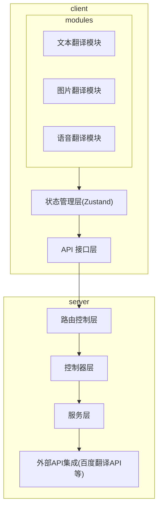
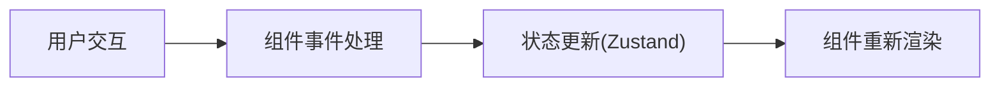
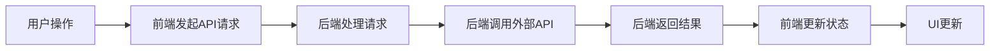
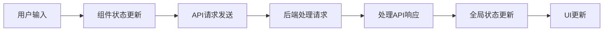
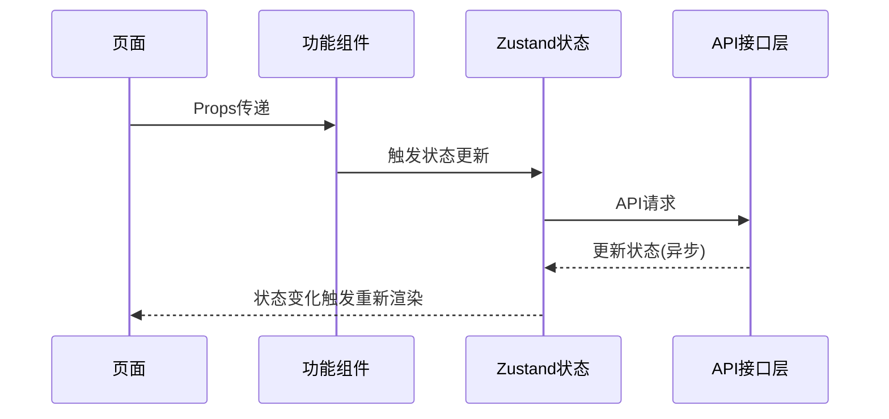
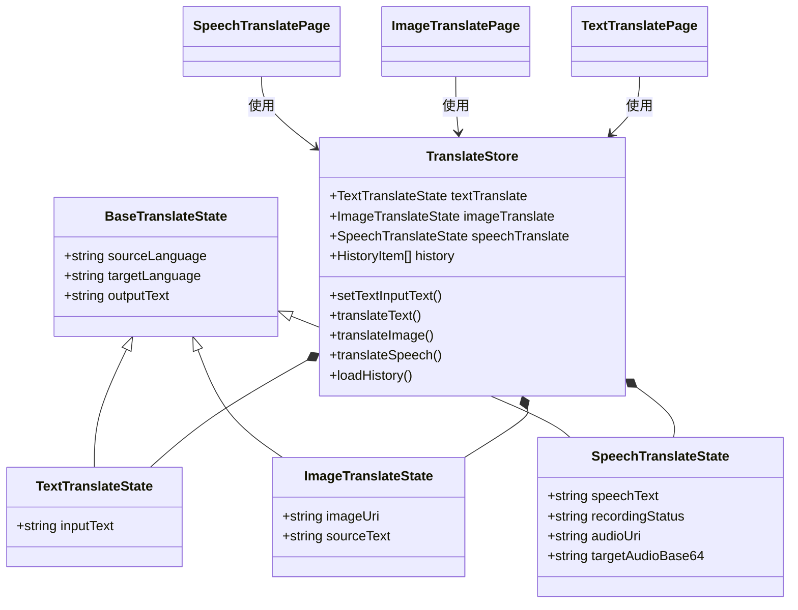
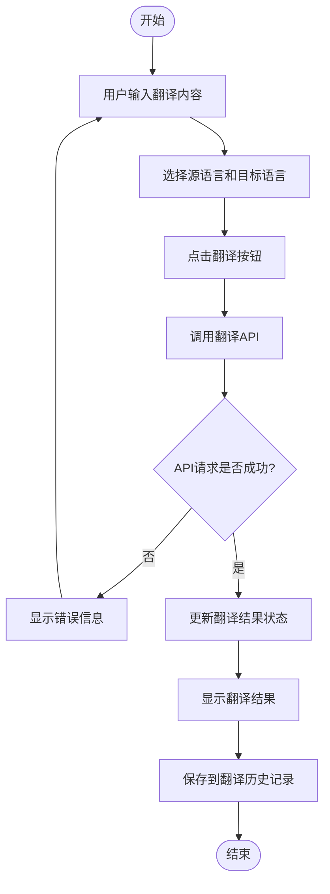
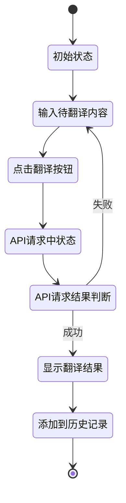

# TransBemo 架构设计文档

## 目录
- [1. 总体架构](#1-总体架构)
- [2. 前端架构](#2-前端架构)
- [3. 后端架构](#3-后端架构)
- [4. 数据流](#4-数据流)
- [5. 组件通信](#5-组件通信)
- [6. 状态管理](#6-状态管理)
- [7. UML图表](#7-uml图表)

## 1. 总体架构

TransBemo是一个基于Expo开发的多语言翻译应用，支持文本翻译、图片翻译和语音翻译功能。整个应用采用前后端分离的架构设计，通过RESTful API进行通信。

### 1.1 系统架构图



### 1.2 架构设计原则

TransBemo的架构设计遵循以下原则：

1. **关注点分离**：将UI、业务逻辑和数据管理分离
2. **单一职责原则**：每个组件和模块只负责一项功能
3. **开放封闭原则**：系统设计便于扩展，无需修改现有代码
4. **组件化设计**：通过组件复用提高开发效率
5. **状态集中管理**：使用Zustand统一管理应用状态

### 1.3 技术栈概览

- **前端**：
  - 框架：React Native 0.76.9 + Expo 52.0.46
  - 状态管理：Zustand 5.0.3
  - 路由：Expo Router 4.0.20
  - 网络请求：Axios 1.9.0
  - UI组件：自定义组件 + React Native内置组件
  - 多媒体处理：expo-av、expo-image-picker
  
- **后端**：
  - 框架：Express.js
  - 数据库：MongoDB (mongoose)
  - 中间件：CORS, body-parser
  - 外部API集成：百度翻译API、有道翻译API

## 2. 前端架构

### 2.1 目录结构

```
TransBemo/
├── app/                  # 应用页面和路由
│   ├── (translate)/      # 翻译相关页面
│   └── _layout.tsx       # 布局组件
├── components/           # 可复用组件
│   ├── global/           # 全局通用组件
│   ├── translate/        # 翻译功能相关组件
│   └── ui/               # UI基础组件
├── api/                  # API请求相关
├── utils/                # 工具函数
├── store/                # 状态管理
├── constants/            # 常量定义
├── styles/               # 样式定义
├── assets/               # 静态资源
└── hooks/                # 自定义Hooks
```

### 2.2 组件设计

TransBemo采用组件化设计思想，将UI拆分为多个独立、可复用的组件。主要组件类型包括：

1. **页面组件**：位于`app/`目录，代表应用的各个页面
   - 文本翻译页面(`index.tsx`)
   - 图片翻译页面(`imageTrans.tsx`)
   - 语音翻译页面(`speechTrans.tsx`)
   - 历史记录页面(`history.tsx`)

2. **功能组件**：位于`components/translate/`目录，实现特定功能
   - 输入组件：`InputBox.tsx`, `SpeechInput.tsx`, `imageContainer.tsx`
   - 输出组件：`OutputBox.tsx`
   - 控制组件：`TranslateButton.tsx`, `SpeechButtonBox.tsx`, `ImageButtonBox.tsx`
   - 语言选择组件：`LanguageSwitcher.tsx`
   - 历史记录项组件：`historyItem.tsx`

3. **通用组件**：位于`components/global/`和`components/ui/`目录，可在多处复用
   - 基础布局：`TranslateBase.tsx`
   - Logo组件：`Logo.tsx`
   - Tab背景：`TabBarBackground.tsx`
   - 自定义文本：`ThemedText.tsx`

### 2.3 路由设计

TransBemo使用Expo Router进行路由管理，采用文件系统路由方式。主要路由包括：

- `/` - 文本翻译页面
- `/(translate)/imageTrans` - 图片翻译页面
- `/(translate)/speechTrans` - 语音翻译页面
- `/(translate)/history` - 翻译历史记录页面

## 3. 后端架构

### 3.1 目录结构

```
backend/
├── server.js             # 服务器入口文件
├── routes/               # 路由定义
│   ├── textTransRoutes.js
│   ├── imageTransRoute.js
│   ├── speechTransRoutes.js
│   └── recordRoutes.js
├── controllers/          # 控制器
│   └── recordController.js
├── models/               # 数据模型
│   └── Record.js
└── config/               # 配置文件
    └── db.js
```

### 3.2 API设计

后端API遵循RESTful设计原则，主要提供以下端点：

1. **文本翻译API**
   - 端点：`/api/translateText`
   - 方法：POST
   - 参数：
     - `q`: 待翻译文本
     - `from`: 源语言代码
     - `to`: 目标语言代码
   - 响应：
     ```json
     {
       "result": {
         "src": "原文内容",
         "dst": "翻译结果"
       }
     }
     ```

2. **图片翻译API**
   - 端点：`/api/translateImage`
   - 方法：POST
   - 参数：
     - `image`: 图片Base64数据
     - `from`: 源语言代码
     - `to`: 目标语言代码
   - 响应：
     ```json
     {
       "result": {
         "src": "识别的原文内容",
         "dst": "翻译结果"
       }
     }
     ```

3. **语音翻译API**
   - 端点：`/api/translateSpeech`
   - 方法：POST
   - 参数：
     - `voice`: 语音文件Base64数据
     - `from`: 源语言代码
     - `to`: 目标语言代码
     - `format`: 音频格式
   - 响应：
     ```json
     {
       "result": {
         "src": "识别的语音文本",
         "dst": "翻译结果",
         "tts": "目标语言TTS音频的Base64数据"
       }
     }
     ```

4. **历史记录API**
   - 获取历史记录：
     - 端点：`/api/records`
     - 方法：GET
   - 保存历史记录：
     - 端点：`/api/records`
     - 方法：POST
   - 删除历史记录：
     - 端点：`/api/records/:id`
     - 方法：DELETE
   - 清空历史记录：
     - 端点：`/api/records/clear`
     - 方法：DELETE

### 3.3 中间件

后端使用以下中间件来增强功能和安全性：

1. **CORS中间件**：允许跨域请求，支持前端与后端的通信
2. **Body Parser中间件**：解析请求体，支持JSON数据和大文件上传（配置了10MB限制）
3. **错误处理中间件**：统一处理API错误，提供一致的错误响应格式

### 3.4 数据库设计

TransBemo使用MongoDB数据库存储翻译历史记录。主要数据模型如下：

**Record模型**：
```js
{
  source: String,        // 源语言
  target: String,        // 目标语言
  inputText: String,     // 输入文本/识别的文本
  outputText: String,    // 翻译结果
  timestamp: Number,     // 时间戳
  type: String           // 翻译类型：'text'/'image'/'speech'
}
```

## 4. 数据流

### 4.1 前端数据流

TransBemo在前端采用单向数据流模型，数据流向如下：



### 4.2 前后端通信数据流

前后端通信采用异步请求模式，数据流向如下：



### 4.3 数据流程图



### 4.4 具体翻译流程

以文本翻译为例：

1. 用户在输入框中输入文本
2. 点击翻译按钮触发`translateText`函数
3. 前端从Zustand状态中获取输入文本和语言设置
4. 通过Axios发送请求到后端`/api/translateText`端点
5. 后端接收请求，调用外部翻译API
6. 后端将翻译结果返回给前端
7. 前端更新Zustand状态中的`outputText`
8. UI自动重新渲染，显示翻译结果
9. 翻译结果被保存到历史记录中

## 5. 组件通信

TransBemo中的组件通信主要通过以下几种方式实现：

### 5.1 Props传递

用于父组件向子组件传递数据和回调函数。例如：

```tsx
// 父组件
<SpeechInput 
  speechText={speechText} 
  recordingStatus={recordingStatus} 
/>

// 子组件
interface SpeechInputProps {
  speechText: string;
  recordingStatus: 'idle' | 'recording' | 'processing';
}
```

### 5.2 Zustand状态共享

使用Zustand实现跨组件的状态共享和通信，避免复杂的Props传递。例如：

```tsx
// 在组件中使用store
const { 
  speechTranslate,
  startSpeechRecording,
  stopSpeechRecording
} = useTranslateStore();

// 调用方法更新状态
await startSpeechRecording();
```

### 5.3 事件回调

通过回调函数实现子组件向父组件的通信。例如：

```tsx
// 父组件定义回调函数并传递给子组件
const handleImageSelected = (uri: string) => {
  // 处理选中的图片
};

<ImageContainer onImageSelected={handleImageSelected} />

// 子组件调用回调函数
if (onImageSelected) {
  onImageSelected(result.uri);
}
```

### 5.4 组件通信UML序列图



## 6. 状态管理

TransBemo使用Zustand作为状态管理库，实现了一个集中式的状态管理方案。

### 6.1 状态设计

状态被划分为以下几个主要部分：

```tsx
// 基础翻译状态接口
interface BaseTranslateState {
  sourceLanguage: string;
  targetLanguage: string;
  outputText: string;
}

// 文本翻译状态
interface TextTranslateState extends BaseTranslateState {
  inputText: string;
}

// 图片翻译状态
interface ImageTranslateState extends BaseTranslateState {
  imageUri: string | null;
  sourceText: string;
}

// 语音翻译状态
interface SpeechTranslateState extends BaseTranslateState {
  speechText: string;
  recordingStatus: 'idle' | 'recording' | 'processing';
  audioUri: string | null;
  targetAudioBase64: string | null;
}

// 翻译历史记录项
interface HistoryItem {
  _id?: string;
  source: string;
  target: string;
  inputText: string;
  outputText: string;
  timestamp: number;
  type: TranslationType;
}

// 完整状态类型定义
type TranslateState = {
  textTranslate: TextTranslateState;
  imageTranslate: ImageTranslateState;
  speechTranslate: SpeechTranslateState;
  translationHistory: HistoryItem[];
  isLoadingHistory: boolean;
  // ...方法定义
};
```

### 6.2 状态更新

状态更新通过Zustand提供的setter函数实现：

```tsx
// 直接更新状态
setTextInputText: (text) => set((state) => ({
  textTranslate: { ...state.textTranslate, inputText: text }
})),

// 异步更新状态
translateText: async () => {
  const state = get();
  const { inputText, sourceLanguage, targetLanguage } = state.textTranslate;
  
  try {
    const fromLang = getLanguageKey(sourceLanguage) || 'zh';
    const toLang = getLanguageKey(targetLanguage) || 'en';
    
    const response = await translateTextRequest(
      inputText,
      fromLang,
      toLang
    );
    
    const translatedText = response.data.result.dst;
    
    // 更新状态
    set((state) => ({
      textTranslate: { ...state.textTranslate, outputText: translatedText }
    }));
    
    // 添加到历史记录
    addToHistory({
      source: sourceLanguage,
      target: targetLanguage,
      inputText: inputText,
      outputText: translatedText,
      type: 'text'
    });
  } catch (error) {
    console.error('翻译失败:', error);
  }
}
```

### 6.3 状态访问

组件通过自定义Hook访问状态：

```tsx
const { 
  textTranslate, 
  translateText, 
  setTextInputText 
} = useTranslateStore();

const { inputText, outputText } = textTranslate;
```

## 7. UML图表

### 7.1 类图

以下是主要组件和状态管理的类图：



### 7.2 组件关系图

```mermaid
flowchart LR
    translateBase[TranslateBase] <-- 包含 --- pageComponents[各翻译页面组件]
    pageComponents --- languageSwitcher[LanguageSwitcher]
    logo[Logo] <-- 包含 --- translateBase
    pageComponents --- inputBox[InputBox]
    inputBox --- outputBox[OutputBox]
    inputBox --- translateButton[TranslateButton]
```

### 7.3 翻译过程活动图



### 7.4 状态管理UML状态图



这种状态管理方式使得组件之间的通信更加简洁，状态更新更加可控，同时也便于实现更复杂的状态逻辑和异步操作。 