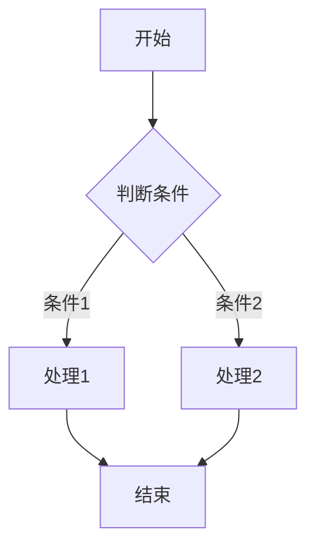
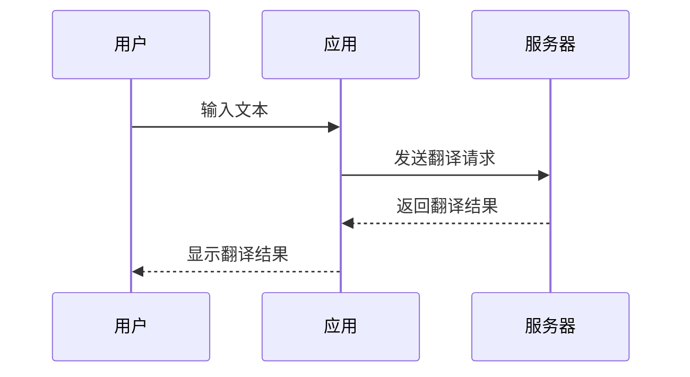
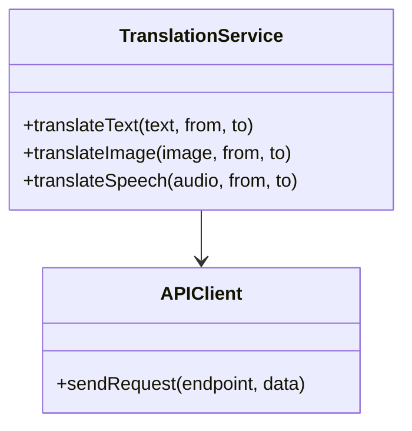
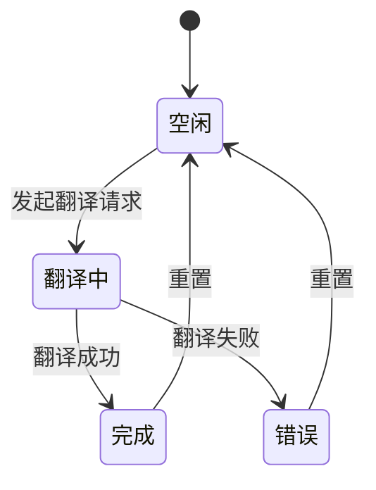
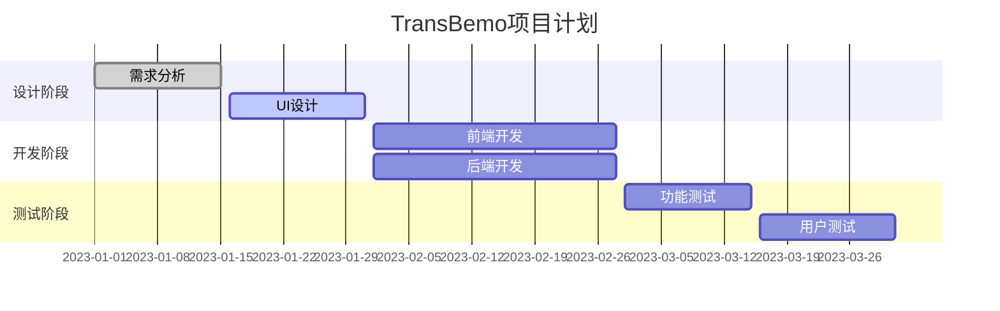
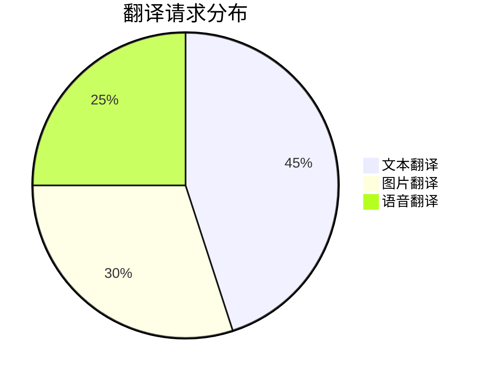

# Mermaid图表测试页面

本页面用于测试Mermaid图表在VitePress中的渲染效果。

## 流程图示例

```mermaid
flowchart TD
    A[开始] --> B{判断条件}
    B -->|条件1| C[处理1]
    B -->|条件2| D[处理2]
    C --> E[结束]
    D --> E
```

## 时序图示例

```mermaid
sequenceDiagram
    participant 用户
    participant 应用
    participant 服务器
    
    用户->>应用: 输入文本
    应用->>服务器: 发送翻译请求
    服务器-->>应用: 返回翻译结果
    应用-->>用户: 显示翻译结果
```

## 类图示例

```mermaid
classDiagram
    class TranslationService {
        +translateText(text, from, to)
        +translateImage(image, from, to)
        +translateSpeech(audio, from, to)
    }
    
    class APIClient {
        +sendRequest(endpoint, data)
    }
    
    TranslationService --> APIClient
```

## 状态图示例

```mermaid
stateDiagram-v2
    [*] --> 空闲
    空闲 --> 翻译中: 发起翻译请求
    翻译中 --> 完成: 翻译成功
    翻译中 --> 错误: 翻译失败
    完成 --> 空闲: 重置
    错误 --> 空闲: 重置
```

## 甘特图示例

```mermaid
gantt
    title TransBemo项目计划
    dateFormat  YYYY-MM-DD
    section 设计阶段
    需求分析        :done,    des1, 2023-01-01, 2023-01-15
    UI设计         :active,  des2, 2023-01-16, 2023-01-31
    section 开发阶段
    前端开发        :         dev1, 2023-02-01, 2023-02-28
    后端开发        :         dev2, 2023-02-01, 2023-02-28
    section 测试阶段
    功能测试        :         test1, 2023-03-01, 2023-03-15
    用户测试        :         test2, 2023-03-16, 2023-03-31
```

## 饼图示例

```mermaid
pie title 翻译请求分布
    "文本翻译" : 45
    "图片翻译" : 30
    "语音翻译" : 25
``` 
 