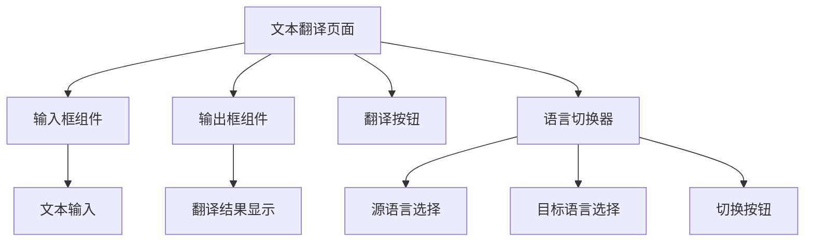
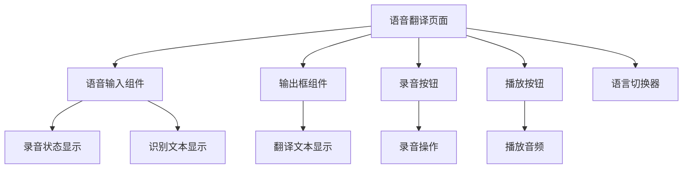
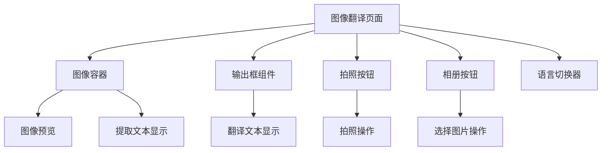
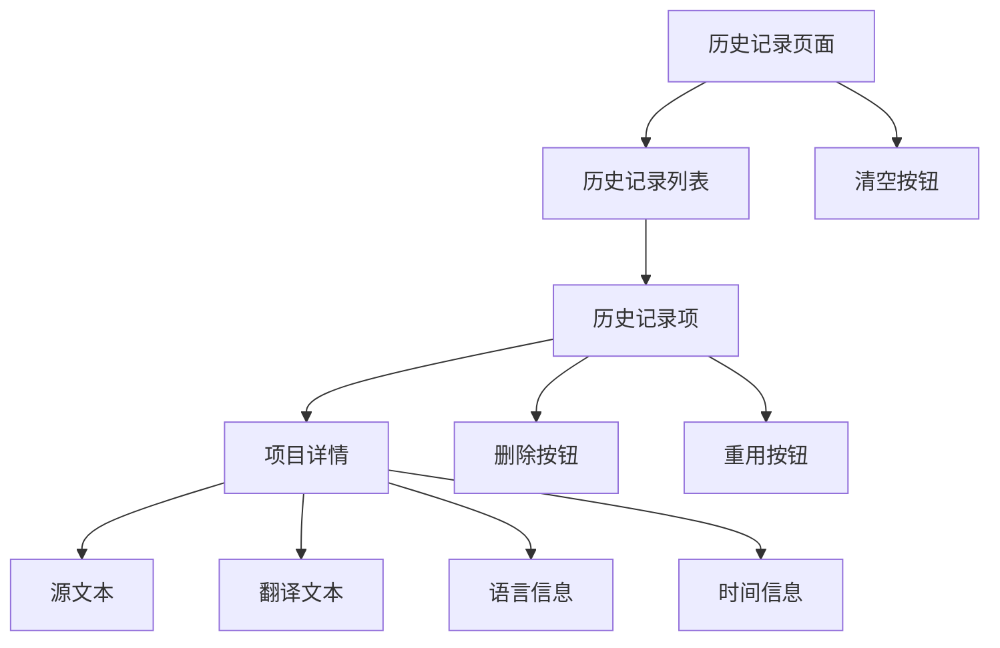
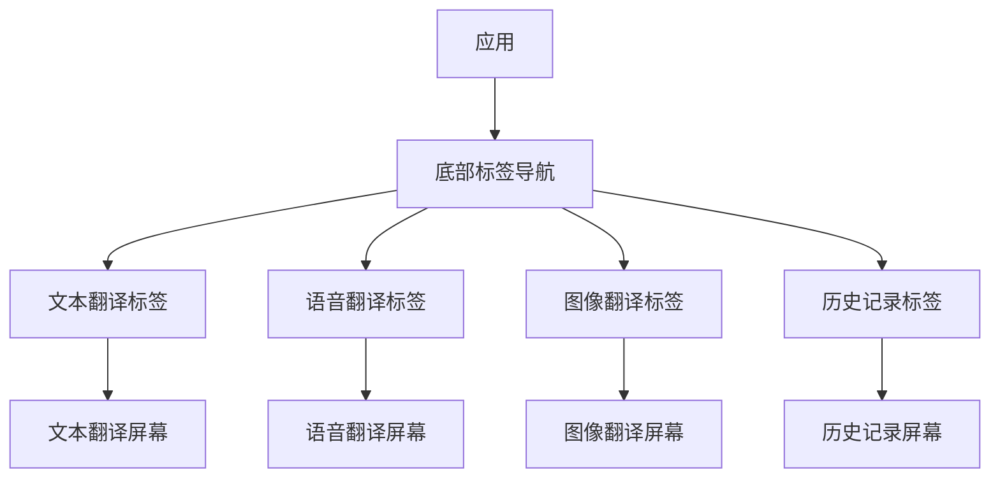

# TransBemo 设计文档

## 目录

- [1. 设计概述](#1-设计概述)
- [2. 核心模块设计](#2-核心模块设计)
- [3. 界面设计](#3-界面设计)
- [4. 数据结构设计](#4-数据结构设计)
- [5. API设计](#5-api设计)
- [6. 性能与安全考量](#6-性能与安全考量)

## 1. 设计概述

### 1.1 设计目标

TransBemo是一个多功能的翻译应用，旨在提供简洁易用的翻译体验。主要设计目标包括：

1. 提供直观、简洁的用户界面
2. 支持多种翻译方式（文本、语音、图像）
3. 实现高效、准确的翻译功能
4. 确保应用在移动设备上的流畅运行
5. 提供良好的离线体验和历史记录功能

### 1.2 设计原则

TransBemo的设计遵循以下原则：

1. **简洁至上**：界面设计简洁明了，减少不必要的视觉元素
2. **功能导向**：功能设计围绕用户核心需求展开
3. **响应式体验**：确保在不同设备上的良好用户体验
4. **性能优先**：优化应用性能，减少加载时间和资源消耗
5. **可扩展性**：设计模块化架构，便于后续功能扩展

### 1.3 技术选择

- **前端框架**：React Native + Expo
- **状态管理**：Zustand
- **UI组件**：自定义组件 + React Native内置组件
- **后端服务**：Express.js + MongoDB
- **翻译API**：百度翻译API、有道翻译API

## 2. 核心模块设计

TransBemo应用包含三个核心功能模块：文本翻译、语音翻译和图像翻译。每个模块都有其独特的设计考量和实现方式。

### 2.1 文本翻译模块

文本翻译是应用的基础功能，允许用户输入文本并获取翻译结果。

#### 2.1.1 功能描述

- 文本输入和编辑
- 源语言和目标语言选择
- 文本翻译请求和结果显示
- 复制翻译结果
- 历史记录保存

#### 2.1.2 组件设计



#### 2.1.3 交互流程

1. 用户在输入框中输入需要翻译的文本
2. 选择源语言和目标语言
3. 点击翻译按钮
4. 系统发送API请求并等待结果
5. 显示翻译结果
6. 自动保存到历史记录

### 2.2 语音翻译模块

语音翻译模块允许用户通过语音输入进行翻译，支持语音识别和文本转语音功能。

#### 2.2.1 功能描述

- 语音录制和识别
- 语音识别结果显示
- 翻译结果文本展示
- 翻译结果语音播放
- 源语言和目标语言选择

#### 2.2.2 组件设计



#### 2.2.3 交互流程

1. 用户选择源语言和目标语言
2. 点击录音按钮开始录音
3. 系统显示录音状态
4. 用户完成语音输入后停止录音
5. 系统识别语音并显示识别结果
6. 系统翻译识别文本并显示
7. 用户可点击播放按钮听取翻译后的语音
8. 翻译结果保存到历史记录

### 2.3 图像翻译模块

图像翻译模块支持从图像中提取文本并进行翻译，适用于处理含有文字的图片。

#### 2.3.1 功能描述

- 拍照或从相册选择图片
- 图像文本识别(OCR)
- 识别文本翻译
- 翻译结果显示
- 源语言和目标语言选择

#### 2.3.2 组件设计



#### 2.3.3 交互流程

1. 用户通过拍照或从相册选择图片
2. 系统显示图片预览
3. 系统自动提取图片中的文本
4. 用户选择源语言和目标语言
5. 系统翻译提取的文本并显示结果
6. 翻译结果保存到历史记录

### 2.4 历史记录模块

历史记录模块保存用户的翻译历史，方便用户查看和重用之前的翻译内容。

#### 2.4.1 功能描述

- 查看翻译历史记录列表
- 历史记录项详情查看
- 删除单条历史记录
- 清空历史记录
- 复用历史记录中的翻译内容

#### 2.4.2 组件设计



#### 2.4.3 数据结构

历史记录项的数据结构设计：

```typescript
interface HistoryItem {
  _id?: string;              // 记录ID
  source: string;            // 源语言
  target: string;            // 目标语言
  inputText: string;         // 输入文本
  outputText: string;        // 翻译结果
  timestamp: number;         // 时间戳
  type: 'text' | 'image' | 'speech'; // 翻译类型
}
```

## 3. 界面设计

### 3.1 整体布局

TransBemo应用采用标签式导航布局，底部导航栏包含四个主要功能标签：文本翻译、语音翻译、图像翻译和历史记录。



### 3.2 配色方案

TransBemo使用简洁明快的配色方案，以提供良好的视觉体验和可读性。

- **主色调**：深蓝色 (#3498db)
- **次要色**：淡蓝色 (#85c1e9)
- **背景色**：白色 (#ffffff) / 暗色模式下的深灰色 (#121212)
- **文本色**：黑色 (#000000) / 暗色模式下的白色 (#ffffff)
- **强调色**：橙色 (#f39c12)

### 3.3 交互设计

TransBemo的交互设计遵循以下原则：

1. **直观性**：用户可以通过可见的UI元素直接理解功能
2. **反馈性**：每个操作都有相应的视觉或触觉反馈
3. **一致性**：在不同功能模块中保持一致的交互模式
4. **可预测性**：用户可以预测操作的结果
5. **容错性**：提供错误处理和恢复机制

#### 3.3.1 手势交互

- 左右滑动：切换语言
- 长按：复制文本
- 点击：激活按钮/控件
- 双击：快速清空输入框

## 4. 数据结构设计

### 4.1 状态管理

TransBemo使用Zustand进行状态管理，主要状态结构如下：

```typescript
interface TranslateState {
  // 文本翻译状态
  textTranslate: {
    inputText: string;
    outputText: string;
    sourceLanguage: string;
    targetLanguage: string;
  };
  
  // 图片翻译状态
  imageTranslate: {
    imageUri: string | null;
    sourceText: string;
    outputText: string;
    sourceLanguage: string;
    targetLanguage: string;
  };
  
  // 语音翻译状态
  speechTranslate: {
    speechText: string;
    outputText: string;
    sourceLanguage: string;
    targetLanguage: string;
    recordingStatus: 'idle' | 'recording' | 'processing';
    audioUri: string | null;
    targetAudioBase64: string | null;
  };
  
  // 翻译历史
  translationHistory: HistoryItem[];
  isLoadingHistory: boolean;
  
  // 方法定义...
}
```

### 4.2 数据持久化

TransBemo使用MongoDB数据库进行历史记录的持久化存储，同时在本地使用AsyncStorage进行缓存。

```typescript
// MongoDB模型
const RecordSchema = new mongoose.Schema({
  source: String,        // 源语言
  target: String,        // 目标语言
  inputText: String,     // 输入/识别的文本
  outputText: String,    // 翻译结果
  timestamp: Number,     // 时间戳
  type: String           // 翻译类型：'text'/'image'/'speech'
});
```

## 5. API设计

### 5.1 翻译API

#### 5.1.1 文本翻译API

**请求**:
```
POST /api/translateText
Content-Type: application/json

{
  "q": "需要翻译的文本",
  "from": "源语言代码",
  "to": "目标语言代码"
}
```

**响应**:
```json
{
  "result": {
    "src": "原文内容",
    "dst": "翻译结果"
  }
}
```

#### 5.1.2 图像翻译API

**请求**:
```
POST /api/translateImage
Content-Type: application/json

{
  "image": "图片Base64编码",
  "from": "源语言代码",
  "to": "目标语言代码"
}
```

**响应**:
```json
{
  "result": {
    "src": "识别的原文内容",
    "dst": "翻译结果"
  }
}
```

#### 5.1.3 语音翻译API

**请求**:
```
POST /api/translateSpeech
Content-Type: application/json

{
  "voice": "语音文件Base64编码",
  "from": "源语言代码",
  "to": "目标语言代码",
  "format": "音频格式"
}
```

**响应**:
```json
{
  "result": {
    "src": "识别的语音文本",
    "dst": "翻译结果",
    "tts": "目标语言TTS音频的Base64数据"
  }
}
```

### 5.2 历史记录API

#### 5.2.1 获取历史记录

**请求**:
```
GET /api/records
```

**响应**:
```json
{
  "records": [
    {
      "_id": "记录ID",
      "source": "源语言",
      "target": "目标语言",
      "inputText": "输入文本",
      "outputText": "翻译结果",
      "timestamp": 1621500000000,
      "type": "text"
    },
    // ...更多记录
  ]
}
```

#### 5.2.2 保存历史记录

**请求**:
```
POST /api/records
Content-Type: application/json

{
  "source": "源语言",
  "target": "目标语言",
  "inputText": "输入文本",
  "outputText": "翻译结果",
  "type": "text"
}
```

**响应**:
```json
{
  "success": true,
  "record": {
    "_id": "新记录ID",
    "source": "源语言",
    "target": "目标语言",
    "inputText": "输入文本",
    "outputText": "翻译结果",
    "timestamp": 1621500000000,
    "type": "text"
  }
}
```

#### 5.2.3 删除历史记录

**请求**:
```
DELETE /api/records/:id
```

**响应**:
```json
{
  "success": true,
  "message": "记录已删除"
}
```

#### 5.2.4 清空历史记录

**请求**:
```
DELETE /api/records/clear
```

**响应**:
```json
{
  "success": true,
  "message": "所有记录已清空"
}
```

## 6. 性能与安全考量

### 6.1 性能优化

TransBemo应用在性能方面进行了以下优化：

1. **懒加载**：页面和组件采用懒加载方式，减少初始加载时间
2. **图片处理**：图像翻译中的图片进行压缩处理，减少传输数据量
3. **缓存机制**：使用缓存减少重复API请求
4. **防抖和节流**：对输入事件进行防抖处理，减少不必要的状态更新
5. **内存管理**：及时释放不再使用的资源，特别是音频和图像资源

### 6.2 安全考量

TransBemo在安全方面的考量包括：

1. **数据传输安全**：使用HTTPS进行API通信
2. **隐私保护**：不存储用户敏感信息
3. **输入验证**：对用户输入进行验证，防止注入攻击
4. **错误处理**：完善的错误处理机制，避免暴露系统信息
5. **权限控制**：仅请求必要的设备权限（相机、麦克风、存储）
